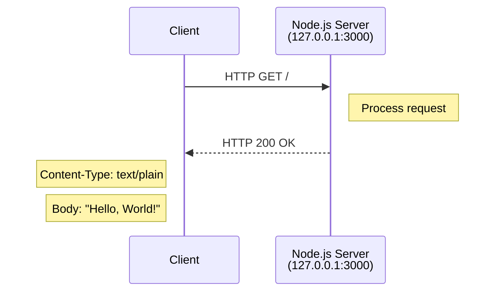
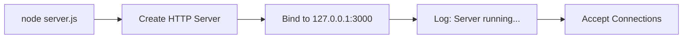

# hao-backprop-test

[](https://opensource.org/licenses/MIT)
[](https://nodejs.org/)

> ⚠️ **WARNING**: This is a test project for Backprop integration. Do not touch!

A minimal Node.js HTTP server used for testing Backprop integration. This project serves as a sandbox environment and is **not intended for production use**.

## Table of Contents

- [Features](#features)
- [Requirements](#requirements)
- [Quick Start](#quick-start)
- [API Reference](#api-reference)
- [Configuration](#configuration)
- [Architecture](#architecture)
- [Known Limitations](#known-limitations)
- [Project Structure](#project-structure)
- [Contributing](#contributing)
- [Changelog](#changelog)
- [License](#license)

## Features

- 🚀 Zero external dependencies - uses only Node.js built-in `http` module
- 📦 Minimal footprint - single file server implementation
- 🔧 Simple configuration - localhost binding with fixed port
- ✅ Ready for integration testing

## Requirements

| Component | Minimum Version | Recommended |
|-----------|----------------|-------------|
| Node.js   | 14.x           | 20.x        |
| npm       | 6.x            | 11.x        |

## Quick Start

### Installation

```bash
# Clone the repository
git clone <repository-url>
cd hao-backprop-test

# Install dependencies (none required, but validates package.json)
npm install
```

### Running the Server

```bash
# Start the server
node server.js

# Expected output:
# Server running at http://127.0.0.1:3000/
```

### Verify the Server

```bash
# In a separate terminal, test the endpoint
curl http://127.0.0.1:3000

# Expected output:
# Hello, World!
```

### Stopping the Server

Press `Ctrl+C` in the terminal running the server, or:

```bash
# Kill the process using port 3000
kill $(lsof -t -i:3000)
```

## API Reference

### HTTP Endpoint

| Method | Path | Description |
|--------|------|-------------|
| GET    | `/`  | Returns a "Hello, World!" greeting |

#### Request

```http
GET / HTTP/1.1
Host: 127.0.0.1:3000
```

#### Response

| Property     | Value            |
|--------------|------------------|
| Status Code  | `200 OK`         |
| Content-Type | `text/plain`     |
| Body         | `Hello, World!\n`|

#### Example Response

```http
HTTP/1.1 200 OK
Content-Type: text/plain

Hello, World!
```

## Configuration

The server uses hardcoded configuration values defined in `server.js`:

| Parameter    | Value         | Description                    |
|--------------|---------------|--------------------------------|
| `hostname`   | `127.0.0.1`   | Server binds to localhost only |
| `port`       | `3000`        | HTTP port number               |
| Content-Type | `text/plain`  | Response content type          |

*Source: server.js:3-4, server.js:8*

> **Note**: To modify these values, edit `server.js` directly. Environment variable support is not implemented.

## Architecture

The server follows a minimal single-file architecture using Node.js built-in modules.

### Request Flow



### Server Startup Flow



### Technology Stack

| Layer      | Technology          |
|------------|---------------------|
| Runtime    | Node.js             |
| HTTP       | Built-in `http` module |
| Language   | JavaScript (ES6+)   |

## Known Limitations

| Issue | Description | Impact |
|-------|-------------|--------|
| Entry Point Mismatch | `package.json` specifies `main: "index.js"` but actual entry point is `server.js` | npm start will fail; use `node server.js` instead |
| No Error Handling | Server does not implement error handling or graceful shutdown | Process may hang on uncaught exceptions |
| No Routing | All paths return the same response | Cannot implement multiple endpoints |
| Localhost Only | Server binds to `127.0.0.1`, not accessible from network | Cannot test from remote machines |
| No Tests | `npm test` returns error, no test suite implemented | No automated validation |

## Project Structure

```
hao-backprop-test/
├── README.md              # This documentation file
├── CONTRIBUTING.md        # Contribution guidelines
├── CHANGELOG.md           # Version history
├── LICENSE                # MIT license text
├── package.json           # npm package configuration
├── package-lock.json      # Dependency lock file
├── server.js              # HTTP server implementation
├── docs/
│   └── ARCHITECTURE.md    # Detailed architecture documentation
│
│  Test Assets (Do Not Modify)
├── industry.csv           # Sample data file (44 industry categories)
├── LoginTest.java         # Java test stub (non-functional)
├── 100Pages.pdf           # Binary test fixture
├── demo.jpg               # Image test fixture
└── sample.doc             # Document test fixture
```

> **Note**: Files with `- Copy` suffix are duplicates and should be ignored.

## Contributing

Please read [CONTRIBUTING.md](CONTRIBUTING.md) for details on our contribution process.

## Changelog

See [CHANGELOG.md](CHANGELOG.md) for version history and release notes.

## License

This project is licensed under the MIT License - see the [LICENSE](LICENSE) file for details.

---

*This documentation was generated for the hao-backprop-test project. For questions or issues, please contact the project maintainer.*
