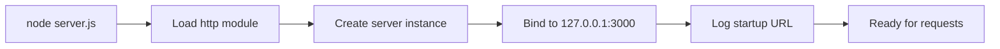
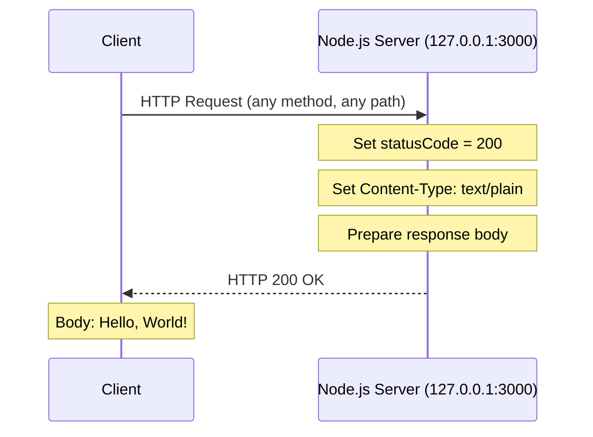

# Hello World Server

A minimal Node.js HTTP server for testing and demonstration purposes. This project serves as a backprop integration test sandbox.

> **Note:** This is a test project for backprop integration.

## About

This project implements a simple HTTP server using Node.js's built-in `http` module. When accessed, it responds with a plain text "Hello, World!" message. The server is designed to be minimal and straightforward, making it ideal for:

- Testing HTTP client implementations
- Learning Node.js HTTP server basics
- Integration testing with backend systems
- Demonstrating server-client communication

*Source: server.js:6-10, package.json*

## Prerequisites

Before running this project, ensure you have the following installed:

- **Node.js** v14.0.0 or higher
  - Recommended: Node.js 18 LTS or 20 LTS
  - Download from: [https://nodejs.org/en/download/](https://nodejs.org/en/download/)

To verify your Node.js installation:

```bash
node --version
# Should output v14.0.0 or higher
```

## Installation

1. **Clone the repository:**

   ```bash
   git clone <repository-url>
   cd hao-backprop-test
   ```

2. **No additional dependencies required:**
   
   This project uses only Node.js built-in modules, so no `npm install` is necessary.

## Quick Start

Start the server with a single command:

```bash
node server.js
```

You should see the following output:

```
Server running at http://127.0.0.1:3000/
```

### Server Startup Flow



*Source: server.js:1, server.js:6, server.js:12-14*

## Usage

### Testing the Server

Once the server is running, you can test it using `curl` or any HTTP client:

```bash
curl http://127.0.0.1:3000/
```

**Expected output:**

```
Hello, World!
```

### Stopping the Server

To stop the server, use one of the following methods:

- **Keyboard interrupt:** Press `Ctrl+C` in the terminal
- **Kill by port:** 
  ```bash
  kill $(lsof -t -i:3000)
  ```

### Browser Access

Open your web browser and navigate to:

```
http://127.0.0.1:3000/
```

The page will display "Hello, World!" as plain text.

## API Reference

### Endpoint

| Method | URL | Description |
|--------|-----|-------------|
| ANY | `http://127.0.0.1:3000/` | Returns a Hello World greeting |

**Note:** The server accepts all HTTP methods (GET, POST, PUT, DELETE, etc.) and all URL paths. Every request returns the same response.

### HTTP Request/Response Flow



*Source: server.js:6-10*

## Response Format

Every HTTP request to the server returns the following response:

| Property | Value |
|----------|-------|
| **Status Code** | `200 OK` |
| **Content-Type** | `text/plain` |
| **Body** | `Hello, World!\n` |
| **Encoding** | UTF-8 |

### Example Response Headers

```http
HTTP/1.1 200 OK
Content-Type: text/plain
Date: <current-date>
Connection: keep-alive
Keep-Alive: timeout=5
Transfer-Encoding: chunked
```

*Source: server.js:7-9*

## Deployment

### Local Development

For local development, simply run the server directly:

```bash
node server.js
```

The server will:
- Bind to `127.0.0.1` (localhost only)
- Listen on port `3000`
- Log the URL when ready to accept connections

*Source: server.js:3-4, server.js:12-14*

### Production Considerations

> ⚠️ **Security Notice:** This server is configured for local development only.

The current configuration binds to `127.0.0.1`, which means:
- The server is **only accessible from the local machine**
- External network connections are **not accepted**
- This is intentional for security in a test environment

**For production deployment, consider:**

1. **Binding to all interfaces:**
   ```javascript
   const hostname = '0.0.0.0'; // Accept connections from any IP
   ```

2. **Using environment variables:**
   ```javascript
   const port = process.env.PORT || 3000;
   const hostname = process.env.HOST || '127.0.0.1';
   ```

3. **Adding proper error handling** for connection failures

4. **Implementing HTTPS** for secure communications

5. **Using a process manager** like PM2 for production:
   ```bash
   npm install -g pm2
   pm2 start server.js
   ```

## Troubleshooting

### Common Issues

#### Port 3000 Already in Use

**Error message:**
```
Error: listen EADDRINUSE: address already in use 127.0.0.1:3000
```

**Solutions:**

1. Find and kill the process using port 3000:
   ```bash
   # On Linux/macOS
   lsof -i :3000
   kill -9 <PID>
   
   # Or in one command
   kill $(lsof -t -i:3000)
   ```

2. Use a different port by modifying `server.js`:
   ```javascript
   const port = 3001; // Change to an available port
   ```

#### Node.js Not Installed

**Error message:**
```
command not found: node
```

**Solution:**

Install Node.js from [https://nodejs.org/en/download/](https://nodejs.org/en/download/)

Verify installation:
```bash
node --version
npm --version
```

#### Permission Denied

**Error message:**
```
Error: listen EACCES: permission denied 127.0.0.1:3000
```

**Solution:**

- Ensure you have proper permissions to bind to port 3000
- On some systems, ports below 1024 require root privileges
- Port 3000 should not require elevated permissions on most systems

## Project Structure

```
hao-backprop-test/
├── server.js          # Main HTTP server implementation
├── package.json       # Project metadata and configuration
├── package-lock.json  # Dependency lock file (auto-generated)
└── README.md          # This documentation file
```

### File Descriptions

| File | Description |
|------|-------------|
| `server.js` | Contains the HTTP server implementation using Node.js built-in `http` module. Creates a server that responds with "Hello, World!" to all requests. |
| `package.json` | Defines project metadata including name, version, author, and license. No runtime dependencies are declared. |
| `package-lock.json` | Auto-generated lock file for npm. Ensures consistent installations across environments. |
| `README.md` | Comprehensive project documentation (this file). |

## Known Limitations

1. **No Routing:**
   - The server responds with the same content for all URL paths
   - All HTTP methods receive the same response

2. **No Error Handling:**
   - The server does not implement custom error handling
   - Relies on Node.js default behavior for exceptions

3. **No HTTPS Support:**
   - The server only supports HTTP connections
   - Not suitable for transmitting sensitive data

4. **Single Response:**
   - All requests return "Hello, World!" regardless of the request content

*Source: server.js:6-10*

## Contributing

Contributions are welcome! To contribute:

1. Fork the repository
2. Create a feature branch (`git checkout -b feature/your-feature`)
3. Make your changes
4. Commit your changes (`git commit -m 'Add some feature'`)
5. Push to the branch (`git push origin feature/your-feature`)
6. Open a Pull Request

Please ensure your code follows the existing style and includes appropriate documentation.

## License

This project is licensed under the **MIT License**.

```
MIT License

Copyright (c) hxu

Permission is hereby granted, free of charge, to any person obtaining a copy
of this software and associated documentation files (the "Software"), to deal
in the Software without restriction, including without limitation the rights
to use, copy, modify, merge, publish, distribute, sublicense, and/or sell
copies of the Software, and to permit persons to whom the Software is
furnished to do so, subject to the following conditions:

The above copyright notice and this permission notice shall be included in all
copies or substantial portions of the Software.

THE SOFTWARE IS PROVIDED "AS IS", WITHOUT WARRANTY OF ANY KIND, EXPRESS OR
IMPLIED, INCLUDING BUT NOT LIMITED TO THE WARRANTIES OF MERCHANTABILITY,
FITNESS FOR A PARTICULAR PURPOSE AND NONINFRINGEMENT. IN NO EVENT SHALL THE
AUTHORS OR COPYRIGHT HOLDERS BE LIABLE FOR ANY CLAIM, DAMAGES OR OTHER
LIABILITY, WHETHER IN AN ACTION OF CONTRACT, TORT OR OTHERWISE, ARISING FROM,
OUT OF OR IN CONNECTION WITH THE SOFTWARE OR THE USE OR OTHER DEALINGS IN THE
SOFTWARE.
```

*Source: package.json (license: MIT, author: hxu)*

---

**Version:** 1.0.0 | **Author:** hxu | **Last Updated:** January 2025
