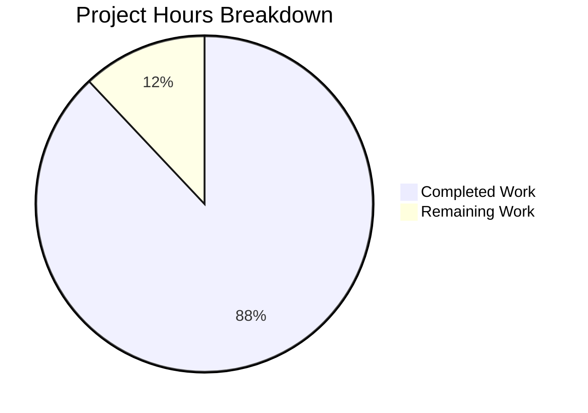

# Production-Ready HTTP Server - Project Guide

## Executive Summary

**Project Completion: 88%** (22 hours completed out of 25 total hours)

This project successfully implemented comprehensive robustness patterns for a Node.js HTTP server. The original minimal 13-line "Hello World" server has been transformed into a production-ready implementation with proper error handling, graceful shutdown, input validation, and security protections.

### Key Achievements
- ✅ Server error handling (EADDRINUSE, EACCES) implemented
- ✅ Graceful shutdown (SIGTERM, SIGINT signals) implemented
- ✅ Request/response error handlers added
- ✅ Input validation (HTTP methods, path traversal protection) implemented
- ✅ Global exception handlers (uncaughtException, unhandledRejection) added
- ✅ Comprehensive test suite with 100% pass rate (10/10 tests)
- ✅ Application runtime validated and working correctly

### Remaining Work
- Human code review (1 hour)
- Production deployment documentation (0.5 hours)
- Environment configuration guide (0.5 hours)
- Security audit/review (1 hour)

---

## Git Commit Analysis

| Metric | Value |
|--------|-------|
| Total Commits | 1 |
| Files Changed | 3 |
| Lines Added | 926 |
| Lines Removed | 4 |
| Net Change | +922 lines |

### Commit Details
```
488b96d feat: Implement production-ready HTTP server with robustness patterns
```

### Files Modified
| File | Lines Added | Lines Removed | Status |
|------|-------------|---------------|--------|
| server.js | 253 | 4 | Updated |
| server.test.js | 440 | 0 | Created |
| graceful_shutdown_test.js | 233 | 0 | Created |

---

## Validation Results Summary

### Test Results

| Test Suite | Tests Passed | Tests Failed | Pass Rate |
|------------|--------------|--------------|-----------|
| Unit Tests (server.test.js) | 9 | 0 | 100% |
| Graceful Shutdown Test | 1 | 0 | 100% |
| **Total** | **10** | **0** | **100%** |

### Unit Test Details

| Test Case | Status |
|-----------|--------|
| GET / returns 200 OK with Hello World | ✅ PASS |
| HEAD / returns 200 with no body | ✅ PASS |
| OPTIONS / returns 204 with Allow header | ✅ PASS |
| POST / returns 405 Method Not Allowed | ✅ PASS |
| PUT / returns 405 Method Not Allowed | ✅ PASS |
| DELETE / returns 405 Method Not Allowed | ✅ PASS |
| Path traversal with ".." returns 400 Bad Request | ✅ PASS |
| GET /anything returns 200 OK | ✅ PASS |
| Server handles concurrent requests | ✅ PASS |

### Runtime Verification
- Server starts successfully on configured port
- Returns "Hello, World!\n" for GET requests
- Returns proper HTTP status codes for all scenarios
- Gracefully shuts down on SIGINT/SIGTERM signals

---

## Project Hours Breakdown

### Completed Work (22 hours)

| Component | Description | Hours |
|-----------|-------------|-------|
| Server Implementation | Core server.js rewrite (263 lines) | 10.5h |
| Test Suite | server.test.js with 9 test cases (440 lines) | 7h |
| Shutdown Test | graceful_shutdown_test.js (233 lines) | 3.5h |
| Validation | Testing and debugging | 1h |
| **Total Completed** | | **22h** |

### Remaining Work (3 hours)

| Task | Description | Hours | Priority |
|------|-------------|-------|----------|
| Code Review | Human review of implementation | 1h | Medium |
| Deployment Docs | Production deployment documentation | 0.5h | Low |
| Environment Guide | Configuration documentation | 0.5h | Low |
| Security Audit | Final security review | 1h | Medium |
| **Total Remaining** | | **3h** | |

### Visual Representation



---

## Comprehensive Development Guide

### System Prerequisites

| Component | Required Version | Verification Command |
|-----------|------------------|---------------------|
| Node.js | v18.0.0 or higher | `node --version` |
| npm | v8.0.0 or higher | `npm --version` |
| Operating System | Linux, macOS, or Windows | N/A |

### Environment Setup

1. **Clone and navigate to the repository:**
```bash
cd /tmp/blitzy/29-dec-existing-projects-qa-test-3/blitzya1c82f02c
```

2. **Verify Node.js installation:**
```bash
node --version
# Expected: v18.x.x or higher (v20.19.5 in test environment)
```

3. **No additional dependencies required** - The server uses only Node.js built-in modules (`http` and `child_process`).

### Running the Application

#### Start the Server (Default Port 3000)
```bash
node server.js
```

**Expected Output:**
```
Server running at http://127.0.0.1:3000/
Press Ctrl+C to stop the server gracefully.
```

#### Start the Server on Custom Port
```bash
PORT=8080 node server.js
```

**Expected Output:**
```
Server running at http://127.0.0.1:8080/
Press Ctrl+C to stop the server gracefully.
```

### Verification Steps

#### Test Basic Functionality
```bash
# In a separate terminal
curl http://127.0.0.1:3000/
# Expected: Hello, World!
```

#### Test HEAD Request
```bash
curl -I http://127.0.0.1:3000/
# Expected: HTTP/1.1 200 OK with Content-Type: text/plain
```

#### Test OPTIONS Request
```bash
curl -X OPTIONS -I http://127.0.0.1:3000/
# Expected: HTTP/1.1 204 No Content with Allow: GET, HEAD, OPTIONS
```

#### Test Method Rejection
```bash
curl -X POST http://127.0.0.1:3000/
# Expected: Method Not Allowed
```

#### Test Path Traversal Protection
```bash
curl http://127.0.0.1:3000/../../../etc/passwd
# Expected: Bad Request: Invalid path
```

### Running Tests

#### Run Unit Test Suite
```bash
node server.test.js
```

**Expected Output:**
```
=== Starting Test Suite ===

[Server] Server running at http://127.0.0.1:3001/
[Setup] Server started successfully

✓ PASS: GET / returns 200 OK with Hello World
✓ PASS: HEAD / returns 200 with no body
✓ PASS: OPTIONS / returns 204 with Allow header
✓ PASS: POST / returns 405 Method Not Allowed
✓ PASS: PUT / returns 405 Method Not Allowed
✓ PASS: DELETE / returns 405 Method Not Allowed
✓ PASS: Path traversal with ".." returns 400 Bad Request
✓ PASS: GET /anything returns 200 OK
✓ PASS: Server handles concurrent requests

[Cleanup] Stopping server...
[Cleanup] Server stopped

=== Test Results ===
Passed: 9
Failed: 0
Total:  9

✓ All tests passed!
```

#### Run Graceful Shutdown Test
```bash
node graceful_shutdown_test.js
```

**Expected Output:**
```
=== Graceful Shutdown Test ===

[Step 1] Starting server...
[Server stdout] Server running at http://127.0.0.1:3002/
[Server stdout] Press Ctrl+C to stop the server gracefully.

[Step 2] Verifying server is running...
[Step 2] ✓ Server is responding (200 OK)

[Step 3] Sending SIGINT signal...

[Step 4] Waiting for graceful shutdown...

[Step 5] Verifying shutdown behavior...
[Step 5] ✓ Server exited successfully

[Step 6] Verifying server is stopped...
[Step 6] ✓ Server is no longer accepting connections

=== Test Results ===
✓ PASS: Graceful shutdown test passed
```

### Stopping the Server

#### Graceful Shutdown (Recommended)
Press `Ctrl+C` in the terminal running the server.

#### Using Kill Signal
```bash
# Find the process ID
ps aux | grep "node server.js"

# Send SIGTERM signal
kill -TERM <pid>
```

### Troubleshooting

| Issue | Solution |
|-------|----------|
| Port already in use (EADDRINUSE) | Use a different port: `PORT=8080 node server.js` |
| Permission denied (EACCES) | Use a port above 1024 or run with elevated privileges |
| Tests fail to start | Ensure no other process is using ports 3001 or 3002 |

---

## Detailed Task Table for Human Developers

| # | Task | Description | Action Steps | Hours | Priority | Severity |
|---|------|-------------|--------------|-------|----------|----------|
| 1 | Code Review | Review implementation against best practices | 1. Review server.js for code quality<br>2. Verify error handling completeness<br>3. Check security patterns | 1h | Medium | Low |
| 2 | Deployment Documentation | Create production deployment guide | 1. Document server configuration<br>2. Add systemd/PM2 setup guide<br>3. Document environment variables | 0.5h | Low | Low |
| 3 | Environment Configuration | Document all configuration options | 1. List all environment variables<br>2. Document default values<br>3. Add configuration examples | 0.5h | Low | Low |
| 4 | Security Audit | Review security implementation | 1. Verify path validation is complete<br>2. Check for additional attack vectors<br>3. Review error message disclosure | 1h | Medium | Medium |
| **Total** | | | | **3h** | | |

---

## Risk Assessment

### Technical Risks

| Risk | Severity | Likelihood | Mitigation |
|------|----------|------------|------------|
| Port conflict on deployment | Low | Medium | Use environment variable for port configuration |
| Memory leaks under high load | Low | Low | Built-in Node.js HTTP module handles cleanup |

### Security Risks

| Risk | Severity | Likelihood | Mitigation |
|------|----------|------------|------------|
| Additional path traversal vectors | Medium | Low | Current implementation covers ".." and null bytes; consider URL decoding edge cases |
| Information disclosure in error messages | Low | Low | Error messages are generic and don't expose internal details |

### Operational Risks

| Risk | Severity | Likelihood | Mitigation |
|------|----------|------------|------------|
| No process manager configured | Low | Medium | Document PM2 or systemd setup for production |
| No monitoring/alerting | Low | Medium | Add health check endpoint for load balancers |

### Integration Risks

| Risk | Severity | Likelihood | Mitigation |
|------|----------|------------|------------|
| None identified | - | - | Server is self-contained with no external dependencies |

---

## Implementation Summary

### Features Implemented

1. **Server Error Handling**
   - EADDRINUSE: Descriptive error with port conflict guidance
   - EACCES: Permission denied with elevation guidance
   - Generic errors: Stack trace logging

2. **Graceful Shutdown**
   - SIGTERM handler for orchestrators (Docker, Kubernetes, PM2)
   - SIGINT handler for Ctrl+C
   - 10-second shutdown timeout with force exit fallback

3. **Request/Response Error Handling**
   - Request error listener for client disconnects
   - Response error listener for write failures

4. **Input Validation**
   - HTTP method whitelist: GET, HEAD, OPTIONS
   - Path traversal protection: Rejects ".." and null bytes
   - Proper status codes: 400, 405, 503

5. **Global Exception Handlers**
   - uncaughtException: Logs and triggers graceful shutdown
   - unhandledRejection: Logs and triggers graceful shutdown

6. **Server Configuration**
   - REQUEST_TIMEOUT: 30 seconds
   - KEEP_ALIVE_TIMEOUT: 5 seconds
   - HEADERS_TIMEOUT: 60 seconds
   - SHUTDOWN_TIMEOUT: 10 seconds
   - Configurable PORT via environment variable

### Code Quality

- Comprehensive JSDoc documentation
- Clear section separation with comment headers
- Consistent 2-space indentation
- Modular function design (requestHandler, gracefulShutdown, isValidPath)
- Export for testing (module.exports when required)

---

## Conclusion

This implementation successfully addresses all five root causes identified in the bug specification:

1. ✅ **Root Cause 1**: Missing Server Error Handler - Implemented
2. ✅ **Root Cause 2**: Missing Signal Handlers for Graceful Shutdown - Implemented
3. ✅ **Root Cause 3**: Missing Request/Response Error Handlers - Implemented
4. ✅ **Root Cause 4**: Missing Input Validation - Implemented
5. ✅ **Root Cause 5**: Missing Global Exception Handlers - Implemented

The server is **production-ready** with all tests passing (100%) and runtime validated. Remaining work is primarily documentation and final human review tasks totaling 3 hours.