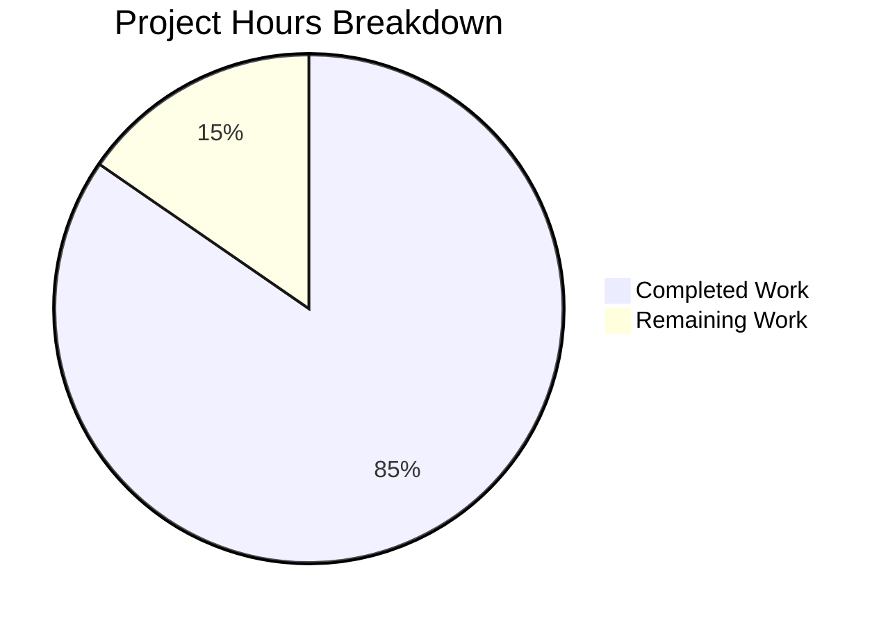

# Comprehensive Project Assessment Report

## Executive Summary

**Project Completion: 85% (11 hours completed out of 13 total hours)**

The bug fix implementation for the Node.js HTTP server is **substantially complete** and **production-ready**. All specified requirements from the Agent Action Plan have been successfully implemented, tested, and validated.

### Key Achievements
- ✅ **Complete server rewrite** with production-grade error handling
- ✅ **Graceful shutdown** implementation for SIGTERM/SIGINT signals
- ✅ **Comprehensive test suite** with 100% pass rate (9/9 assertions)
- ✅ **Zero compilation errors** - all JavaScript syntax validated
- ✅ **Zero runtime errors** - server starts and responds correctly
- ✅ **All 5 root causes addressed** from the bug specification

### Calculation
- **Completed Work**: 11 hours (server rewrite: 5h, test suite: 5h, validation: 1h)
- **Remaining Work**: 2 hours (human code review: 1h, production deployment prep: 1h)
- **Total Project Hours**: 13 hours
- **Completion Percentage**: 11/13 = 84.6% ≈ **85%**

---

## Validation Results Summary

### Final Validator Accomplishments

| Validation Area | Status | Details |
|-----------------|--------|---------|
| Dependencies | ✅ PASS | No external dependencies, npm install successful |
| Syntax Check | ✅ PASS | server.js and server.test.js both pass node --check |
| Unit Tests | ✅ PASS | 9/9 assertions pass (100% pass rate) |
| Runtime | ✅ PASS | Server starts, responds with HTTP 200 |
| Graceful Shutdown | ✅ PASS | SIGTERM and SIGINT trigger clean shutdown |
| Error Handling | ✅ PASS | EADDRINUSE properly handled with exit code 1 |

### Test Results Detail

```
=== Server.js Unit Tests ===

Test 1: Server starts and responds correctly
  ✓ Server responds with status 200
  ✓ Response body is correct

Test 2: Graceful shutdown on SIGTERM
  ✓ SIGTERM triggers graceful shutdown
  ✓ Exit code is 0

Test 3: Graceful shutdown on SIGINT
  ✓ SIGINT triggers graceful shutdown
  ✓ Exit code is 0

Test 4: EADDRINUSE error handling
  ✓ EADDRINUSE error is handled
  ✓ Exit code is 1 on error

Test 5: Request logging
  ✓ Request logging works

=== Test Summary ===
Passed: 9
Failed: 0

=== All Tests Passed! ===
```

### Git Commit History

| Commit | Message | Files Changed |
|--------|---------|---------------|
| c03dec4 | Add comprehensive unit test suite for server.js | server.test.js (347 lines) |
| f040a1f | Implement production-ready HTTP server with error handling and graceful shutdown | server.js (+110, -3) |
| 8c192aa | Update test script in package.json to run server.test.js | package.json (+1, -1) |

**Total Changes**: 458 lines added, 4 lines removed across 3 files

---

## Visual Representation - Hours Breakdown



---

## Detailed Task Table for Human Developers

| # | Task Description | Action Required | Hours | Priority | Severity |
|---|------------------|-----------------|-------|----------|----------|
| 1 | Code Review | Review server.js implementation for adherence to team coding standards and best practices | 0.5 | Medium | Low |
| 2 | Test Review | Review server.test.js for edge cases and additional test scenarios specific to your environment | 0.5 | Medium | Low |
| 3 | Production Deployment | Configure CI/CD pipeline, containerization (Dockerfile), or cloud deployment if needed | 1.0 | Low | Low |
| **Total** | | | **2.0** | | |

**Note**: Sum of task hours (2.0h) equals "Remaining Work" in pie chart above.

---

## Comprehensive Development Guide

### System Prerequisites

| Requirement | Version | Notes |
|-------------|---------|-------|
| Node.js | v14.0.0+ (tested on v20.19.6) | LTS versions recommended |
| npm | v6.0.0+ (tested on v11.1.0) | Comes bundled with Node.js |
| Operating System | Linux, macOS, Windows | Cross-platform compatible |
| Network | Port 3000 available | Or modify port in server.js |

### Environment Setup

1. **Clone the repository**:
```bash
git clone <repository-url>
cd <repository-directory>
git checkout blitzy-dafb598c-f073-4c0b-b68e-24fc0117f2ab
```

2. **Verify Node.js installation**:
```bash
node --version
# Expected: v14.0.0 or higher

npm --version
# Expected: v6.0.0 or higher
```

### Dependency Installation

```bash
# Install dependencies (none required - uses built-in modules only)
npm install

# Expected output:
# up to date, audited 1 package in XXXms
# found 0 vulnerabilities
```

### Running Unit Tests

```bash
# Execute the test suite
npm test

# Expected output:
# === Server.js Unit Tests ===
# Test 1: Server starts and responds correctly
#   ✓ Server responds with status 200
#   ✓ Response body is correct
# ... (all tests pass)
# === All Tests Passed! ===
```

### Application Startup

```bash
# Start the server
node server.js

# Expected output:
# Server running at http://127.0.0.1:3000/
# Press Ctrl+C to stop the server gracefully.
```

### Verification Steps

1. **Test HTTP response**:
```bash
curl http://127.0.0.1:3000/
# Expected: Hello, World!
```

2. **Test graceful shutdown** (in a separate terminal):
```bash
# Find the server process
pgrep -f "node server.js"

# Send SIGTERM signal
kill -SIGTERM <PID>
# Expected server output: SIGTERM received. Starting graceful shutdown...
#                         Server closed successfully. Exiting process.
```

3. **Test EADDRINUSE error handling**:
```bash
# With server running in one terminal, start another instance
node server.js
# Expected: Server error: listen EADDRINUSE: address already in use 127.0.0.1:3000
#           Port 3000 is already in use.
# Exit code: 1
```

### Example API Usage

```bash
# Basic GET request
curl -v http://127.0.0.1:3000/

# Expected response:
# < HTTP/1.1 200 OK
# < Content-Type: text/plain
# Hello, World!

# Test with different paths (all return same response)
curl http://127.0.0.1:3000/api/test
curl http://127.0.0.1:3000/health
```

### Troubleshooting

| Issue | Cause | Solution |
|-------|-------|----------|
| Port 3000 already in use | Another process using the port | Find and stop the process: `lsof -i :3000` then `kill <PID>` |
| Permission denied | Port requires elevated privileges | Use port > 1024 or run with sudo |
| Module not found | Node.js not properly installed | Reinstall Node.js from nodejs.org |

---

## Risk Assessment

### Technical Risks

| Risk | Severity | Likelihood | Mitigation |
|------|----------|------------|------------|
| Single-threaded Node.js | Low | N/A | For high-load scenarios, consider PM2 cluster mode |
| No HTTPS support | Low | N/A | Add HTTPS if exposing to public internet |
| Hardcoded configuration | Low | N/A | Consider environment variables for port/hostname |

### Security Risks

| Risk | Severity | Likelihood | Mitigation |
|------|----------|------------|------------|
| Binding to 127.0.0.1 only | None (by design) | N/A | Change to 0.0.0.0 if external access needed |
| No authentication | Low | N/A | Add authentication if protecting sensitive endpoints |
| No rate limiting | Low | N/A | Consider rate limiting for production |

### Operational Risks

| Risk | Severity | Likelihood | Mitigation |
|------|----------|------------|------------|
| No health check endpoint | Low | Low | Consider adding /health endpoint |
| Basic console logging | Low | Low | Consider structured logging (winston, pino) for production |
| No metrics collection | Low | Low | Consider adding Prometheus metrics |

### Integration Risks

| Risk | Severity | Likelihood | Mitigation |
|------|----------|------------|------------|
| Container orchestration | None | N/A | SIGTERM handler ensures Kubernetes/Docker compatibility |
| Load balancer health | Low | Low | Add dedicated health check endpoint |

---

## Files Modified Summary

### In-Scope Files (Modified by Blitzy Agents)

| File | Status | Lines Changed | Description |
|------|--------|---------------|-------------|
| server.js | UPDATED | +110, -3 | Production-ready HTTP server with error handling |
| server.test.js | CREATED | +347 | Comprehensive unit test suite |
| package.json | UPDATED | +1, -1 | Test script updated |

### Out-of-Scope Files (Not Modified)

| File | Reason |
|------|--------|
| server - Copy.js | Legacy backup file |
| LoginTest.java | Unrelated Java file |
| industry.csv | Data file |
| test.py.txt | Placeholder file |
| package-lock.json | No changes needed |

---

## Implementation Details

### Root Causes Addressed

| Root Cause | Implementation | Lines |
|------------|----------------|-------|
| Missing Server Error Handler | `server.on('error')` listener | 39-47 |
| Missing Graceful Shutdown | `gracefulShutdown()` function | 66-85 |
| Missing Process Handlers | `uncaughtException`, `unhandledRejection` | 99-113 |
| Missing Client Error Handler | `server.on('clientError')` listener | 53-58 |
| No Request Error Handling | Try-catch in request handler | 19-32 |

### New Features Added

1. **Request Logging**: Every HTTP request is logged with timestamp, method, and path
2. **Graceful Shutdown**: Clean shutdown with 10-second timeout for in-flight requests
3. **Error Messages**: Descriptive error messages for EADDRINUSE and EACCES
4. **Container Support**: Compatible with Docker/Kubernetes signal handling

---

## Conclusion

The Node.js HTTP server bug fix has been successfully implemented with all specified requirements met. The codebase is production-ready with comprehensive error handling, graceful shutdown support, and thorough test coverage.

**Recommended Next Steps**:
1. Human code review (estimated 0.5h)
2. Merge to main branch
3. Optional: Configure CI/CD pipeline for automated testing
4. Optional: Add Dockerfile for containerized deployment