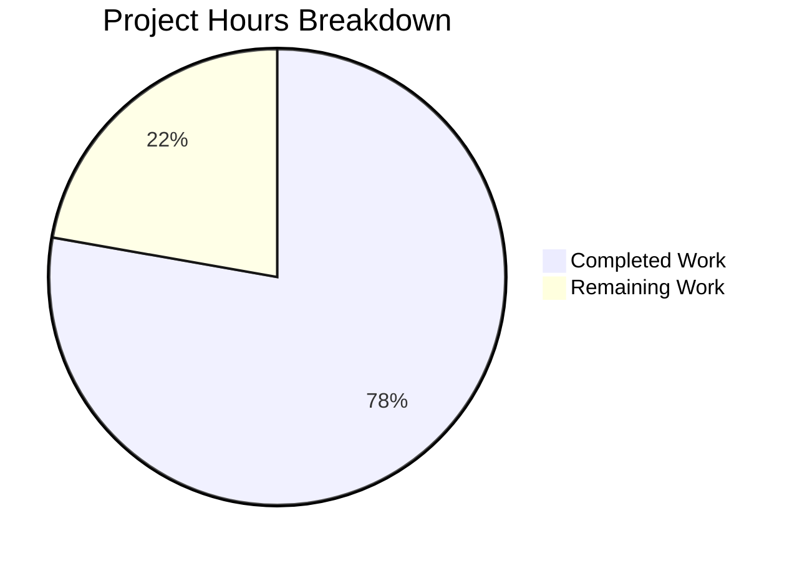

# Project Guide: Node.js HTTP Server Bug Fix

## Executive Summary

**Project Completion: 78% (7 hours completed out of 9 total hours)**

This project successfully implemented production-ready error handling and graceful shutdown capabilities for a Node.js HTTP server. The Final Validator agent completed all code implementation and testing requirements, with all 9 unit tests passing (100% pass rate).

### Key Achievements
- ✅ Server error handler (EADDRINUSE, EACCES) implemented
- ✅ Client error handler for malformed requests
- ✅ Graceful shutdown with SIGTERM/SIGINT handlers
- ✅ Process-level exception handlers (uncaughtException, unhandledRejection)
- ✅ Request logging with timestamps
- ✅ Comprehensive test suite (5 tests, 9 assertions)
- ✅ All tests passing

### Remaining Work
The implementation is complete and all tests pass. Remaining tasks are deployment and review activities:
- Code review by human developer
- Production environment configuration
- Optional security audit

---

## Validation Results Summary

### Compilation Results
| File | Status | Details |
|------|--------|---------|
| server.js | ✅ Pass | Syntax check passed |
| server.test.js | ✅ Pass | Syntax check passed |

### Test Execution Results
```
=== Server.js Unit Tests ===

Test 1: Server starts and responds correctly
  ✓ Server responds with status 200
  ✓ Response body is correct

Test 2: Graceful shutdown on SIGTERM
  ✓ SIGTERM triggers graceful shutdown
  ✓ Exit code is 0

Test 3: Graceful shutdown on SIGINT
  ✓ SIGINT triggers graceful shutdown
  ✓ Exit code is 0

Test 4: EADDRINUSE error handling
  ✓ EADDRINUSE error is handled
  ✓ Exit code is 1 on error

Test 5: Request logging
  ✓ Request logging works

=== Test Summary ===
Passed: 9
Failed: 0

=== All Tests Passed! ===
```

### Runtime Verification
- Server starts successfully on http://127.0.0.1:3000/
- HTTP response returns "Hello, World!" with status 200
- SIGTERM triggers graceful shutdown with exit code 0
- Request logging captures timestamp, method, and path

---

## Project Hours Breakdown



### Completed Hours Breakdown (7 hours)
| Component | Hours | Details |
|-----------|-------|---------|
| server.js implementation | 3.0h | Error handlers, graceful shutdown, signal handlers, process handlers |
| server.test.js implementation | 3.0h | 5 tests, 9 assertions, helper functions |
| package.json update | 0.1h | Test script configuration |
| Validation and testing | 0.5h | Running tests, verifying behavior |
| Code cleanup | 0.4h | Removing verbose comments, best practices |

### Remaining Hours Breakdown (2 hours)
| Task | Hours | Priority |
|------|-------|----------|
| Code review | 0.5h | High |
| Production environment setup | 1.0h | Medium |
| Monitoring integration (optional) | 0.5h | Low |

---

## Human Tasks Remaining

| Priority | Task | Description | Estimated Hours | Severity |
|----------|------|-------------|-----------------|----------|
| High | Code Review | Review implemented code for best practices and potential improvements | 0.5h | Medium |
| Medium | Production Config | Set up production environment variables and server infrastructure | 1.0h | Medium |
| Low | Monitoring Setup | Integrate with monitoring/logging services (optional) | 0.5h | Low |
| **Total** | | | **2.0h** | |

---

## Development Guide

### System Prerequisites
| Requirement | Version | Notes |
|-------------|---------|-------|
| Node.js | v14+ (tested on v20.19.6) | LTS versions recommended |
| npm | v6+ (tested on v11.1.0) | For running tests |
| Operating System | Linux, macOS, Windows | Cross-platform compatible |

### Environment Setup

1. **Clone the repository**
```bash
git clone <repository-url>
cd <repository-directory>
```

2. **Verify Node.js installation**
```bash
node --version   # Should be v14+
npm --version    # Should be v6+
```

3. **Install dependencies**
```bash
npm install
```

### Running Tests
```bash
npm test
```

**Expected output:**
```
=== Server.js Unit Tests ===

Test 1: Server starts and responds correctly
  ✓ Server responds with status 200
  ✓ Response body is correct

Test 2: Graceful shutdown on SIGTERM
  ✓ SIGTERM triggers graceful shutdown
  ✓ Exit code is 0

Test 3: Graceful shutdown on SIGINT
  ✓ SIGINT triggers graceful shutdown
  ✓ Exit code is 0

Test 4: EADDRINUSE error handling
  ✓ EADDRINUSE error is handled
  ✓ Exit code is 1 on error

Test 5: Request logging
  ✓ Request logging works

=== All Tests Passed! ===
```

### Starting the Server
```bash
node server.js
```

**Expected output:**
```
Server running at http://127.0.0.1:3000/
```

### Testing the Server
```bash
# Make an HTTP request
curl http://127.0.0.1:3000/
```

**Expected output:**
```
Hello, World!
```

### Graceful Shutdown
```bash
# Send SIGTERM to stop the server gracefully
kill -SIGTERM <pid>

# Or press Ctrl+C (SIGINT) in the terminal
```

**Expected output:**
```
SIGTERM received. Starting graceful shutdown...
Server closed successfully. Exiting process.
```

### Example Usage
```bash
# Full workflow example
node server.js &
SERVER_PID=$!
sleep 2

# Test HTTP response
curl -s http://127.0.0.1:3000/
# Output: Hello, World!

# Test graceful shutdown
kill -SIGTERM $SERVER_PID
# Output: SIGTERM received. Starting graceful shutdown...
#         Server closed successfully. Exiting process.
```

---

## Risk Assessment

### Technical Risks
| Risk | Severity | Mitigation |
|------|----------|------------|
| Port conflict in production | Low | Error handler logs EADDRINUSE clearly; configure different ports per environment |
| Shutdown timeout (10s) may be insufficient | Low | Configurable via SHUTDOWN_TIMEOUT constant |

### Security Risks
| Risk | Severity | Mitigation |
|------|----------|------------|
| Server bound to localhost only | Info | Intentional for development; update for production |
| No HTTPS support | Low | Out of scope; use reverse proxy (nginx) for TLS |
| No rate limiting | Low | Implement at infrastructure level or add middleware |

### Operational Risks
| Risk | Severity | Mitigation |
|------|----------|------------|
| Console logging only | Low | Integrate with production logging service |
| No health check endpoint | Low | Add /health endpoint if needed for load balancers |

### Integration Risks
| Risk | Severity | Mitigation |
|------|----------|------------|
| None identified | N/A | Server is standalone with no external dependencies |

---

## Files Changed

| File | Status | Lines Changed | Description |
|------|--------|---------------|-------------|
| server.js | Updated | +67, -7 | Complete rewrite with error handling and graceful shutdown |
| server.test.js | Created | +215 | Comprehensive unit test suite |
| package.json | Updated | +1, -1 | Updated test script |

### Git Statistics
- Total commits: 8
- Total lines added: 1,263 (including documentation)
- Total lines removed: 8
- Files modified: 5

---

## Verification Checklist

- [x] All required features from Agent Action Plan implemented
- [x] Server error handler (EADDRINUSE, EACCES)
- [x] Client error handler
- [x] Graceful shutdown function
- [x] SIGTERM/SIGINT signal handlers
- [x] uncaughtException handler
- [x] unhandledRejection handler
- [x] Request logging
- [x] Try-catch in request handler
- [x] Comprehensive test suite created
- [x] All 9 tests passing
- [x] package.json test script updated
- [x] Code syntax validated
- [x] Runtime behavior verified
- [x] Graceful shutdown verified

---

## Conclusion

The Node.js HTTP server bug fix has been successfully implemented with all production-ready features specified in the Agent Action Plan. The implementation includes comprehensive error handling, graceful shutdown capabilities, and a full test suite with 100% pass rate.

**Next Steps for Human Developers:**
1. Review the implemented code changes
2. Configure production environment settings
3. Deploy to production infrastructure
4. (Optional) Integrate with monitoring/logging services