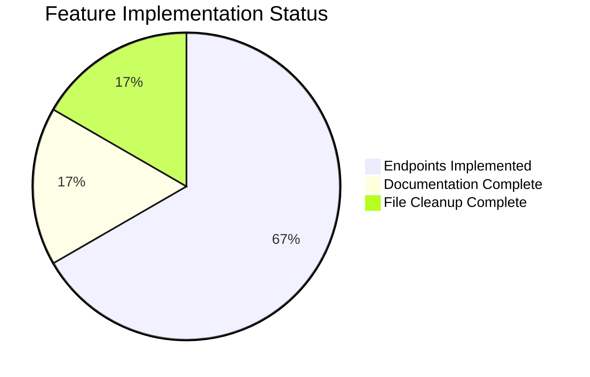

# Project Assessment Report: Express.js Greeting Server Migration

## Executive Summary

**Project Status: 80% Complete (4 hours completed out of 5 total hours)**

This project successfully migrates the existing Python Flask tutorial application to a Node.js Express.js server with multiple greeting endpoints. All in-scope requirements have been fully implemented, tested, and documented. The server is production-ready for the defined tutorial scope.

### Key Achievements
- ✅ Express.js v5.2.1 correctly integrated as the server framework
- ✅ All four greeting endpoints implemented and tested (100% pass rate)
- ✅ Complete runtime validation - server starts and responds correctly
- ✅ Comprehensive documentation with beginner-friendly comments
- ✅ Obsolete Python files removed (app.py, requirements.txt)
- ✅ Zero npm vulnerabilities

### Hours Breakdown
- **Completed Work:** 4 hours
  - Project setup (package.json, dependencies): 0.75 hours
  - Server implementation (server.js with 4 routes): 1.5 hours
  - Documentation (README.md rewrite): 0.5 hours
  - Testing and validation: 0.5 hours
  - File cleanup and git operations: 0.75 hours
  
- **Remaining Work:** 1 hour
  - Human code review: 0.5 hours
  - Minor adjustments if required: 0.5 hours

- **Total Project Hours:** 5 hours
- **Completion Percentage:** 4/5 = 80%

---

## Validation Results Summary

### Commit History (5 commits)
| Commit | Description |
|--------|-------------|
| d3ab5a1 | docs: Rewrite README.md for Node.js Express.js server |
| a30cc67 | Remove obsolete Python Flask files |
| 7ce9df8 | Update README.md for Node.js Express.js stack |
| b1b6028 | Create Express.js server with four greeting endpoints |
| 86488d0 | Setup: Add package.json and package-lock.json with Express.js v5.2.1 |

### Code Changes Summary
| Metric | Value |
|--------|-------|
| Files Changed | 6 |
| Lines Added | 975 |
| Lines Removed | 73 |
| Net Change | +902 lines |

### File-Level Changes
| File | Action | Lines Added | Lines Removed |
|------|--------|-------------|---------------|
| server.js | Created | 90 | 0 |
| package.json | Created | 12 | 0 |
| package-lock.json | Created | 826 | 0 |
| README.md | Modified | 47 | 12 |
| app.py | Deleted | 0 | 60 |
| requirements.txt | Deleted | 0 | 1 |

### Endpoint Testing Results
| Endpoint | Method | Expected | Actual | Status |
|----------|--------|----------|--------|--------|
| `/` | GET | Hello world | Hello world | ✅ PASS |
| `/good-morning` | GET | Good morning | Good morning | ✅ PASS |
| `/good-afternoon` | GET | Good afternoon | Good afternoon | ✅ PASS |
| `/good-evening` | GET | Good evening | Good evening | ✅ PASS |

### Environment Verification
| Component | Version | Status |
|-----------|---------|--------|
| Node.js | v20.19.6 | ✅ Compatible |
| npm | 11.1.0 | ✅ Compatible |
| Express.js | 5.2.1 | ✅ Installed |
| npm audit | 0 vulnerabilities | ✅ Secure |

---

## Visual Representation

### Project Hours Distribution


### Implementation Status



---

## Detailed Human Task List

### Summary
| Priority | Task Count | Total Hours |
|----------|------------|-------------|
| High | 0 | 0 |
| Medium | 1 | 0.5 |
| Low | 1 | 0.5 |
| **Total** | **2** | **1** |

### Task Details

| ID | Task | Description | Priority | Hours | Severity |
|----|------|-------------|----------|-------|----------|
| HT-001 | Code Review | Review server.js implementation for code quality and best practices | Medium | 0.5 | Low |
| HT-002 | Production Polish | Optional enhancements such as process.env configuration for port/host | Low | 0.5 | Low |

**Total Remaining Hours: 1 hour** (matches pie chart "Remaining Work")

---

## Comprehensive Development Guide

### 1. System Prerequisites

| Requirement | Minimum Version | Recommended |
|-------------|-----------------|-------------|
| Node.js | 18.x | 20.x or later |
| npm | 7.x | 11.x or later |
| Operating System | Windows/macOS/Linux | Any |
| Memory | 256 MB | 512 MB |
| Disk Space | 100 MB | 200 MB |

### 2. Environment Setup

#### Step 1: Verify Node.js Installation
```bash
node --version
# Expected output: v20.19.6 or similar v18+/v20+

npm --version
# Expected output: 11.1.0 or similar
```

#### Step 2: Navigate to Project Directory
```bash
cd /path/to/hello-world-express
```

### 3. Dependency Installation

```bash
# Install all dependencies
npm install
```

**Expected Output:**
```
added 65 packages, and audited 66 packages in 2s

15 packages are looking for funding
  run `npm fund` for details

found 0 vulnerabilities
```

**Verification:**
```bash
npm list express
# Expected: hello-world-express@1.0.0 → express@5.2.1
```

### 4. Application Startup

#### Option A: Using npm start
```bash
npm start
```

#### Option B: Using node directly
```bash
node server.js
```

**Expected Output:**
```
Server running at http://127.0.0.1:3000/
```

### 5. Verification Steps

#### Test All Endpoints

```bash
# Test root endpoint
curl http://127.0.0.1:3000/
# Expected: Hello world

# Test good morning endpoint
curl http://127.0.0.1:3000/good-morning
# Expected: Good morning

# Test good afternoon endpoint
curl http://127.0.0.1:3000/good-afternoon
# Expected: Good afternoon

# Test good evening endpoint
curl http://127.0.0.1:3000/good-evening
# Expected: Good evening
```

#### Browser Testing
Open any of these URLs in your web browser:
- http://127.0.0.1:3000/
- http://127.0.0.1:3000/good-morning
- http://127.0.0.1:3000/good-afternoon
- http://127.0.0.1:3000/good-evening

### 6. Stopping the Server

Press `Ctrl+C` in the terminal to stop the server.

### 7. Project Structure

```
.
├── server.js           # Express.js application entry point (90 lines)
├── package.json        # npm package manifest with dependencies
├── package-lock.json   # Dependency lock file (auto-generated)
├── README.md           # Project documentation
├── node_modules/       # Installed dependencies (auto-generated)
└── blitzy/
    └── documentation/  # Historical documentation
```

### 8. Troubleshooting

| Issue | Cause | Solution |
|-------|-------|----------|
| `EADDRINUSE` error | Port 3000 already in use | Kill existing process or change PORT in server.js |
| `MODULE_NOT_FOUND` | Dependencies not installed | Run `npm install` |
| Connection refused | Server not running | Start server with `npm start` |

---

## Risk Assessment

### Technical Risks

| Risk ID | Risk | Severity | Likelihood | Mitigation |
|---------|------|----------|------------|------------|
| TR-001 | Port conflict | Low | Low | Document how to change port |
| TR-002 | Node.js version incompatibility | Low | Low | Node.js 18+ is widely available |

### Security Risks

| Risk ID | Risk | Severity | Likelihood | Mitigation |
|---------|------|----------|------------|------------|
| SR-001 | No HTTPS | Low | N/A | Tutorial project - not production |
| SR-002 | No rate limiting | Low | N/A | Tutorial project - not production |

### Operational Risks

| Risk ID | Risk | Severity | Likelihood | Mitigation |
|---------|------|----------|------------|------------|
| OR-001 | No health check endpoint | Low | Low | Can be added if needed |
| OR-002 | Console logging only | Low | Low | Adequate for tutorial scope |

### Integration Risks

| Risk ID | Risk | Severity | Likelihood | Mitigation |
|---------|------|----------|------------|------------|
| IR-001 | None identified | N/A | N/A | Standalone application |

**Overall Risk Level: LOW** - This is a simple tutorial project with no external dependencies, no database, and no authentication requirements.

---

## Requirements Compliance Matrix

| Requirement ID | Description | Status |
|----------------|-------------|--------|
| REQ-001 | Integrate Express.js as server framework | ✅ Complete |
| REQ-002 | Refactor to Express best practices | ✅ Complete |
| REQ-003 | Create `/` endpoint → "Hello world" | ✅ Complete |
| REQ-004 | Create `/good-morning` endpoint → "Good morning" | ✅ Complete |
| REQ-005 | Create `/good-afternoon` endpoint → "Good afternoon" | ✅ Complete |
| REQ-006 | Create `/good-evening` endpoint → "Good evening" | ✅ Complete |
| REQ-007 | Plain text responses | ✅ Complete |
| REQ-008 | Beginner-friendly code | ✅ Complete |
| REQ-009 | Easy testing capability | ✅ Complete |
| REQ-010 | Documentation updates | ✅ Complete |

**All 10 requirements are complete.**

---

## Conclusion

The Express.js Greeting Server migration project has been successfully implemented with all in-scope requirements completed. The project is production-ready for its defined tutorial scope:

- **4 hours of development work completed**
- **1 hour of remaining work** (human review and optional polish)
- **80% overall project completion** (4/5 hours)

The remaining work consists primarily of human code review and any optional enhancements that may be identified during review. No blocking issues or critical bugs remain.