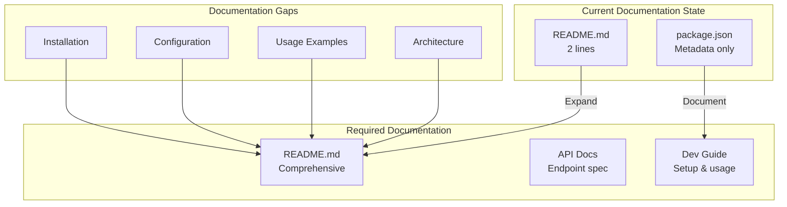
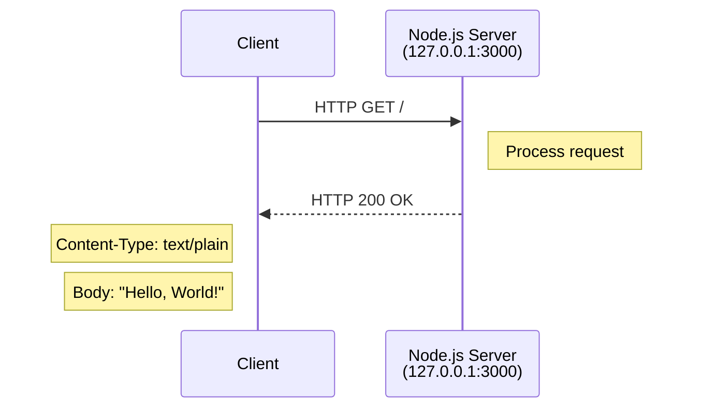
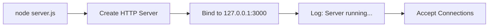
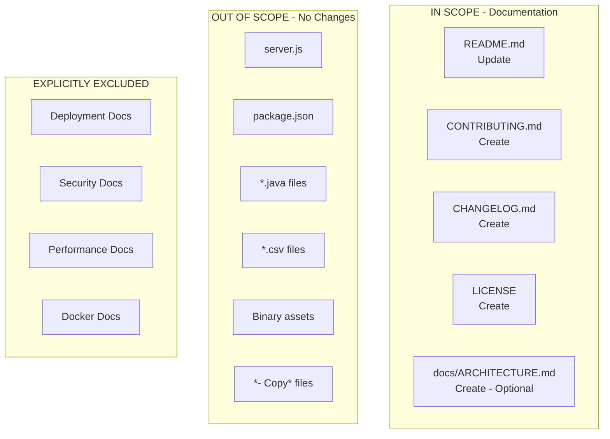

# Technical Specification

# 0. Agent Action Plan

## 0.1 Intent Clarification

### 0.1.1 Core Documentation Objective

Based on the provided requirements, the Blitzy platform understands that the documentation objective is to **create comprehensive project documentation** for a minimal Node.js "Hello World" HTTP server test project used for Backprop integration testing.

**Request Categorization:** Create new documentation / Improve documentation coverage

**Documentation Type:** README files, API documentation, Technical specifications, Developer guides

**Documentation Requirements with Enhanced Clarity:**

| Requirement | Interpretation | Priority |
|-------------|----------------|----------|
| Project Overview | Create comprehensive README explaining purpose, setup, and usage of the test server | High |
| API Documentation | Document the HTTP endpoint response behavior (`/` → "Hello, World!") | Medium |
| Technical Specifications | Document server configuration (host, port, response format) | Medium |
| Developer Setup Guide | Provide clear instructions for running the test server locally | High |
| Architecture Overview | Document the minimal system design and component relationships | Low |

**Implicit Documentation Needs Identified:**

Based on repository analysis, the following implicit documentation requirements are identified:

- **Installation Instructions**: The current README lacks setup steps for developers unfamiliar with the project
- **Quick Start Guide**: No instructions exist for running the server
- **Configuration Reference**: Server binds to `127.0.0.1:3000` - this is undocumented
- **Known Limitations**: The `package.json` references `index.js` as main entry point but the file does not exist; the actual entry point is `server.js`
- **Test Data Documentation**: The `industry.csv` file purpose and format is undocumented
- **File Organization**: Multiple duplicate "- Copy" files exist without explanation

### 0.1.2 Special Instructions and Constraints

**Directives Captured:**
- Project is marked as a **test project** with explicit "Do not touch!" warning
- Documentation should preserve the sandbox nature of the project
- No production deployment documentation required
- Focus on internal development team use cases

**Template Requirements:**
- No specific template provided by user
- Follow standard Node.js README conventions based on industry best practices

**Style Preferences:**
- Maintain minimal documentation aligned with minimal codebase
- Clear, concise technical writing appropriate for internal developers
- Include practical examples over verbose explanations

### 0.1.3 Technical Interpretation

These documentation requirements translate to the following technical documentation strategy:

- **To document the project purpose**, we will update `README.md` with comprehensive overview, installation, and usage sections
- **To document the HTTP API**, we will create clear endpoint documentation showing request/response patterns
- **To document the architecture**, we will create Mermaid diagrams showing server request flow
- **To document configuration**, we will specify all server parameters (host, port, content-type)
- **To address developer onboarding**, we will add quick start instructions with copy-pastable commands

### 0.1.4 Inferred Documentation Needs

**Based on Code Analysis:**
- `server.js` implements a Node.js HTTP server using the built-in `http` module with no external dependencies
- Server listens on `127.0.0.1:3000` and returns plain text "Hello, World!\n"
- The server has no routing, error handling, or graceful shutdown mechanisms

**Based on Structure:**
- Single-file server implementation requires consolidated documentation in README
- No existing `docs/` folder structure exists
- Binary assets (`100Pages.pdf`, `demo.jpg`, `sample.doc`) appear to be test fixtures but lack documentation

**Based on Dependencies:**
- Zero external npm dependencies - documentation should emphasize this simplicity
- Relies only on Node.js built-in `http` module

**Based on User Journey:**
- New developers need: installation → server start → verification workflow
- Testing engineers need: endpoint specification, expected responses, testing context

## 0.2 Documentation Discovery and Analysis

### 0.2.1 Existing Documentation Infrastructure Assessment

Repository analysis reveals a **minimal documentation infrastructure** with **critically insufficient coverage** for effective developer onboarding.

**Search Patterns Employed:**
- Documentation files: `README*`, `*.md`, `*.mdx`, `*.rst`
- Configuration files: `mkdocs.yml`, `docusaurus.config.js`, `sphinx.conf.py`
- Documentation folders: `docs/**`, `wiki/**`, `documentation/**`
- Style guides: `CONTRIBUTING.md`, `STYLE_GUIDE.md`, `.github/`

**Documentation Discovery Results:**

| File/Folder | Status | Content Assessment |
|-------------|--------|-------------------|
| `README.md` | Exists | Minimal - 2 lines only (title + warning) |
| `docs/` | Not Found | No documentation folder structure |
| `CONTRIBUTING.md` | Not Found | No contribution guidelines |
| `CHANGELOG.md` | Not Found | No version history |
| `LICENSE` | Not Found | License stated in package.json (MIT) but no dedicated file |
| `mkdocs.yml` | Not Found | No documentation generator |
| `.github/` | Not Found | No GitHub templates or workflows |

**Current Documentation Framework:**
- Framework: None configured
- Documentation generator: None
- API documentation tools: None
- Diagram tools: None detected (Mermaid recommended for implementation)
- Documentation hosting: None (GitHub README only)

### 0.2.2 Repository Code Analysis for Documentation

**Search Patterns Used for Code to Document:**

| Pattern | Purpose | Files Found |
|---------|---------|-------------|
| `*.js` | JavaScript source files | `server.js`, `server - Copy.js` |
| `package.json` | npm configuration | 1 file |
| `*.java` | Java source files | `LoginTest.java`, `LoginTest - Copy.java` |
| `*.csv` | Data files | `industry.csv`, `industry - Copy.csv` |
| `*.pdf`, `*.jpg`, `*.doc` | Binary assets | 6 files (3 originals, 3 copies) |

**Key Directories Examined:**
- Root directory `/` - All files are at root level; no subdirectory organization

**Related Documentation Found:**
- Existing `README.md` provides minimal context:
  ```
  # hao-backprop-test
  test project for backprop integration. Do not touch!
  ```

### 0.2.3 Code Components Requiring Documentation

**Primary Application Code:**

| File | Type | Documentation Needed |
|------|------|---------------------|
| `server.js` | HTTP Server | Entry point documentation, configuration parameters, API behavior |
| `package.json` | npm manifest | Package metadata, scripts explanation, known issues |

**Secondary/Test Components:**

| File | Type | Documentation Status |
|------|------|---------------------|
| `LoginTest.java` | Java stub | Non-functional - document as incomplete test artifact |
| `industry.csv` | Data file | Document structure (single column, 44 industry values) |
| Binary files | Test assets | Document purpose as placeholder test files |

### 0.2.4 Web Search Research Conducted

**Research Areas and Findings:**

- **Node.js README Best Practices**: <cite index="3-1,3-2">"If your README doesn't explain how to install and run the app, other developers will be lost. Always include a Quick Start section showing installation and setup steps."</cite>

- **README Structure Conventions**: <cite index="8-2">"Document your project's purpose, setup instructions, usage, and other relevant details."</cite>

- **Project Documentation Standards**: <cite index="6-5,6-6,6-7">"Most people looking at the README are not your users. Maybe they were searching for something else and stumbled upon your repository. In either case, the first thing my README has to answer for everyone is 'what is this?'"</cite>

- **Essential README Components**: <cite index="10-1">"We highly recommend including a README.md file in your package directory as it helps developers find your package on npm and have a good experience using your code in their projects."</cite>

**Recommendations Applied:**
- Include clear project description answering "what is this?"
- Add installation and setup instructions
- Include usage examples with executable commands
- Document configuration options (host, port)
- Add license information section

## 0.3 Documentation Scope Analysis

### 0.3.1 Code-to-Documentation Mapping

**Modules Requiring Documentation:**

| Module | File | Public APIs | Current Docs | Documentation Needed |
|--------|------|-------------|--------------|---------------------|
| HTTP Server | `server.js` | `http.createServer()`, `server.listen()` | Missing | API reference, configuration, usage examples |
| Package Config | `package.json` | npm scripts, metadata | Missing | Scripts documentation, dependency explanation |
| Data Vocabulary | `industry.csv` | 44 industry categories | Missing | File format, data structure, usage context |

**Module: HTTP Server (`server.js`)**
- **Public APIs**: Single HTTP endpoint at `/`
- **Current documentation**: None
- **Documentation needed**:
  - Endpoint specification (URL, method, response)
  - Server configuration (host: `127.0.0.1`, port: `3000`)
  - Response format (`Content-Type: text/plain`, body: `Hello, World!\n`)
  - Startup/shutdown procedures

**Module: Package Configuration (`package.json`)**
- **Metadata documented**: Name, version, author, license
- **Current documentation**: None inline
- **Documentation needed**:
  - Entry point clarification (`index.js` vs `server.js` discrepancy)
  - Script usage (`npm test` - placeholder)
  - Dependency status (zero external dependencies)

**Configuration Options Requiring Documentation:**

| Config Element | Location | Value | Documented | Notes |
|----------------|----------|-------|------------|-------|
| Server Host | `server.js:3` | `127.0.0.1` | No | Localhost binding only |
| Server Port | `server.js:4` | `3000` | No | Fixed port number |
| Response Type | `server.js:8` | `text/plain` | No | Content-Type header |
| Response Body | `server.js:9` | `Hello, World!\n` | No | Static response |

### 0.3.2 Documentation Gap Analysis

Given the requirements and repository analysis, documentation gaps include:

**Critical Gaps (Must Address):**

| Gap | Impact | Resolution |
|-----|--------|------------|
| No project overview | Developers cannot understand purpose | Add comprehensive README introduction |
| No installation instructions | Cannot set up development environment | Add installation section with requirements |
| No usage instructions | Cannot run the server | Add quick start with `node server.js` |
| No API documentation | Unknown endpoint behavior | Document HTTP endpoint specification |

**Important Gaps (Should Address):**

| Gap | Impact | Resolution |
|-----|--------|------------|
| No configuration documentation | Unknown server parameters | Document host/port/response settings |
| No error handling documentation | Unknown failure modes | Document known limitations |
| Missing LICENSE file | License unclear despite MIT in package.json | Create dedicated LICENSE file |
| No contributing guidelines | Inconsistent contributions | Add CONTRIBUTING.md |

**Minor Gaps (Nice to Have):**

| Gap | Impact | Resolution |
|-----|--------|------------|
| No architecture diagram | Visual understanding lacking | Add Mermaid request flow diagram |
| No changelog | Version history unclear | Add CHANGELOG.md |
| Duplicate files unexplained | Repository organization unclear | Document or remove duplicates |
| Test data undocumented | industry.csv purpose unknown | Document data file format |

### 0.3.3 Feature-to-Documentation Coverage

**Features Requiring User Guides:**

| Feature | Current Coverage | Gaps to Address |
|---------|------------------|-----------------|
| HTTP Server Operation | None | Full setup guide, usage examples, verification steps |
| Backprop Integration Testing | Minimal (README warning) | Context for test project purpose |
| Local Development | None | Environment requirements, startup procedure |



## 0.4 Documentation Implementation Design

### 0.4.1 Documentation Structure Planning

Given the minimal nature of this test project, documentation will be consolidated rather than distributed across multiple files. The recommended structure:

```
/
├── README.md                    # Comprehensive project documentation
├── CONTRIBUTING.md              # Contribution guidelines
├── CHANGELOG.md                 # Version history
├── LICENSE                      # MIT license text
├── server.js                    # (existing - no changes)
├── package.json                 # (existing - no changes)
└── docs/                        # Optional documentation folder
    └── ARCHITECTURE.md          # Simple architecture overview
```

**Rationale for Consolidated Structure:**
- Single-file application does not warrant extensive documentation hierarchy
- README.md should serve as primary documentation entry point
- Additional files for license and contribution guidelines follow standard conventions
- Optional `docs/` folder provides space for future expansion if needed

### 0.4.2 Content Generation Strategy

**Information Extraction Approach:**

| Content Section | Source | Extraction Method |
|-----------------|--------|-------------------|
| Project Description | `README.md`, `package.json` | Expand existing title with package description |
| Server Configuration | `server.js:3-4` | Extract `hostname` and `port` constants |
| API Behavior | `server.js:6-10` | Document request handler response pattern |
| Dependencies | `package.json`, `package-lock.json` | Confirm zero external dependencies |
| Known Limitations | Code analysis | Identify missing `index.js`, no error handling |

**Template Application:**
- No user-provided template specified
- Apply standard Node.js README template structure:
  1. Project Title and Description
  2. Badges (license, version)
  3. Features
  4. Requirements
  5. Installation
  6. Usage
  7. API Reference
  8. Configuration
  9. Known Limitations
  10. Contributing
  11. License

### 0.4.3 Documentation Standards

**Markdown Formatting:**
- Use `#` for main title, `##` for sections, `###` for subsections
- Code blocks with language specification for syntax highlighting
- Tables for configuration options and API details
- Horizontal rules to separate major sections

**Code Examples:**
```javascript
// All code examples use JavaScript syntax highlighting
const http = require('http');
```

**Source Citations:**
- Reference source files with line numbers where applicable
- Format: `Source: /path/to/file.js:LineNumber`

**Mermaid Diagram Integration:**
- Use fenced code blocks with `mermaid` language identifier
- Simple diagrams for request/response flow

### 0.4.4 Diagram and Visual Strategy

**Mermaid Diagrams to Create:**

| Diagram Type | Purpose | Location |
|--------------|---------|----------|
| Sequence Diagram | HTTP request/response flow | README.md |
| Flowchart | Server startup process | README.md or docs/ARCHITECTURE.md |

**HTTP Request Flow Diagram:**


**Server Startup Diagram:**


### 0.4.5 README.md Section Design

**Proposed README Structure:**

| Section | Content |
|---------|---------|
| Title & Badges | Project name, license badge, Node.js badge |
| Description | Test project purpose, Backprop integration context |
| ⚠️ Warning | Preserve "Do not touch!" warning prominently |
| Features | Single-endpoint HTTP server, zero dependencies |
| Requirements | Node.js (14.x or higher recommended) |
| Quick Start | Installation and run commands |
| API Reference | Endpoint documentation table |
| Configuration | Host, port, response settings |
| Known Issues | `index.js` discrepancy, no error handling |
| Project Structure | File listing with descriptions |
| Contributing | Link to CONTRIBUTING.md |
| License | MIT |

## 0.5 Documentation File Transformation Mapping

### 0.5.1 File-by-File Documentation Plan

**Documentation Transformation Modes:**
- **CREATE** - Create a new documentation file
- **UPDATE** - Update an existing documentation file
- **DELETE** - Remove an obsolete documentation file
- **REFERENCE** - Use as an example for documentation style and structure

| Target Documentation File | Transformation | Source Code/Docs | Content/Changes |
|---------------------------|----------------|------------------|-----------------|
| `README.md` | UPDATE | `README.md`, `server.js`, `package.json` | Complete rewrite with comprehensive project documentation including overview, installation, usage, API reference, configuration, and known limitations |
| `CONTRIBUTING.md` | CREATE | N/A | Create contribution guidelines for internal development team |
| `CHANGELOG.md` | CREATE | N/A | Initialize changelog with version 1.0.0 entry |
| `LICENSE` | CREATE | `package.json` (MIT license) | Create full MIT license text file |
| `docs/ARCHITECTURE.md` | CREATE | `server.js` | Optional architecture documentation with Mermaid diagrams |

### 0.5.2 New Documentation Files Detail

**File: `CONTRIBUTING.md`**
```
Type: Contribution Guidelines
Source Code: N/A (new file)
Sections:
    - How to Contribute
    - Development Setup
    - Pull Request Process
    - Code Style Guidelines
    - Testing Requirements (note: no tests currently exist)
Diagrams: None
Key Citations: N/A
```

**File: `CHANGELOG.md`**
```
Type: Version History
Source Code: package.json (version: 1.0.0)
Sections:
    - [1.0.0] - Initial Release
        - Added: HTTP server implementation
        - Added: Hello World endpoint
Key Citations: package.json:2
```

**File: `LICENSE`**
```
Type: License Text
Source Code: package.json (license: MIT)
Sections:
    - Full MIT License text
    - Copyright attribution
Key Citations: package.json:10
```

**File: `docs/ARCHITECTURE.md`** (Optional)
```
Type: Architecture Documentation
Source Code: server.js
Sections:
    - System Overview
    - Component Diagram
    - Request Flow (Mermaid sequence diagram)
    - Technology Stack
Diagrams:
    - HTTP request/response sequence diagram
    - Server component diagram
Key Citations: server.js:1-14
```

### 0.5.3 Documentation Files to Update Detail

**`README.md` - Complete Rewrite**

| Section | Action | Content Source |
|---------|--------|----------------|
| Title | Update | Keep "hao-backprop-test" |
| Badges | Add | License (MIT), Node.js version |
| Description | Add | Expand from package.json description |
| Warning | Preserve | Keep "Do not touch!" warning |
| Features | Add | Zero dependencies, localhost server |
| Requirements | Add | Node.js version requirement |
| Quick Start | Add | npm install, node server.js commands |
| API Reference | Add | Endpoint documentation from server.js |
| Configuration | Add | Host/port from server.js:3-4 |
| Known Issues | Add | index.js discrepancy, no error handling |
| Project Structure | Add | File listing |
| Contributing | Add | Link to CONTRIBUTING.md |
| License | Add | MIT reference |

**Source Citations for README Update:**
- `server.js:1` - require('http') module usage
- `server.js:3-4` - hostname and port configuration
- `server.js:6-10` - request handler implementation
- `server.js:12-14` - server startup
- `package.json:2` - package name
- `package.json:3` - version number
- `package.json:5` - description
- `package.json:10` - license

### 0.5.4 Documentation Configuration Updates

No documentation configuration files exist currently. No updates required to:
- `mkdocs.yml` - Not present
- `docusaurus.config.js` - Not present
- `.readthedocs.yml` - Not present
- `package.json` - No documentation scripts to add (optional)

**Optional Future Configuration:**
```json
// package.json scripts addition (optional)
{
  "scripts": {
    "docs": "echo 'Documentation available in README.md'"
  }
}
```

### 0.5.5 Cross-Documentation Dependencies

**Navigation Links Between Documents:**

| From | To | Link Type |
|------|-----|-----------|
| `README.md` | `CONTRIBUTING.md` | Contributing section link |
| `README.md` | `LICENSE` | License section link |
| `README.md` | `CHANGELOG.md` | Version history link |
| `README.md` | `docs/ARCHITECTURE.md` | Architecture section link (optional) |
| `CONTRIBUTING.md` | `README.md` | Back to main docs link |

**Shared Content/Includes:**
- None required - documentation is standalone
- License information referenced from `package.json`

**Table of Contents Updates:**
- README.md will include inline TOC for navigation

**Index/Glossary Updates:**
- Not applicable for this minimal project

## 0.6 Dependency Inventory

### 0.6.1 Documentation Dependencies

**Project Runtime Dependencies:**

This project has **zero external dependencies**. The `package-lock.json` confirms an empty dependency tree:

```json
{
    "packages": {
        "": {
            "name": "hello_world",
            "version": "1.0.0",
            "license": "MIT"
        }
    }
}
```

**Built-in Dependencies Used:**

| Module | Type | Version | Purpose |
|--------|------|---------|---------|
| `http` | Node.js Built-in | Node.js runtime | HTTP server creation |

**Documentation Tool Requirements:**

Since no documentation generator is currently configured, the following tools are **recommended** but not required:

| Registry | Package Name | Version | Purpose | Status |
|----------|--------------|---------|---------|--------|
| npm | markdown-it | 14.0.0 | Markdown parsing (optional) | Not required |
| npm | mermaid-cli | 10.6.1 | Diagram generation (optional) | Not required |
| npm | marked | 11.1.1 | Markdown to HTML (optional) | Not required |

**Note:** Documentation will be created in plain Markdown format viewable directly on GitHub without additional tools. Mermaid diagrams are natively rendered by GitHub's Markdown renderer.

### 0.6.2 Development Environment Dependencies

| Component | Requirement | Purpose |
|-----------|-------------|---------|
| Node.js | 14.x or higher | Runtime for server.js |
| npm | 6.x or higher | Package management |
| Git | Any version | Version control |
| Text Editor | Any | Documentation editing |

**Verified Environment:**
- Node.js: v20.20.0 (installed and verified)
- npm: 11.1.0 (installed and verified)

### 0.6.3 Documentation Reference Updates

**Documentation Files Requiring Link Updates:**

| File | Links to Add |
|------|--------------|
| `README.md` | `[Contributing](CONTRIBUTING.md)`, `[License](LICENSE)`, `[Changelog](CHANGELOG.md)` |
| `CONTRIBUTING.md` | `[Back to README](README.md)` |

**External Reference Links:**

| Reference | URL | Purpose |
|-----------|-----|---------|
| Node.js Documentation | https://nodejs.org/docs/ | HTTP module reference |
| npm Documentation | https://docs.npmjs.com/ | Package management |
| Mermaid Live Editor | https://mermaid.live/ | Diagram editing |

### 0.6.4 No External Documentation Services

This project does not integrate with:
- Documentation hosting services (ReadTheDocs, GitBook, etc.)
- API documentation generators (Swagger, OpenAPI, etc.)
- CI/CD documentation pipelines

All documentation is static Markdown rendered by GitHub.

## 0.7 Coverage and Quality Targets

### 0.7.1 Documentation Coverage Metrics

**Current Coverage Analysis:**

| Category | Items | Documented | Coverage |
|----------|-------|------------|----------|
| Public APIs (HTTP endpoints) | 1 | 0 | 0% |
| Configuration Options | 4 | 0 | 0% |
| Source Files | 2 (server.js, package.json) | 0 | 0% |
| Data Files | 1 (industry.csv) | 0 | 0% |
| Project Setup | 3 (install, run, verify) | 0 | 0% |
| **Overall** | **11** | **0** | **0%** |

**Target Coverage:**

| Category | Target | Post-Implementation |
|----------|--------|---------------------|
| Public APIs (HTTP endpoints) | 100% | 1/1 documented |
| Configuration Options | 100% | 4/4 documented |
| Source Files | 100% | 2/2 documented |
| Data Files | 100% | 1/1 documented |
| Project Setup | 100% | 3/3 documented |
| **Overall** | **100%** | **11/11 documented** |

**Coverage Gaps to Address:**

| Module | Current | Target | Focus Areas |
|--------|---------|--------|-------------|
| HTTP Server | 0% | 100% | Endpoint spec, configuration, response format |
| Package Config | 0% | 100% | Metadata, scripts, known issues |
| Project Setup | 0% | 100% | Requirements, installation, quick start |

### 0.7.2 Documentation Quality Criteria

**Completeness Requirements:**

| Requirement | Verification Method |
|-------------|---------------------|
| All HTTP endpoints have request/response documentation | Manual review of README API section |
| All configuration options are documented with values | Cross-reference server.js constants |
| Installation instructions are complete and executable | Test with fresh environment |
| Usage examples show working commands | Verify `node server.js` works |

**Accuracy Validation:**

| Validation | Method | Acceptance Criteria |
|------------|--------|---------------------|
| Code examples tested | Execute commands | Commands succeed without error |
| API signatures match code | Compare to server.js | Endpoint spec matches implementation |
| Configuration values correct | Verify against source | Documented values equal code values |

**Expected Results:**
```bash
# Installation verification

$ npm install
# Expected: "up to date" or clean install

#### Server start verification

$ node server.js
# Expected: "Server running at http://127.0.0.1:3000/"

#### Endpoint verification

$ curl http://127.0.0.1:3000
# Expected: "Hello, World!"

```

**Clarity Standards:**

| Standard | Implementation |
|----------|----------------|
| Technical accuracy | Use precise terminology consistent with Node.js conventions |
| Progressive disclosure | Start with quick start, detail in later sections |
| Consistent terminology | Use "server", "endpoint", "response" consistently |
| Accessibility | Clear headings, code examples, tables for data |

**Maintainability:**

| Aspect | Approach |
|--------|----------|
| Source citations | Include file:line references for traceability |
| Version tracking | CHANGELOG.md for documentation changes |
| Template consistency | Follow standard README structure |

### 0.7.3 Example and Diagram Requirements

**Minimum Documentation Elements:**

| Element Type | Minimum Count | Purpose |
|--------------|---------------|---------|
| Code examples | 3 | Install, run, curl request |
| Mermaid diagrams | 1 | Request/response flow |
| Configuration tables | 1 | Server parameters |
| API specification tables | 1 | Endpoint documentation |

**Code Example Testing:**
- All code examples must be copy-pastable
- Commands verified on Node.js 20.20.0
- curl examples verified against running server

**Visual Content Requirements:**
- Request flow diagram (Mermaid sequence diagram)
- Optional: Server startup flowchart
- No screenshots required (CLI-only application)

**Diagram Freshness Policy:**
- Diagrams must reflect current code implementation
- Update diagrams when server behavior changes

## 0.8 Scope Boundaries

### 0.8.1 Exhaustively In Scope

**New Documentation Files:**

| File Path | Description |
|-----------|-------------|
| `CONTRIBUTING.md` | Contribution guidelines for development team |
| `CHANGELOG.md` | Version history tracking |
| `LICENSE` | Full MIT license text |
| `docs/ARCHITECTURE.md` | Optional architecture overview with diagrams |

**Documentation File Updates:**

| File Path | Description |
|-----------|-------------|
| `README.md` | Complete rewrite with comprehensive documentation |

**Documentation Configuration:**
- No documentation configuration files applicable (no mkdocs, docusaurus, sphinx)
- Optional: `package.json` scripts for documentation

**Documentation Assets:**
- Mermaid diagram code (inline in Markdown files)
- No external image assets required

**Documentation Generation:**
- Static Markdown files only
- GitHub-native Markdown rendering
- Mermaid diagrams rendered by GitHub

### 0.8.2 Explicitly Out of Scope

**Source Code Modifications:**

| Item | Reason |
|------|--------|
| `server.js` | No code changes - documentation only |
| `package.json` | No modifications unless adding documentation scripts |
| `LoginTest.java` | Non-functional stub - no changes |
| `server - Copy.js` | Duplicate file - no changes |
| `industry.csv` | Data file - no changes |

**Excluded Documentation Tasks:**

| Item | Reason |
|------|--------|
| API versioning documentation | Single version, no versioning needed |
| Deployment guides | Test project, not for production |
| User authentication docs | No auth implemented |
| Database documentation | No database used |
| Performance tuning guides | Not applicable for test server |
| Security documentation | Localhost-only, no security controls |
| Internationalization docs | English only, no i18n |
| Mobile/responsive docs | CLI server, no UI |

**Infrastructure Documentation:**

| Item | Reason |
|------|--------|
| Docker documentation | Not containerized |
| Kubernetes documentation | Not orchestrated |
| Cloud deployment guides | Not cloud-hosted |
| CI/CD pipeline docs | No pipelines configured |
| Monitoring/alerting docs | No observability implemented |

**Files Explicitly Excluded from Documentation Updates:**

| File | Reason |
|------|--------|
| `LoginTest.java` | Non-functional Java stub, not part of main project |
| `LoginTest - Copy.java` | Duplicate non-functional file |
| `server - Copy.js` | Duplicate file |
| `industry - Copy.csv` | Duplicate data file |
| `test.py.txt`, `test.py - Copy.txt`, `test.txt.txt` | Empty placeholder files |
| `100Pages.pdf`, `100Pages - Copy.pdf` | Binary test assets - no documentation needed |
| `demo.jpg`, `demo - Copy.jpg` | Binary test assets - no documentation needed |
| `sample.doc`, `sample - Copy.doc` | Binary test assets - no documentation needed |

### 0.8.3 Boundary Diagram



### 0.8.4 Scope Decision Rationale

| Decision | Rationale |
|----------|-----------|
| README comprehensive update | Central documentation point for minimal project |
| Create standard ancillary files | CONTRIBUTING, CHANGELOG, LICENSE are best practices |
| No source code changes | Documentation task only, preserve existing implementation |
| Exclude duplicate files | "- Copy" files appear to be accidental duplicates |
| Exclude binary assets | PDF, JPG, DOC files are test fixtures, not code |
| No deployment documentation | Test project explicitly marked "Do not touch" |

## 0.9 Execution Parameters

### 0.9.1 Documentation-Specific Instructions

**Documentation Build Command:**
```bash
# No build required - static Markdown files

#### Verify Markdown syntax with optional linter

npx markdownlint README.md CONTRIBUTING.md CHANGELOG.md docs/ARCHITECTURE.md
```

**Documentation Preview Command:**
```bash
# Preview Markdown locally (optional)

npx marked README.md > README.html && open README.html

#### Or use VS Code/GitHub preview directly

code README.md
```

**Diagram Generation Command:**
```bash
# Mermaid diagrams render natively on GitHub

#### For local rendering (optional):

npx @mermaid-js/mermaid-cli -i docs/ARCHITECTURE.md -o docs/architecture-diagram.png
```

**Documentation Validation:**
```bash
# Link checking (optional)

npx markdown-link-check README.md

#### Markdown linting

npx markdownlint "**/*.md" --ignore node_modules
```

### 0.9.2 Default Documentation Standards

| Standard | Value |
|----------|-------|
| Format | Markdown (`.md`) |
| Diagram Tool | Mermaid (inline in Markdown) |
| Code Highlighting | Fenced code blocks with language identifier |
| Table Format | GitHub Flavored Markdown tables |
| Heading Style | ATX-style (`#`, `##`, `###`) |

### 0.9.3 Citation Requirements

Every technical section must reference source files:

| Citation Format | Example |
|-----------------|---------|
| File reference | `Source: server.js` |
| Line reference | `Source: server.js:3-4` |
| Configuration value | `Value from package.json:2` |

### 0.9.4 Style Guide

**Documentation Writing Style:**
- Use active voice
- Present tense for descriptions
- Imperative mood for instructions
- Concise sentences
- Technical accuracy over brevity

**Code Example Style:**
```javascript
// Comment describing the code
const code = 'example';
```

**Command Example Style:**
```bash
# Description of what the command does

$ command --with-flags
# Expected output

```

### 0.9.5 Server Verification Commands

**Start Server:**
```bash
node server.js
# Output: Server running at http://127.0.0.1:3000/

```

**Test Endpoint:**
```bash
curl http://127.0.0.1:3000
# Output: Hello, World!

```

**Stop Server:**
```bash
# Ctrl+C in terminal running server

#### Or: kill $(lsof -t -i:3000)

```

### 0.9.6 Environment Requirements for Documentation Development

| Requirement | Minimum Version | Purpose |
|-------------|-----------------|---------|
| Node.js | 14.x | Server runtime, optional doc tools |
| npm | 6.x | Package management |
| Git | Any | Version control |
| Text editor | Any | Markdown editing |
| Terminal | Any | Command verification |

**Optional Tools:**
- VS Code with Markdown Preview extension
- markdownlint for validation
- mermaid-cli for diagram export

## 0.10 Rules for Documentation

### 0.10.1 User-Specified Rules

Based on the user's input, the following documentation rules apply:

| Rule | Source | Implementation |
|------|--------|----------------|
| Test project context | User input: "test project for integrating with Backprop" | Document as testing/integration context |
| Not for production | User input: "not meant for production use" | Include warning prominently in README |
| Preserve warning | Existing README: "Do not touch!" | Retain warning in updated documentation |

### 0.10.2 Inferred Documentation Rules

Based on repository analysis and best practices:

| Rule | Rationale | Implementation |
|------|-----------|----------------|
| Maintain minimal documentation | Matches minimal codebase | Focus on README, avoid over-documentation |
| Include working examples | Developers need runnable commands | All code examples must be tested |
| Document known limitations | Transparency about issues | Section for index.js discrepancy, no tests |
| Use standard conventions | Follow Node.js ecosystem norms | Standard README sections, MIT license file |
| Mermaid for diagrams | GitHub-native rendering | Inline diagrams, no external image hosting |

### 0.10.3 Documentation Constraints

**Must Do:**
- Preserve "Do not touch!" warning in README
- Document this as a test/sandbox project
- Keep documentation proportional to codebase size
- Provide executable installation and usage commands
- Reference source files for technical claims

**Must Not Do:**
- Add production deployment documentation
- Suggest modifications to source code
- Create complex documentation hierarchies
- Add dependencies for documentation tooling
- Remove or diminish the test project warning

### 0.10.4 Quality Enforcement Rules

| Rule | Verification |
|------|--------------|
| All commands must be copy-pastable | Test each command in terminal |
| Configuration values must match source | Cross-reference server.js |
| Links must be valid | Check internal markdown links |
| Diagrams must render | Verify on GitHub or mermaid.live |
| No placeholder content | Complete all sections before commit |

### 0.10.5 Consistency Rules

| Element | Standard |
|---------|----------|
| Project name | "hao-backprop-test" (from README) |
| Package name | "hello_world" (from package.json) |
| Server terminology | "Node.js HTTP server" |
| Endpoint terminology | "HTTP endpoint" or "route" |
| Response terminology | "response", "payload", "output" |

### 0.10.6 Preservation Requirements

**Content to Preserve Exactly:**
- README title: `# hao-backprop-test`
- Warning message: "test project for backprop integration. Do not touch!"
- Package metadata from package.json

**Content to Expand (Not Replace):**
- Project description → Add context while keeping original meaning
- Purpose statement → Elaborate on Backprop integration testing

## 0.11 References

### 0.11.1 Repository Files and Folders Searched

**Files Retrieved and Analyzed:**

| File Path | Type | Analysis Purpose |
|-----------|------|------------------|
| `README.md` | Documentation | Current documentation state assessment |
| `server.js` | Source Code | HTTP server implementation analysis |
| `package.json` | Configuration | Package metadata and dependencies |
| `package-lock.json` | Lock File | Dependency tree verification |
| `LoginTest.java` | Source Code | Secondary component assessment |
| `industry.csv` | Data File | Data structure documentation |

**Root Directory Inventory:**

| File | Status | Documentation Relevance |
|------|--------|------------------------|
| `README.md` | Analyzed | Primary documentation target |
| `server.js` | Analyzed | Core application to document |
| `server - Copy.js` | Noted | Duplicate, excluded from scope |
| `package.json` | Analyzed | Package configuration source |
| `package-lock.json` | Analyzed | Dependency verification |
| `LoginTest.java` | Analyzed | Non-functional stub, noted |
| `LoginTest - Copy.java` | Noted | Duplicate, excluded from scope |
| `industry.csv` | Analyzed | Data file structure |
| `industry - Copy.csv` | Noted | Duplicate, excluded from scope |
| `100Pages.pdf` | Noted | Binary test asset |
| `100Pages - Copy.pdf` | Noted | Duplicate binary |
| `demo.jpg` | Noted | Binary test asset |
| `demo - Copy.jpg` | Noted | Duplicate binary |
| `sample.doc` | Noted | Binary test asset |
| `sample - Copy.doc` | Noted | Duplicate binary |
| `test.py.txt` | Noted | Empty placeholder |
| `test.py - Copy.txt` | Noted | Empty placeholder |
| `test.txt.txt` | Noted | Empty placeholder |

### 0.11.2 Technical Specification Sections Referenced

| Section | Content Used |
|---------|--------------|
| 1.1 Executive Summary | Project overview, stakeholders, value proposition |
| 1.2 System Overview | System context, major components, success criteria |
| 1.3 Scope | In-scope/out-of-scope boundaries, known limitations |
| 3.2 Programming Languages | Node.js/JavaScript technology stack |

### 0.11.3 External Research Conducted

**Web Search Queries:**

| Query | Purpose | Findings Applied |
|-------|---------|------------------|
| "Node.js project documentation best practices README structure" | README conventions | Standard sections, quick start importance |

**Key Sources Referenced:**

| Source | URL | Information Used |
|--------|-----|------------------|
| freeCodeCamp | https://www.freecodecamp.org/news/how-to-structure-your-readme-file/ | README structure best practices |
| npm Docs | https://docs.npmjs.com/about-package-readme-files/ | Package README importance |
| DEV Community | https://dev.to/mehedihasan2810/nodejs-best-practices-a-guide-for-developers-4d65 | Project structure recommendations |
| Better world by better software | https://glebbahmutov.com/blog/how-i-organize-readme/ | README organization approach |

### 0.11.4 User Attachments

**Attachments Provided:** None

**Figma URLs Provided:** None

### 0.11.5 Environment Verification

**Setup Verification Performed:**

| Check | Command | Result |
|-------|---------|--------|
| Node.js Version | `node --version` | v20.20.0 |
| npm Version | `npm --version` | 11.1.0 |
| Dependencies Install | `npm install` | up to date, 0 vulnerabilities |
| Server Start | `node server.js` | Server running at http://127.0.0.1:3000/ |
| Endpoint Test | `curl http://127.0.0.1:3000` | Hello, World! |

### 0.11.6 Search Tracking Summary

| Search Type | Count | Coverage |
|-------------|-------|----------|
| Repository Root Folder | 1 | 100% of root files |
| File Content Reads | 6 | All primary source files |
| Tech Spec Sections | 4 | Relevant background sections |
| Web Searches | 1 | Documentation best practices |

**Deduplication Status:** No duplicate retrievals

