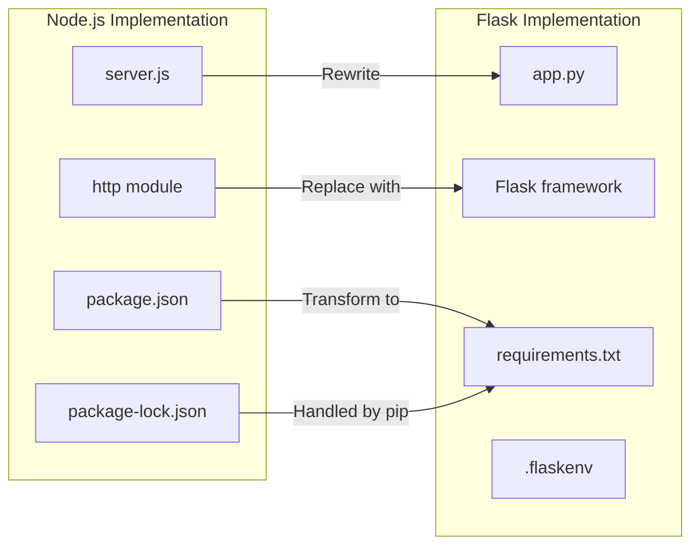
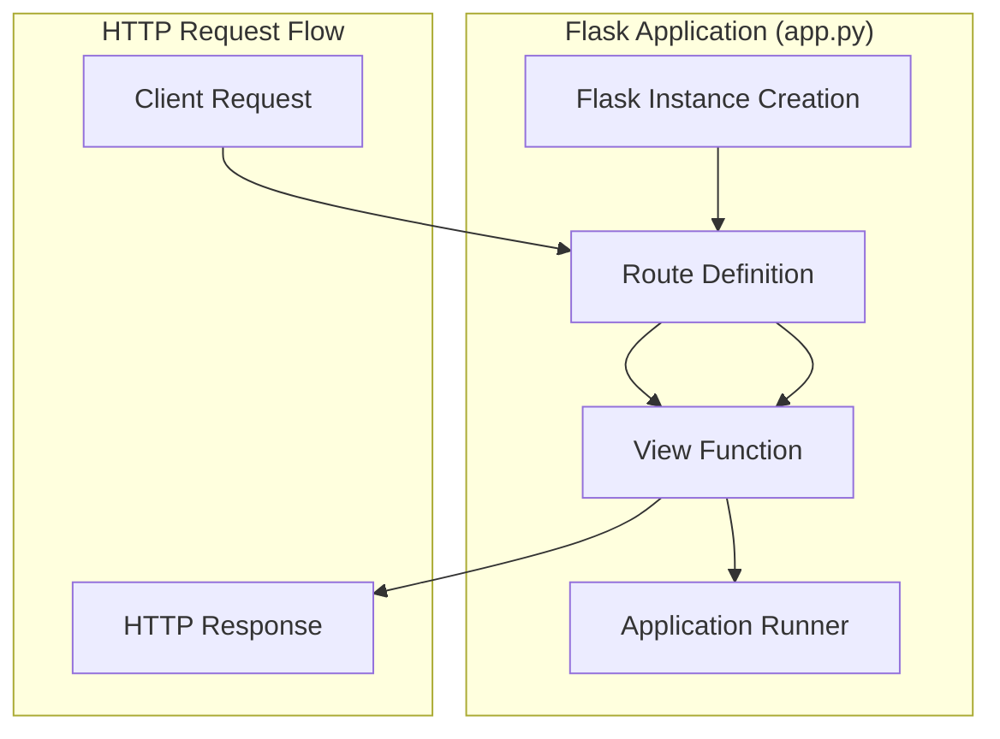
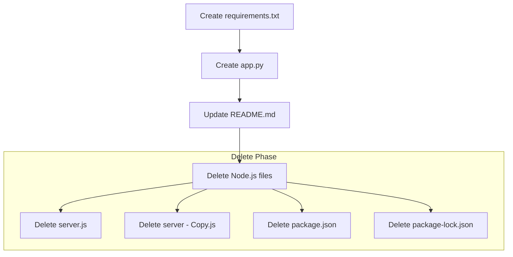

# Technical Specification

# 0. Agent Action Plan

## 0.1 Intent Clarification

### 0.1.1 Core Refactoring Objective

Based on the prompt, the Blitzy platform understands that the refactoring objective is to **completely rewrite an existing Node.js HTTP server into a Python 3 Flask application** while maintaining exact functional parity with the original implementation. This is a **tech stack migration** transformation where every feature, functionality, and behavior from the Node.js implementation must be faithfully reproduced in Python Flask.

| Attribute | Value |
|-----------|-------|
| **Refactoring Type** | Tech Stack Migration (Node.js → Python 3 Flask) |
| **Target Repository** | Same repository (in-place rewrite) |
| **Behavior Preservation** | Full functional parity required |
| **Source Framework** | Node.js native `http` module |
| **Target Framework** | Python 3 Flask |

**Specific Refactoring Goals:**

- Replace Node.js `http` module implementation with Flask-based HTTP server
- Migrate CommonJS JavaScript code to Python 3 syntax and conventions
- Preserve identical HTTP response behavior (status code, content-type, body)
- Maintain server startup logging functionality
- Create equivalent Python dependency management infrastructure
- Ensure the rewritten Flask application can serve as a drop-in replacement

**Implicit Requirements Identified:**

- Maintain API compatibility: Same endpoint behavior must be preserved
- Preserve response format: "Hello, World!\n" with `text/plain` content type
- Keep HTTP 200 status code for all requests
- Implement equivalent console logging on server startup
- Create proper Python project structure with `requirements.txt`
- Follow Python and Flask best practices and conventions

### 0.1.2 Special Instructions and Constraints

**Critical User Directive:**
> "keeping every feature and functionality exactly as in the original Node.js project"
> "Ensure the rewritten version fully matches the behavior and logic of the current implementation"

**Preservation Requirements:**

| Requirement | Original Behavior | Must Be Preserved |
|-------------|-------------------|-------------------|
| Response Body | `"Hello, World!\n"` | ✅ Exact string with newline |
| HTTP Status | 200 OK | ✅ Must return 200 |
| Content-Type | `text/plain` | ✅ Same MIME type |
| Endpoint Behavior | All paths respond identically | ✅ Catch-all routing |
| Startup Log | Server URL logged to console | ✅ Equivalent logging |

**Environment Variables Available:**
- `DB_HOST` - Database host (available but not currently used by source)
- `DB_HOST1` - Secondary database host (available but not currently used by source)

**Note:** The original Node.js server does not use database connections, so these environment variables remain available for future use but are not required for this migration.

### 0.1.3 Technical Interpretation

This refactoring translates to the following technical transformation strategy:

**Architecture Mapping:**



**Transformation Rules:**

| Source Concept | Target Implementation |
|----------------|----------------------|
| `require('http')` | `from flask import Flask` |
| `http.createServer(callback)` | `Flask(__name__)` with `@app.route()` decorator |
| `res.statusCode = 200` | Default Flask response (200) |
| `res.setHeader('Content-Type', 'text/plain')` | `Response(..., mimetype='text/plain')` or return tuple |
| `res.end('Hello, World!\n')` | `return 'Hello, World!\n'` |
| `server.listen(port, hostname)` | `app.run(host=hostname, port=port)` |
| `console.log()` | Built-in Flask startup message or custom logging |
| `package.json` dependencies | `requirements.txt` with Flask |

**Key Technology Decisions:**

- **Flask Version:** 3.1.2 (latest stable, requires Python ≥3.9)
- **Python Version:** 3.9+ (Flask 3.x requirement)
- **Routing Strategy:** Catch-all route to match original behavior (all paths return same response)
- **Response Handling:** Plain text response with explicit MIME type

## 0.2 Source Analysis

### 0.2.1 Comprehensive Source File Discovery

**Search Patterns Applied:**

The following source files were identified through systematic repository analysis:

| Pattern | Files Found | Relevance |
|---------|-------------|-----------|
| `*.js` | `server.js`, `server - Copy.js` | Primary application code |
| `package*.json` | `package.json`, `package-lock.json` | Dependency management |
| `*.md` | `README.md` | Documentation |
| `*.csv` | `industry.csv`, `industry - Copy.csv` | Static data files |
| `*.java` | `LoginTest.java`, `LoginTest - Copy.java` | Non-functional test stubs |
| `*.txt` | `test.py.txt`, `test.py - Copy.txt`, `test.txt.txt` | Empty placeholder files |

### 0.2.2 Current Structure Mapping

```
Current Repository Structure:
/
├── server.js                 (15 lines - Main HTTP server - TO BE REPLACED)
├── server - Copy.js          (15 lines - Duplicate of server.js - TO BE REMOVED)
├── package.json              (11 lines - npm metadata - TO BE REPLACED)
├── package-lock.json         (13 lines - npm lockfile - TO BE REMOVED)
├── README.md                 (2 lines - Project documentation - TO BE UPDATED)
├── industry.csv              (45 lines - Static data file - UNCHANGED)
├── industry - Copy.csv       (45 lines - Duplicate data file - OUT OF SCOPE)
├── LoginTest.java            (Non-functional Java stub - OUT OF SCOPE)
├── LoginTest - Copy.java     (Duplicate Java stub - OUT OF SCOPE)
├── test.py.txt               (Empty placeholder - OUT OF SCOPE)
├── test.py - Copy.txt        (Empty placeholder - OUT OF SCOPE)
└── test.txt.txt              (Empty placeholder - OUT OF SCOPE)
```

### 0.2.3 Source File Analysis

**Primary Source: server.js**

```javascript
const http = require('http');
const hostname = '127.0.0.1';
const port = 3000;
```

| Component | Value | Migration Action |
|-----------|-------|------------------|
| HTTP Module | Node.js built-in `http` | Replace with Flask |
| Hostname | `127.0.0.1` (localhost) | Preserve in Flask config |
| Port | `3000` | Preserve in Flask config |

**Server Behavior Analysis:**

| Feature | Implementation | Flask Equivalent |
|---------|----------------|------------------|
| Server Creation | `http.createServer(callback)` | `Flask(__name__)` |
| Request Handler | Arrow function `(req, res) => {...}` | Route decorator `@app.route()` |
| Status Code | `res.statusCode = 200` | Default or explicit in Response |
| Content-Type | `res.setHeader('Content-Type', 'text/plain')` | `mimetype='text/plain'` |
| Response Body | `res.end('Hello, World!\n')` | `return 'Hello, World!\n'` |
| Server Start | `server.listen(port, hostname, callback)` | `app.run(host, port)` |
| Startup Log | `console.log(...)` | Flask built-in or `print()` |

**Secondary Source: package.json**

| Field | Value | Migration Status |
|-------|-------|------------------|
| `name` | `hello_world` | Informational only |
| `version` | `1.0.0` | Informational only |
| `description` | "Hello world in Node.js" | Update in README |
| `main` | `index.js` (incorrect) | Not applicable to Python |
| `scripts.test` | Placeholder error exit | Create pytest setup |
| `author` | `hxu` | Preserve attribution |
| `license` | `MIT` | Preserve license |
| `dependencies` | None (uses built-in http) | Map to requirements.txt |

**Tertiary Source: README.md**

```
# hao-backprop-test
test project for backprop integration. Do not touch!
```

| Element | Migration Action |
|---------|------------------|
| Project Name | Update to reflect Flask migration |
| Description | Update to describe Python Flask implementation |
| Warning | Preserve "Do not touch!" instruction |

### 0.2.4 Complete Source File Inventory

**Files Requiring Transformation:**

| Source File | Lines | Purpose | Migration Priority |
|-------------|-------|---------|-------------------|
| `server.js` | 15 | HTTP server implementation | HIGH - Core transformation |
| `package.json` | 11 | npm package metadata | HIGH - Replace with requirements.txt |
| `package-lock.json` | 13 | Dependency lock | HIGH - Remove (not needed) |
| `README.md` | 2 | Project documentation | MEDIUM - Update content |

**Files Unchanged (Data Assets):**

| File | Lines | Status |
|------|-------|--------|
| `industry.csv` | 45 | UNCHANGED - Static data |

**Files Out of Scope:**

| File | Reason |
|------|--------|
| `server - Copy.js` | Duplicate, not part of active implementation |
| `industry - Copy.csv` | Duplicate data file |
| `LoginTest.java` | Non-functional Java stub |
| `LoginTest - Copy.java` | Duplicate Java stub |
| `test.py.txt` | Empty placeholder |
| `test.py - Copy.txt` | Empty placeholder |
| `test.txt.txt` | Empty placeholder |

## 0.3 Target Design

### 0.3.1 Refactored Structure Planning

**Target Architecture:**

```
Target Repository Structure:
/
├── app.py                    (NEW - Flask application entry point)
├── requirements.txt          (NEW - Python dependencies)
├── README.md                 (UPDATE - Documentation with Flask instructions)
├── industry.csv              (UNCHANGED - Static data file)
├── industry - Copy.csv       (OUT OF SCOPE - Unchanged)
├── LoginTest.java            (OUT OF SCOPE - Unchanged)
├── LoginTest - Copy.java     (OUT OF SCOPE - Unchanged)
├── test.py.txt               (OUT OF SCOPE - Unchanged)
├── test.py - Copy.txt        (OUT OF SCOPE - Unchanged)
└── test.txt.txt              (OUT OF SCOPE - Unchanged)
```

**Files to Create:**

| File | Purpose | Content Overview |
|------|---------|------------------|
| `app.py` | Main Flask application | Flask app with catch-all route returning "Hello, World!\n" |
| `requirements.txt` | Python dependencies | Flask>=3.1.0 specification |

**Files to Remove:**

| File | Reason |
|------|--------|
| `server.js` | Replaced by `app.py` |
| `server - Copy.js` | Duplicate, no longer needed |
| `package.json` | Node.js metadata, replaced by `requirements.txt` |
| `package-lock.json` | npm lockfile, no longer needed |

**Files to Update:**

| File | Changes |
|------|---------|
| `README.md` | Update description to reflect Flask implementation |

### 0.3.2 Web Search Research Conducted

**Research Findings:**

| Topic | Key Insight | Source |
|-------|-------------|--------|
| Flask Latest Version | Flask 3.1.2 (released Aug 19, 2025) | PyPI |
| Python Requirement | Python >=3.9 required for Flask 3.x | Flask Documentation |
| Migration Approach | Map routes from Node.js to Flask decorators | Best Practices Guide |
| File Naming | `app.py` is Flask convention for main entry | Flask for Node Developers |
| Dependencies | Flask is the only required package | PyPI Flask |

**Best Practices Applied:**

- Use `app.py` as the main entry point (Flask convention)
- Create `requirements.txt` for pip dependency management
- Use `@app.route()` decorators for routing
- Return plain strings or Response objects from view functions
- Use `app.run()` with explicit host and port parameters

### 0.3.3 Design Pattern Applications

**Pattern Mapping:**

| Node.js Pattern | Flask Equivalent |
|-----------------|------------------|
| Callback-based request handler | Decorator-based route handlers |
| CommonJS module import | Python import statements |
| Single event loop | WSGI synchronous model |
| Built-in http module | Flask/Werkzeug HTTP handling |

**Flask Application Architecture:**



### 0.3.4 Target File Specifications

**app.py - Flask Application Entry Point:**

| Specification | Value |
|---------------|-------|
| Flask Import | `from flask import Flask` |
| App Instance | `app = Flask(__name__)` |
| Route | Catch-all route `@app.route('/', defaults={'path': ''})` and `@app.route('/<path:path>')` |
| Response | `'Hello, World!\n'` with `text/plain` mimetype |
| Host | `127.0.0.1` |
| Port | `3000` |
| Main Guard | `if __name__ == '__main__':` |

**requirements.txt - Dependency Specification:**

| Package | Version Constraint | Reason |
|---------|-------------------|--------|
| Flask | `>=3.1.0` | Latest stable micro framework |

### 0.3.5 Behavioral Equivalence Verification

**Feature Parity Matrix:**

| Feature | Node.js Implementation | Flask Implementation | Parity |
|---------|----------------------|----------------------|--------|
| HTTP Server | `http.createServer()` | `Flask().run()` | ✅ |
| Default Route | Handles all paths | Catch-all route decorator | ✅ |
| Response Body | `'Hello, World!\n'` | `'Hello, World!\n'` | ✅ |
| Status Code | 200 | 200 (Flask default) | ✅ |
| Content-Type | `text/plain` | `text/plain` (explicit) | ✅ |
| Host Binding | `127.0.0.1` | `127.0.0.1` | ✅ |
| Port | `3000` | `3000` | ✅ |
| Startup Log | `console.log()` | Flask built-in output | ✅ |

## 0.4 Transformation Mapping

### 0.4.1 File-by-File Transformation Plan

**Comprehensive Transformation Table:**

| Target File | Transformation | Source File | Key Changes |
|------------|---------------|-------------|-------------|
| `app.py` | CREATE | `server.js` | Create Flask application with equivalent HTTP server functionality, catch-all routing, and identical response behavior |
| `requirements.txt` | CREATE | `package.json` | Create Python dependency file specifying Flask>=3.1.0 |
| `README.md` | UPDATE | `README.md` | Update documentation to reflect Flask implementation with Python setup instructions |
| `server.js` | DELETE | N/A | Remove Node.js server file after Flask replacement is complete |
| `server - Copy.js` | DELETE | N/A | Remove duplicate Node.js server file |
| `package.json` | DELETE | N/A | Remove npm package metadata (replaced by requirements.txt) |
| `package-lock.json` | DELETE | N/A | Remove npm lockfile (not needed for Python project) |

### 0.4.2 Detailed Transformation Specifications

**CREATE: app.py from server.js**

| Source Element (server.js) | Target Element (app.py) | Transformation |
|---------------------------|------------------------|----------------|
| `const http = require('http');` | `from flask import Flask, Response` | Module import transformation |
| `const hostname = '127.0.0.1';` | `HOST = '127.0.0.1'` | Constant declaration |
| `const port = 3000;` | `PORT = 3000` | Constant declaration |
| `http.createServer((req, res) => {...})` | `@app.route()` + view function | Server/route creation |
| `res.statusCode = 200;` | Default Flask response (200) | Status code handling |
| `res.setHeader('Content-Type', 'text/plain');` | `mimetype='text/plain'` in Response | Header setting |
| `res.end('Hello, World!\n');` | `return Response('Hello, World!\n', mimetype='text/plain')` | Response body |
| `server.listen(port, hostname, () => {...})` | `app.run(host=HOST, port=PORT)` | Server startup |
| `console.log(\`Server running...\`)` | Flask built-in startup message | Startup logging |

**CREATE: requirements.txt from package.json**

| package.json Field | requirements.txt Entry | Notes |
|--------------------|----------------------|-------|
| No `dependencies` defined | `Flask>=3.1.0` | Node.js used built-in http; Flask is external |
| `"name": "hello_world"` | N/A | Project name not in requirements |
| `"version": "1.0.0"` | N/A | Version not in requirements |

**UPDATE: README.md**

| Current Content | Updated Content |
|----------------|-----------------|
| `# hao-backprop-test` | `# hao-backprop-test` (unchanged) |
| `test project for backprop integration. Do not touch!` | `Python Flask test project for backprop integration. Do not touch!` |

### 0.4.3 Code Transformation Examples

**Source server.js Implementation:**
```javascript
const http = require('http');
const hostname = '127.0.0.1';
```

**Target app.py Implementation:**
```python
from flask import Flask, Response
HOST = '127.0.0.1'
```

**Route Handler Transformation:**

| Node.js Callback | Flask View Function |
|------------------|---------------------|
| `(req, res) => { res.end('Hello, World!\n') }` | `def hello(): return Response(...)` |

### 0.4.4 Cross-File Dependencies

**Import Statement Transformations:**

There are no cross-file import dependencies in this project since it consists of a single application file. The only imports required are from external packages:

| Source Import | Target Import |
|--------------|---------------|
| `require('http')` (Node.js built-in) | `from flask import Flask, Response` (pip package) |

### 0.4.5 File Operation Summary

**One-Phase Execution Plan:**

All file transformations will be executed in a single phase:

| Operation | Files | Count |
|-----------|-------|-------|
| CREATE | `app.py`, `requirements.txt` | 2 |
| UPDATE | `README.md` | 1 |
| DELETE | `server.js`, `server - Copy.js`, `package.json`, `package-lock.json` | 4 |
| UNCHANGED | `industry.csv`, `industry - Copy.csv`, `LoginTest.java`, `LoginTest - Copy.java`, `test.py.txt`, `test.py - Copy.txt`, `test.txt.txt` | 7 |

**Total Files Affected:** 7 (2 created + 1 updated + 4 deleted)

### 0.4.6 Execution Order

The transformation must follow this order to maintain project integrity:



| Step | Action | Rationale |
|------|--------|-----------|
| 1 | Create `requirements.txt` | Define Python dependencies first |
| 2 | Create `app.py` | Create replacement server implementation |
| 3 | Update `README.md` | Update documentation |
| 4 | Delete Node.js files | Remove obsolete files only after replacements are verified |

## 0.5 Dependency Inventory

### 0.5.1 Key Private and Public Packages

**Source Dependencies (Node.js - Current):**

| Registry | Package | Version | Purpose | Status |
|----------|---------|---------|---------|--------|
| Built-in | `http` | Node.js bundled | HTTP server functionality | To be replaced |

**Note:** The original Node.js implementation uses only the built-in `http` module with zero external npm dependencies (confirmed via `package-lock.json` analysis showing empty dependency tree).

**Target Dependencies (Python Flask - New):**

| Registry | Package | Version | Purpose | Required |
|----------|---------|---------|---------|----------|
| PyPI | Flask | >=3.1.0 | Micro web framework for HTTP server | YES |

**Flask Transitive Dependencies (Automatically Installed):**

| Package | Version Requirement | Purpose |
|---------|---------------------|---------|
| Werkzeug | >=3.1 | WSGI utilities and HTTP handling |
| Jinja2 | >3.1.2 | Template engine (not used but required by Flask) |
| itsdangerous | >=2.2 | Cryptographic signing |
| click | >=8.1.3 | Command-line interface |
| blinker | >=1.9 | Signal support |
| MarkupSafe | (Jinja2 dependency) | Safe string handling |

### 0.5.2 Dependency Updates

**Import Refactoring:**

Since this is a complete tech stack migration rather than an internal refactoring, import changes involve replacing the entire module system:

| File Pattern | Original Import | New Import | Action |
|--------------|-----------------|------------|--------|
| `server.js` → `app.py` | `require('http')` | `from flask import Flask, Response` | Complete replacement |

**No internal import updates required** - The project consists of a single source file with no internal module dependencies.

### 0.5.3 External Reference Updates

**Configuration File Changes:**

| File Type | Pattern | Change Required |
|-----------|---------|-----------------|
| Package metadata | `package.json` | DELETE (replaced by `requirements.txt`) |
| Lock file | `package-lock.json` | DELETE (pip handles dependency resolution) |
| Python requirements | `requirements.txt` | CREATE |

**Build and Runtime Files:**

| Current (Node.js) | Target (Python) | Notes |
|-------------------|-----------------|-------|
| `package.json` | `requirements.txt` | Different dependency management paradigm |
| `node_modules/` | Virtual environment | Python uses venv/virtualenv |
| `npm install` | `pip install -r requirements.txt` | Installation command |
| `node server.js` | `python app.py` or `flask run` | Execution command |

### 0.5.4 Runtime Environment Requirements

**Python Runtime:**

| Requirement | Specification | Rationale |
|-------------|---------------|-----------|
| Python Version | >=3.9 | Flask 3.x minimum requirement |
| Recommended Version | 3.11 or 3.12 | Latest stable with best performance |
| Package Manager | pip | Standard Python package installer |
| Virtual Environment | venv or virtualenv | Isolated dependency management |

**Development Environment Setup:**

```bash
# Create virtual environment
python3 -m venv venv

#### Activate virtual environment
source venv/bin/activate  # Linux/Mac

#### Install dependencies
pip install -r requirements.txt
```

### 0.5.5 Dependency Manifest Content

**requirements.txt Specification:**

```
Flask>=3.1.0
```

| Entry | Explanation |
|-------|-------------|
| `Flask>=3.1.0` | Minimum Flask 3.1.0 for latest features and Python 3.9+ support |

**Version Justification:**

| Consideration | Decision |
|---------------|----------|
| Flask 3.1.2 is latest | Use `>=3.1.0` to allow patch updates |
| Python 3.9+ requirement | Compatible with modern Python installations |
| No upper bound | Allow future Flask 3.x updates |

### 0.5.6 Environment Variables

**Available Environment Variables:**

| Variable | Status | Usage in Migration |
|----------|--------|-------------------|
| `DB_HOST` | Available | Not used (no database in original) |
| `DB_HOST1` | Available | Not used (no database in original) |

**Note:** These environment variables are available in the execution environment but are not utilized by either the original Node.js server or the Flask migration, as the application is a simple stateless HTTP server with no database connectivity.

## 0.6 Scope Boundaries

### 0.6.1 Exhaustively In Scope

**Source Transformations:**

| Pattern | Files Matched | Action |
|---------|--------------|--------|
| `server.js` | Main HTTP server | DELETE after replacement |
| `server - Copy.js` | Duplicate server file | DELETE |
| `package.json` | npm package metadata | DELETE |
| `package-lock.json` | npm lockfile | DELETE |

**Target Creations:**

| Pattern | Files to Create | Action |
|---------|----------------|--------|
| `app.py` | Flask application | CREATE |
| `requirements.txt` | Python dependencies | CREATE |

**Documentation Updates:**

| Pattern | Files | Action |
|---------|-------|--------|
| `README.md` | Project documentation | UPDATE |

**Complete In-Scope File List:**

| File | Current Status | Migration Action | Priority |
|------|----------------|------------------|----------|
| `server.js` | EXISTS | DELETE | HIGH |
| `server - Copy.js` | EXISTS | DELETE | HIGH |
| `package.json` | EXISTS | DELETE | HIGH |
| `package-lock.json` | EXISTS | DELETE | HIGH |
| `README.md` | EXISTS | UPDATE | MEDIUM |
| `app.py` | NEW | CREATE | HIGH |
| `requirements.txt` | NEW | CREATE | HIGH |

### 0.6.2 Explicitly Out of Scope

**Files Excluded by User Request:**

No explicit exclusions were requested by the user. The following files are excluded because they are not part of the Node.js server functionality being migrated:

**Data Files (No Migration Required):**

| File | Reason for Exclusion |
|------|---------------------|
| `industry.csv` | Static data file, not used by server.js |
| `industry - Copy.csv` | Duplicate data file |

**Non-Functional Files:**

| File | Reason for Exclusion |
|------|---------------------|
| `LoginTest.java` | Non-functional Java stub with syntax errors |
| `LoginTest - Copy.java` | Duplicate non-functional Java stub |
| `test.py.txt` | Empty placeholder file (0 bytes) |
| `test.py - Copy.txt` | Empty placeholder file (0 bytes) |
| `test.txt.txt` | Empty placeholder file (0 bytes) |

**Functionality Out of Scope:**

| Item | Reason |
|------|--------|
| Database integration | Original server has no database connectivity |
| Authentication | Original server has no authentication |
| Multiple endpoints | Original server handles all paths identically |
| Error handling framework | Original server uses default Node.js behavior |
| Test framework setup | Beyond scope of 1:1 feature migration |
| Docker/containerization | Not present in original implementation |
| CI/CD configuration | Not present in original implementation |

### 0.6.3 Scope Validation Matrix

**Feature Coverage Verification:**

| Original Feature | In Scope | Justification |
|-----------------|----------|---------------|
| HTTP server on localhost:3000 | ✅ YES | Core functionality |
| "Hello, World!" response | ✅ YES | Core functionality |
| HTTP 200 status | ✅ YES | Core functionality |
| text/plain content type | ✅ YES | Core functionality |
| Console startup message | ✅ YES | Core functionality |
| npm package metadata | ✅ YES | Transformed to requirements.txt |
| README documentation | ✅ YES | Updated for Flask |

**Non-Feature Scope Decisions:**

| Item | Status | Rationale |
|------|--------|-----------|
| Port configuration | IN SCOPE | Must match original (3000) |
| Host binding | IN SCOPE | Must match original (127.0.0.1) |
| HTTPS/TLS | OUT OF SCOPE | Not in original |
| Graceful shutdown | OUT OF SCOPE | Not in original |
| Health checks | OUT OF SCOPE | Not in original |
| Logging framework | OUT OF SCOPE | Original uses simple console.log |

### 0.6.4 Boundary Enforcement Rules

**Strict Boundaries:**

- **DO** migrate all HTTP server functionality from `server.js`
- **DO** create equivalent Python dependency management
- **DO** update documentation to reflect new tech stack
- **DO NOT** add features not present in the original
- **DO NOT** modify behavior beyond tech stack translation
- **DO NOT** touch files unrelated to the Node.js server

**Behavioral Boundaries:**

| Behavior | Boundary Rule |
|----------|--------------|
| Response body | Must be exactly `'Hello, World!\n'` (with newline) |
| Status code | Must be 200 |
| Content-Type | Must be `text/plain` |
| Port | Must be 3000 |
| Host | Must be 127.0.0.1 |
| Routing | Must handle all paths (catch-all) |

## 0.7 Refactoring Rules

### 0.7.1 User-Specified Rules

Based on the user's explicit requirements, the following rules must be strictly observed:

**Primary Directive:**
> "keeping every feature and functionality exactly as in the original Node.js project"

**Secondary Directive:**
> "Ensure the rewritten version fully matches the behavior and logic of the current implementation"

### 0.7.2 Behavioral Preservation Rules

| Rule ID | Rule | Enforcement |
|---------|------|-------------|
| BPR-001 | Response body must be exactly `'Hello, World!\n'` | Exact string match required |
| BPR-002 | HTTP status code must be 200 | Explicit or default return |
| BPR-003 | Content-Type header must be `text/plain` | Explicit MIME type setting |
| BPR-004 | Server must bind to `127.0.0.1:3000` | Exact host/port configuration |
| BPR-005 | All HTTP request paths must return identical response | Catch-all routing required |
| BPR-006 | Server startup must log URL to console | Startup notification required |

### 0.7.3 Technical Transformation Rules

| Rule ID | Rule | Application |
|---------|------|-------------|
| TTR-001 | Use Flask framework as HTTP server | Replace Node.js http module |
| TTR-002 | Use Python 3.9+ runtime | Flask 3.x requirement |
| TTR-003 | Create `requirements.txt` for dependencies | Python package management standard |
| TTR-004 | Use `app.py` as entry point | Flask convention |
| TTR-005 | Implement catch-all route pattern | Match original behavior |
| TTR-006 | No additional frameworks or libraries | Minimal dependency footprint |

### 0.7.4 Code Quality Rules

| Rule ID | Rule | Implementation |
|---------|------|----------------|
| CQR-001 | Follow PEP 8 style guidelines | Python code formatting |
| CQR-002 | Use explicit main guard | `if __name__ == '__main__':` |
| CQR-003 | Use UPPERCASE for constants | `HOST`, `PORT` constants |
| CQR-004 | Include appropriate imports | Only import what is used |
| CQR-005 | No unused code or imports | Clean implementation |

### 0.7.5 Migration Constraints

| Constraint | Description | Impact |
|------------|-------------|--------|
| No feature additions | Do not add features not in original | Prevents scope creep |
| No feature removals | All original features must be present | Ensures parity |
| Port preservation | Must use port 3000, not Flask default 5000 | Configuration override |
| Host preservation | Must use 127.0.0.1, not Flask default | Configuration override |
| Response exactness | Newline character must be preserved | String accuracy |

### 0.7.6 Verification Rules

**Pre-Migration Verification:**

| Check | Criteria |
|-------|----------|
| Source analysis complete | All source files identified |
| Target design approved | All target files specified |
| Dependencies identified | Flask version confirmed |

**Post-Migration Verification:**

| Check | Criteria | Method |
|-------|----------|--------|
| Server starts | Flask app runs without errors | `python app.py` |
| Port binding | Server binds to 127.0.0.1:3000 | Startup log verification |
| Response body | Returns "Hello, World!\n" | HTTP GET request |
| Status code | Returns 200 | HTTP response verification |
| Content-Type | Returns text/plain | HTTP header verification |
| Catch-all routing | All paths return same response | Multiple path testing |

### 0.7.7 Exception Handling

**Acceptable Deviations:**

| Deviation | Reason | Acceptable |
|-----------|--------|------------|
| Different startup log format | Flask has built-in startup message | ✅ Yes |
| Additional Flask debug output | Development mode behavior | ✅ Yes |
| Different shutdown behavior | Framework difference | ✅ Yes |

**Unacceptable Deviations:**

| Deviation | Reason | Status |
|-----------|--------|--------|
| Different response body | User requirement | ❌ No |
| Different status code | User requirement | ❌ No |
| Different Content-Type | User requirement | ❌ No |
| Different port | User requirement | ❌ No |
| Path-specific responses | Changes original behavior | ❌ No |

## 0.8 References

### 0.8.1 Repository Files Examined

**Core Application Files:**

| File Path | Purpose | Lines | Relevance |
|-----------|---------|-------|-----------|
| `server.js` | Primary Node.js HTTP server | 15 | HIGH - Main transformation source |
| `server - Copy.js` | Duplicate of server.js | 15 | LOW - To be deleted |
| `package.json` | npm package metadata | 11 | HIGH - Dependency information |
| `package-lock.json` | npm dependency lock | 13 | MEDIUM - Confirms zero dependencies |
| `README.md` | Project documentation | 2 | MEDIUM - To be updated |

**Static Data Files:**

| File Path | Purpose | Lines | Relevance |
|-----------|---------|-------|-----------|
| `industry.csv` | Industry category vocabulary | 45 | LOW - Out of scope |
| `industry - Copy.csv` | Duplicate data file | 45 | LOW - Out of scope |

**Other Repository Files:**

| File Path | Purpose | Status |
|-----------|---------|--------|
| `LoginTest.java` | Non-functional Java stub | OUT OF SCOPE |
| `LoginTest - Copy.java` | Duplicate Java stub | OUT OF SCOPE |
| `test.py.txt` | Empty placeholder | OUT OF SCOPE |
| `test.py - Copy.txt` | Empty placeholder | OUT OF SCOPE |
| `test.txt.txt` | Empty placeholder | OUT OF SCOPE |

### 0.8.2 Technical Specification Sections Referenced

| Section | Purpose |
|---------|---------|
| 3.2 Programming Languages | Understanding current Node.js implementation details |
| 1.3 Scope | Current project scope and limitations |
| 5.2 Component Details | HTTP server component architecture |

### 0.8.3 External Resources Consulted

**Flask Documentation and Package Information:**

| Resource | URL | Key Information |
|----------|-----|-----------------|
| Flask on PyPI | https://pypi.org/project/Flask/ | Flask 3.1.2 latest, requires Python >=3.9 |
| Flask Documentation | https://flask.palletsprojects.com/ | Framework best practices |
| Flask GitHub Releases | https://github.com/pallets/flask/releases | Version history and changelog |

**Migration Best Practices:**

| Resource | Key Insight |
|----------|-------------|
| "Transforming a Node.js Backend to Python Flask" | Route migration requires syntax adjustment while keeping logic similar |
| "Flask for Node Developers" | Flask is similar to Express, use `app.py` as entry point |
| "Python Flask vs Node.js Express" | Flask's Pythonic simplicity makes it accessible for migration |

### 0.8.4 Attachments and User-Provided Files

**Attachments Provided:**
- No file attachments were provided by the user

**Figma URLs Provided:**
- No Figma design URLs were provided

**Environment Files:**
- Location: `/tmp/environments_files`
- Status: No attachments found in this directory

### 0.8.5 Environment Configuration

**Environment Variables Available:**

| Variable | Status | Usage |
|----------|--------|-------|
| `DB_HOST` | Set in environment | Not used in migration |
| `DB_HOST1` | Set in environment | Not used in migration |

**Secrets Provided:**
- No secrets were provided for this project

### 0.8.6 Search and Analysis Summary

**Repository Searches Conducted:**

| Search Type | Target | Result |
|-------------|--------|--------|
| `.blitzyignore` lookup | Entire filesystem | No files found |
| Root folder analysis | Repository root (`/`) | 12 files identified |
| JavaScript files | `*.js` | 2 files found |
| Package files | `package*.json` | 2 files found |
| Documentation | `*.md` | 1 file found |

**Web Searches Conducted:**

| Query | Purpose | Key Finding |
|-------|---------|-------------|
| "migrate Node.js server to Python Flask best practices" | Migration patterns | Map routes from Node.js to Flask decorators |
| "Flask latest version 2025 Python requirements" | Version information | Flask 3.1.2, requires Python >=3.9 |

### 0.8.7 Document Cross-References

| Section | Cross-Reference |
|---------|-----------------|
| 0.1 Intent Clarification | References user requirements directly |
| 0.2 Source Analysis | References repository file contents |
| 0.3 Target Design | References web search findings |
| 0.4 Transformation Mapping | References both source analysis and target design |
| 0.5 Dependency Inventory | References package.json and PyPI search |
| 0.6 Scope Boundaries | References all previous sections |
| 0.7 Refactoring Rules | References user directives from 0.1 |

