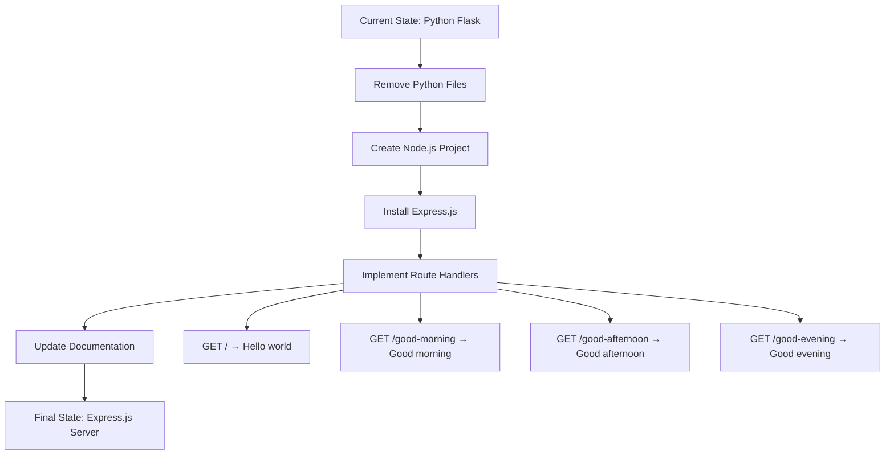
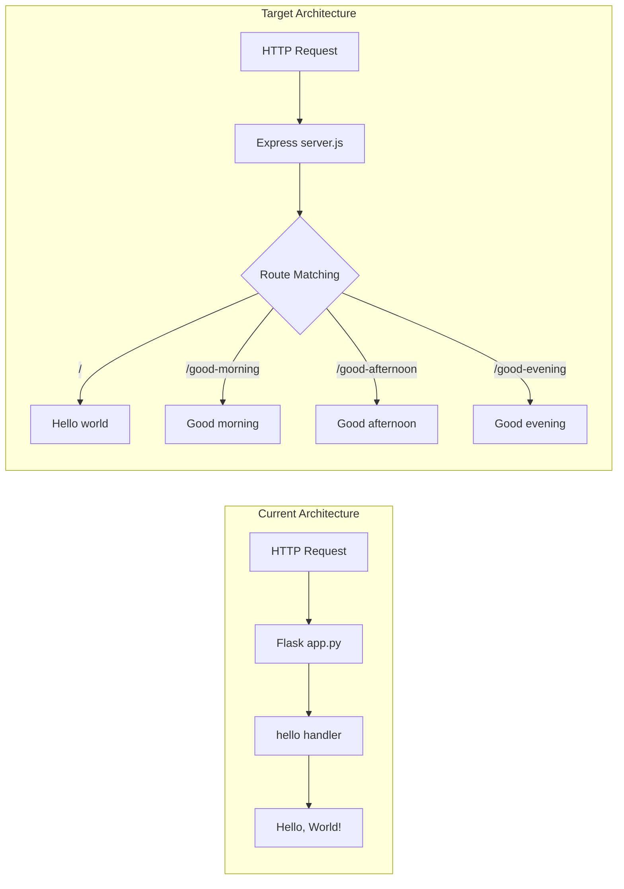
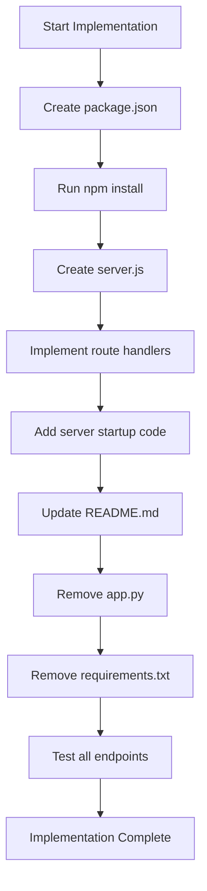

# Technical Specification

# 0. Agent Action Plan

## 0.1 Intent Clarification

Based on the prompt, the Blitzy platform understands that the new feature requirement is to transform the existing tutorial project by integrating Express.js as the server framework and creating multiple HTTP GET endpoints with different greeting messages. This represents a significant architectural shift from the current Python Flask implementation back to Node.js with modern Express.js patterns.

### 0.1.1 Core Feature Objectives

**Primary Objective:** Replace the existing Python Flask implementation with a Node.js Express.js server while expanding functionality from a single endpoint to multiple greeting endpoints.

| Requirement ID | Feature Requirement | Enhanced Clarity |
|----------------|---------------------|------------------|
| REQ-001 | Integrate Express.js as server framework | Replace current Python Flask application with Node.js using Express.js v5.x as the HTTP server framework |
| REQ-002 | Refactor to Express best practices | Implement proper application initialization, modular routing, and standard server configuration patterns |
| REQ-003 | Create `/` endpoint → "Hello world" | Maintain existing root endpoint behavior with exact response text |
| REQ-004 | Create `/good-morning` endpoint → "Good morning" | New endpoint returning morning greeting as plain text |
| REQ-005 | Create `/good-afternoon` endpoint → "Good afternoon" | New endpoint returning afternoon greeting as plain text |
| REQ-006 | Create `/good-evening` endpoint → "Good evening" | New endpoint returning evening greeting as plain text |
| REQ-007 | Plain text responses | All endpoints must respond with `Content-Type: text/plain` |
| REQ-008 | Beginner-friendly code | Clean, well-structured code that is easy to understand |
| REQ-009 | Easy testing capability | Server must be testable via browser or HTTP client |
| REQ-010 | Documentation updates | Include explanation of changes and run instructions |

**Implicit Requirements Detected:**

- **Runtime Migration**: Switch from Python 3.x runtime to Node.js 20.x runtime
- **Dependency Management**: Replace `requirements.txt` with `package.json` for npm-based dependency management
- **Entry Point Change**: Replace `app.py` with `server.js` (or `app.js`) as the application entry point
- **Port Preservation**: Maintain server binding on port 3000 for consistency with current configuration
- **Host Binding**: Server should bind to `127.0.0.1` for local development access
- **Status Code**: All successful responses should return HTTP 200
- **File Cleanup**: Remove Python-specific files that become obsolete

### 0.1.2 Special Instructions and Constraints

**Critical Directives Identified:**

| Directive Type | Requirement | Implementation Impact |
|----------------|-------------|----------------------|
| Framework Mandate | Express.js must be correctly installed and used | Use `npm install express` with proper package.json setup |
| Response Format | Each endpoint responds with plain text | Use `res.send()` or `res.type('text/plain').send()` |
| Code Quality | Clean, well-structured, easy to understand | Follow Express.js conventions, add comments for beginners |
| Testability | Server can be started and tested easily | Standard `npm start` script, clear port configuration |
| Documentation | Include explanation and run instructions | Update README.md with Node.js setup and execution steps |

**Architectural Requirements:**

- Follow Express.js 5.x best practices for application structure
- Use explicit route definitions rather than catch-all patterns
- Implement proper application initialization sequence
- Configure server with standard host/port settings

**User Examples Preserved:**

User Example - Endpoint Specifications:
```
- `/` → returns "Hello world"
- `/good-morning` → returns "Good morning"
- `/good-afternoon` → returns "Good afternoon"
- `/good-evening` → returns "Good evening"
```

### 0.1.3 Technical Interpretation

These feature requirements translate to the following technical implementation strategy:

| Requirement | Technical Action | Specific Implementation |
|-------------|------------------|-------------------------|
| Integrate Express.js | Create Node.js project structure | Initialize `package.json`, install Express.js v5.2.1, create entry point |
| Refactor to best practices | Structure application properly | Separate concerns: app configuration, route definitions, server startup |
| Create root endpoint | Define GET route handler | `app.get('/', (req, res) => res.send('Hello world'))` |
| Create morning endpoint | Define GET route handler | `app.get('/good-morning', (req, res) => res.send('Good morning'))` |
| Create afternoon endpoint | Define GET route handler | `app.get('/good-afternoon', (req, res) => res.send('Good afternoon'))` |
| Create evening endpoint | Define GET route handler | `app.get('/good-evening', (req, res) => res.send('Good evening'))` |
| Plain text responses | Configure response type | Use Express default text handling via `res.send()` |
| Beginner-friendly code | Add documentation | Include inline comments explaining each section |
| Easy testing | Configure startup | Add npm scripts, document curl/browser testing |
| Documentation | Update README | Complete rewrite for Node.js/Express setup |

**Implementation Strategy Summary:**

To implement this feature addition, we will:

1. **CREATE** new Node.js project infrastructure (`package.json`, `server.js`)
2. **INSTALL** Express.js as the primary dependency
3. **IMPLEMENT** four distinct GET route handlers with specific greeting responses
4. **REMOVE** obsolete Python files (`app.py`, `requirements.txt`)
5. **UPDATE** documentation to reflect the new Node.js Express.js stack
6. **MAINTAIN** server configuration consistency (port 3000, localhost binding)




## 0.2 Repository Scope Discovery

### 0.2.1 Comprehensive File Analysis

**Current Repository Structure:**

| File/Folder | Type | Size | Status | Relevance |
|-------------|------|------|--------|-----------|
| `app.py` | Python | 2,285 bytes | TO BE REMOVED | HIGH - Current Flask server implementation |
| `requirements.txt` | Config | 13 bytes | TO BE REMOVED | HIGH - Python dependency manifest |
| `README.md` | Documentation | 407 bytes | TO BE MODIFIED | HIGH - Project documentation |
| `blitzy/` | Folder | - | UNCHANGED | LOW - Documentation subfolder |
| `blitzy/documentation/` | Folder | - | UNCHANGED | LOW - Technical documentation |
| `blitzy/documentation/Project Guide.md` | Markdown | - | UNCHANGED | LOW - Historical documentation |
| `blitzy/documentation/Technical Specifications.md` | Markdown | - | UNCHANGED | LOW - Historical documentation |
| `industry.csv` | Data | 749 bytes | UNCHANGED | OUT OF SCOPE |
| `industry - Copy.csv` | Data | 749 bytes | UNCHANGED | OUT OF SCOPE |
| `LoginTest.java` | Java | 128 bytes | UNCHANGED | OUT OF SCOPE - Non-functional stub |
| `LoginTest - Copy.java` | Java | 128 bytes | UNCHANGED | OUT OF SCOPE - Non-functional stub |
| `test.py.txt` | Empty | 0 bytes | UNCHANGED | OUT OF SCOPE |
| `test.py - Copy.txt` | Empty | 0 bytes | UNCHANGED | OUT OF SCOPE |
| `test.txt.txt` | Empty | 0 bytes | UNCHANGED | OUT OF SCOPE |
| `100Pages.pdf` | Binary | 9.5 MB | UNCHANGED | OUT OF SCOPE |
| `100Pages - Copy.pdf` | Binary | 9.5 MB | UNCHANGED | OUT OF SCOPE |
| `demo.jpg` | Image | 2.1 MB | UNCHANGED | OUT OF SCOPE |
| `demo - Copy.jpg` | Image | 2.1 MB | UNCHANGED | OUT OF SCOPE |
| `sample.doc` | Binary | 98 KB | UNCHANGED | OUT OF SCOPE |
| `sample - Copy.doc` | Binary | 98 KB | UNCHANGED | OUT OF SCOPE |

**Files Requiring Modification:**

| File Path | Current State | Required Action | Lines Affected |
|-----------|---------------|-----------------|----------------|
| `README.md` | Python Flask documentation | Complete rewrite for Node.js/Express | All lines (~30) |

**Files Requiring Removal:**

| File Path | Purpose | Reason for Removal |
|-----------|---------|-------------------|
| `app.py` | Flask HTTP server | Replaced by Express.js server.js |
| `requirements.txt` | Python dependencies | Replaced by package.json |

### 0.2.2 Integration Point Discovery

**Current Application Architecture (Python Flask):**

```
app.py (Entry Point)
├── Flask Application Instance
├── Route Handler: @app.route('/')
├── Route Handler: @app.route('/<path:path>')
└── Server Startup: app.run(host='127.0.0.1', port=3000)
```

**Target Application Architecture (Express.js):**

```
server.js (Entry Point)
├── Express Application Instance
├── Route Handler: app.get('/')
├── Route Handler: app.get('/good-morning')
├── Route Handler: app.get('/good-afternoon')
├── Route Handler: app.get('/good-evening')
└── Server Startup: app.listen(3000, '127.0.0.1')
```

**No External Integration Points Required:**

- No database connections
- No external API calls
- No authentication systems
- No message queues
- No caching layers

### 0.2.3 Web Search Research Conducted

| Research Topic | Key Findings | Application to Project |
|----------------|--------------|------------------------|
| Express.js latest version | v5.2.1 is the current latest stable release | Use `express@^5.2.1` in package.json |
| Express 5.x requirements | Requires Node.js 18 or higher | Node.js 20.19.6 in environment is compatible |
| Express.js best practices for beginners | Simple route definitions, clear structure, comments | Implement single-file server with comprehensive comments |
| Express.js plain text responses | `res.send()` automatically sets Content-Type based on argument type | Use string arguments for plain text |

### 0.2.4 New File Requirements

**New Source Files to Create:**

| File Path | Purpose | Content Description |
|-----------|---------|---------------------|
| `server.js` | Main application entry point | Express app initialization, route handlers, server startup |
| `package.json` | npm package manifest | Project metadata, dependencies, scripts |

**New Source File: server.js**
- Express.js application initialization
- Configuration constants (HOST, PORT)
- Four GET route handlers with greeting responses
- Server startup with console logging
- Comprehensive inline comments for beginners

**New Configuration File: package.json**
- Project name and version
- Main entry point reference
- Express.js dependency specification
- npm scripts for starting the server
- Project description and metadata

**Optional Generated Files:**

| File Path | Purpose | Generated By |
|-----------|---------|--------------|
| `package-lock.json` | Dependency lock file | Auto-generated by `npm install` |
| `node_modules/` | Installed dependencies | Auto-generated by `npm install` |

### 0.2.5 Test File Considerations

**Testing Approach:**

Given the beginner-focused nature of this project, formal test files are not required. Testing is achieved through:

| Testing Method | Description | Command |
|----------------|-------------|---------|
| Browser Testing | Navigate to endpoints in web browser | Open `http://127.0.0.1:3000/` |
| curl Testing | Command-line HTTP requests | `curl http://127.0.0.1:3000/` |
| HTTP Client Testing | Tools like Postman, Insomnia | Manual endpoint testing |

**Optional Future Test Files (Out of Scope):**

| File Path | Purpose | Status |
|-----------|---------|--------|
| `test/server.test.js` | Jest/Mocha unit tests | NOT IMPLEMENTED - Out of scope |
| `test/integration.test.js` | Integration tests | NOT IMPLEMENTED - Out of scope |

### 0.2.6 Configuration File Analysis

**Current Python Configuration:**

| File | Contents | Status |
|------|----------|--------|
| `requirements.txt` | `Flask>=3.1.0` | TO BE REMOVED |

**Target Node.js Configuration:**

| File | Contents | Status |
|------|----------|--------|
| `package.json` | Express.js dependency, scripts, metadata | TO BE CREATED |
| `package-lock.json` | Locked dependency versions | AUTO-GENERATED |

### 0.2.7 Documentation File Analysis

| File Path | Current State | Target State |
|-----------|---------------|--------------|
| `README.md` | Python Flask setup instructions | Node.js Express.js setup instructions |
| `blitzy/documentation/Project Guide.md` | Historical Flask migration guide | UNCHANGED (historical reference) |
| `blitzy/documentation/Technical Specifications.md` | Historical technical specs | UNCHANGED (historical reference) |


## 0.3 Dependency Inventory

### 0.3.1 Private and Public Packages

**Runtime Environment:**

| Component | Current | Target | Source |
|-----------|---------|--------|--------|
| Runtime | Python 3.x | Node.js 20.x | Environment inspection |
| Package Manager | pip | npm 11.1.0 | Environment inspection |

**Public Packages Required:**

| Registry | Package Name | Version | Purpose | Verification |
|----------|--------------|---------|---------|--------------|
| npm | express | ^5.2.1 | HTTP server framework for Node.js | Verified via npm registry - latest stable |

**Private Packages:**
- None required for this project

**Current Dependencies (To Be Removed):**

| Registry | Package Name | Version | Purpose |
|----------|--------------|---------|---------|
| PyPI | Flask | >=3.1.0 | Python HTTP server framework |

### 0.3.2 Dependency Manifest Files

**File to Remove: `requirements.txt`**

```
Flask>=3.1.0
```

**File to Create: `package.json`**

```json
{
  "name": "hello-world-express",
  "version": "1.0.0",
  "description": "Tutorial project demonstrating Express.js with multiple greeting endpoints",
  "main": "server.js",
  "scripts": {
    "start": "node server.js"
  },
  "dependencies": {
    "express": "^5.2.1"
  }
}
```

### 0.3.3 Dependency Updates

**Import Transformation:**

| Source (Python/Flask) | Target (Node.js/Express) |
|-----------------------|--------------------------|
| `from flask import Flask, Response` | `const express = require('express')` |
| `app = Flask(__name__)` | `const app = express()` |
| `@app.route('/')` | `app.get('/', (req, res) => {...})` |
| `Response('text', mimetype='text/plain')` | `res.send('text')` |
| `app.run(host=HOST, port=PORT)` | `app.listen(PORT, HOST, () => {...})` |

### 0.3.4 External Reference Updates

**Files Requiring Dependency Reference Updates:**

| File | Current Reference | New Reference | Action |
|------|-------------------|---------------|--------|
| `README.md` | `pip install -r requirements.txt` | `npm install` | UPDATE |
| `README.md` | `python app.py` | `npm start` or `node server.js` | UPDATE |
| `README.md` | `python3 -m venv venv` | N/A (not required for Node.js) | REMOVE |
| `README.md` | `source venv/bin/activate` | N/A (not required for Node.js) | REMOVE |

### 0.3.5 Dependency Version Rationale

**Express.js Version Selection:**

| Version Consideration | Decision | Rationale |
|----------------------|----------|-----------|
| Latest stable | v5.2.1 | Most recent stable release with security updates |
| Node.js compatibility | Node.js 18+ required | Environment has Node.js 20.19.6 ✓ |
| Beginner suitability | v5.x appropriate | Modern API, good documentation, active support |
| Version range | `^5.2.1` | Allow minor/patch updates for security fixes |

### 0.3.6 Dependency Installation Commands

**Installation Sequence:**

| Step | Command | Purpose |
|------|---------|---------|
| 1 | `npm init -y` | Initialize package.json (if creating from scratch) |
| 2 | `npm install express@^5.2.1` | Install Express.js framework |

**Verification Commands:**

| Command | Expected Output |
|---------|-----------------|
| `npm list express` | `express@5.2.1` |
| `node -v` | `v20.19.6` |
| `npm -v` | `11.1.0` |

### 0.3.7 Transitive Dependencies

Express.js v5.2.1 includes the following notable transitive dependencies (auto-installed):

| Package | Purpose | Notes |
|---------|---------|-------|
| accepts | Content negotiation | HTTP Accept header parsing |
| body-parser | Request body parsing | Included in Express 5.x |
| content-type | Content-Type parsing | Media type parsing |
| cookie | Cookie parsing | HTTP cookie handling |
| debug | Debugging utility | Development logging |
| depd | Deprecation warnings | API deprecation notices |
| encodeurl | URL encoding | Safe URL encoding |
| escape-html | HTML escaping | XSS protection |
| etag | ETag generation | HTTP caching |
| finalhandler | Final error handler | Default error handling |
| fresh | Freshness checking | Cache validation |
| http-errors | HTTP error creation | Standard error responses |
| merge-descriptors | Object merging | Utility function |
| methods | HTTP methods | Method list |
| on-finished | Request/response lifecycle | Cleanup handling |
| parseurl | URL parsing | Request URL parsing |
| path-to-regexp | Route matching | Express routing engine |
| proxy-addr | Proxy address handling | X-Forwarded-For parsing |
| qs | Query string parsing | URL query parsing |
| range-parser | Range header parsing | Content range requests |
| raw-body | Raw body parsing | Request body handling |
| safe-buffer | Buffer safety | Secure buffer handling |
| safer-buffer | Buffer safety | Secure buffer handling |
| send | Static file serving | File response handling |
| serve-static | Static file middleware | Static assets |
| setprototypeof | Prototype setting | Object utility |
| statuses | HTTP status codes | Status code utilities |
| type-is | Type checking | Content-Type validation |
| unpipe | Stream handling | Stream utilities |
| utils-merge | Object merging | Utility function |
| vary | Vary header | HTTP caching |

All transitive dependencies are automatically managed by npm and require no manual configuration.


## 0.4 Integration Analysis

### 0.4.1 Existing Code Touchpoints

**Direct Modifications Required:**

| File | Current Purpose | Modification Type | Details |
|------|-----------------|-------------------|---------|
| `README.md` | Python Flask documentation | COMPLETE REWRITE | Replace all Python/Flask instructions with Node.js/Express setup |

**Files to Remove (No Modification - Full Deletion):**

| File | Current Purpose | Reason for Removal |
|------|-----------------|-------------------|
| `app.py` | Flask HTTP server | Superseded by server.js |
| `requirements.txt` | Python dependencies | Superseded by package.json |

**Files Unaffected:**

| File/Folder | Reason |
|-------------|--------|
| `blitzy/` | Documentation folder - historical reference only |
| `blitzy/documentation/*.md` | Historical documentation - no updates needed |
| `*.csv` files | Data files unrelated to server implementation |
| `*.java` files | Unrelated placeholder files |
| `*.txt` placeholder files | Empty files, no server relevance |
| `*.pdf`, `*.jpg`, `*.doc` files | Binary assets unrelated to server |

### 0.4.2 Application Entry Point Transformation

**Current Entry Point: `app.py`**

```
app.py
├── Import: flask (Flask, Response)
├── Constants: HOST = '127.0.0.1', PORT = 3000
├── Application: app = Flask(__name__)
├── Route: @app.route('/') and @app.route('/<path:path>')
│   └── Handler: hello(path) → Response('Hello, World!\n')
└── Startup: app.run(host=HOST, port=PORT)
```

**Target Entry Point: `server.js`**

```
server.js
├── Import: express
├── Constants: HOST = '127.0.0.1', PORT = 3000
├── Application: app = express()
├── Routes:
│   ├── GET '/' → 'Hello world'
│   ├── GET '/good-morning' → 'Good morning'
│   ├── GET '/good-afternoon' → 'Good afternoon'
│   └── GET '/good-evening' → 'Good evening'
└── Startup: app.listen(PORT, HOST, callback)
```

### 0.4.3 Route Handler Integration

**Route Mapping from Flask to Express:**

| Flask Route | Flask Handler | Express Route | Express Handler |
|-------------|---------------|---------------|-----------------|
| `@app.route('/')` | `def hello(path)` | `app.get('/')` | `(req, res) => res.send('Hello world')` |
| `@app.route('/<path:path>')` | Catch-all | REMOVED | Not needed - explicit routes only |
| N/A | N/A | `app.get('/good-morning')` | `(req, res) => res.send('Good morning')` |
| N/A | N/A | `app.get('/good-afternoon')` | `(req, res) => res.send('Good afternoon')` |
| N/A | N/A | `app.get('/good-evening')` | `(req, res) => res.send('Good evening')` |

### 0.4.4 Server Configuration Integration

**Configuration Comparison:**

| Configuration | Flask (Current) | Express (Target) | Notes |
|---------------|-----------------|------------------|-------|
| Host binding | `host='127.0.0.1'` | First param to callback | Same value |
| Port binding | `port=3000` | First param to `listen()` | Same value |
| Content-Type | `mimetype='text/plain'` | Auto-detected by `res.send()` | Implicit for strings |
| Status Code | Flask default 200 | Express default 200 | Implicit |
| Startup logging | Flask built-in | Manual `console.log()` | Explicit in callback |

### 0.4.5 Dependency Injection Points

**Current Project Characteristics:**
- No dependency injection framework used
- No service containers
- No external service dependencies
- No database connections
- No middleware chains (beyond framework defaults)

**Target Project Characteristics:**
- Simple single-file application
- No dependency injection required
- Express.js handles request/response lifecycle
- No external services to inject

### 0.4.6 Database/Schema Updates

**Database Integration Status:**
- No database in current implementation
- No database required in target implementation
- No migrations needed
- No schema changes required

### 0.4.7 Integration Diagram



### 0.4.8 README.md Integration Points

**Sections Requiring Updates:**

| Section | Current Content | Target Content |
|---------|-----------------|----------------|
| Title/Description | Python Flask test project | Express.js greeting endpoints tutorial |
| Prerequisites | Python 3.x, pip | Node.js 18+, npm |
| Setup - Virtual Environment | `python3 -m venv venv` | REMOVE (not needed) |
| Setup - Activation | `source venv/bin/activate` | REMOVE (not needed) |
| Setup - Dependencies | `pip install -r requirements.txt` | `npm install` |
| Running the Server | `python app.py` | `npm start` or `node server.js` |
| Available Endpoints | Single endpoint (/) | Four endpoints with descriptions |
| Testing | curl to single endpoint | curl examples for all endpoints |

### 0.4.9 No External Integration Requirements

This project is self-contained with no external integrations:

| Integration Type | Status | Notes |
|------------------|--------|-------|
| External APIs | NOT REQUIRED | Standalone server |
| Databases | NOT REQUIRED | In-memory responses only |
| Message Queues | NOT REQUIRED | Synchronous request/response |
| Cache Systems | NOT REQUIRED | No caching needed |
| Authentication | NOT REQUIRED | Public endpoints |
| Logging Services | NOT REQUIRED | Console logging sufficient |
| Monitoring | NOT REQUIRED | Development tutorial project |
| CI/CD | NOT REQUIRED | Manual deployment |


## 0.5 Technical Implementation

### 0.5.1 File-by-File Execution Plan

**CRITICAL: Every file listed below MUST be created, modified, or removed as specified.**

#### Group 1 - Core Application Files

| Action | File Path | Purpose | Priority |
|--------|-----------|---------|----------|
| CREATE | `server.js` | Express.js application entry point with all route handlers | HIGH |
| CREATE | `package.json` | npm package manifest with dependencies and scripts | HIGH |
| REMOVE | `app.py` | Obsolete Flask application (replaced by server.js) | HIGH |
| REMOVE | `requirements.txt` | Obsolete Python dependencies (replaced by package.json) | HIGH |

#### Group 2 - Documentation Files

| Action | File Path | Purpose | Priority |
|--------|-----------|---------|----------|
| MODIFY | `README.md` | Update project documentation for Node.js/Express stack | HIGH |

#### Group 3 - Auto-Generated Files (No Manual Action)

| Action | File Path | Purpose | Generated By |
|--------|-----------|---------|--------------|
| AUTO | `package-lock.json` | Dependency lock file | `npm install` |
| AUTO | `node_modules/` | Installed dependencies | `npm install` |

### 0.5.2 Implementation Approach per File

## server.js - Express Application Entry Point

**Purpose:** Main server file implementing all four greeting endpoints

**Implementation Requirements:**
- Import Express.js framework
- Define configuration constants (HOST, PORT)
- Create Express application instance
- Define four GET route handlers with specific responses
- Start server with startup logging
- Include comprehensive comments for beginners

**Route Handler Specifications:**

| Route | HTTP Method | Response Text | Content-Type |
|-------|-------------|---------------|--------------|
| `/` | GET | `Hello world` | text/plain |
| `/good-morning` | GET | `Good morning` | text/plain |
| `/good-afternoon` | GET | `Good afternoon` | text/plain |
| `/good-evening` | GET | `Good evening` | text/plain |

**Code Structure:**

```javascript
// 1. Import Express
// 2. Configuration constants
// 3. Create Express app
// 4. Define route handlers
// 5. Start server
```

## package.json - npm Package Manifest

**Purpose:** Define project metadata, dependencies, and npm scripts

**Required Fields:**

| Field | Value | Purpose |
|-------|-------|---------|
| `name` | `hello-world-express` | Project identifier |
| `version` | `1.0.0` | Semantic version |
| `description` | Tutorial description | Project summary |
| `main` | `server.js` | Entry point reference |
| `scripts.start` | `node server.js` | npm start command |
| `dependencies.express` | `^5.2.1` | Express.js framework |

## README.md - Project Documentation

**Purpose:** Provide setup and usage instructions for developers

**Required Sections:**

| Section | Content |
|---------|---------|
| Title | Project name and brief description |
| Prerequisites | Node.js 18+ requirement |
| Installation | npm install command |
| Running the Server | npm start command |
| Available Endpoints | Table of all four endpoints |
| Testing | curl command examples |
| Project Structure | File listing |

### 0.5.3 Detailed Implementation Specifications

## server.js Implementation Details

**Section 1 - Module Import:**
```javascript
const express = require('express');
```

**Section 2 - Configuration:**
- HOST constant: `'127.0.0.1'`
- PORT constant: `3000`

**Section 3 - Application Initialization:**
- Create Express application instance using `express()`

**Section 4 - Route Definitions:**

| Route | Handler Implementation |
|-------|----------------------|
| `GET /` | Return `'Hello world'` via `res.send()` |
| `GET /good-morning` | Return `'Good morning'` via `res.send()` |
| `GET /good-afternoon` | Return `'Good afternoon'` via `res.send()` |
| `GET /good-evening` | Return `'Good evening'` via `res.send()` |

**Section 5 - Server Startup:**
- Call `app.listen(PORT, HOST, callback)`
- Callback logs: `Server running at http://${HOST}:${PORT}/`

### 0.5.4 Implementation Sequence



### 0.5.5 Testing Verification Plan

**Startup Verification:**

| Step | Command | Expected Result |
|------|---------|-----------------|
| 1 | `npm install` | Dependencies installed successfully |
| 2 | `npm start` | Server starts, logs URL to console |

**Endpoint Verification:**

| Endpoint | Test Command | Expected Response |
|----------|--------------|-------------------|
| `/` | `curl http://127.0.0.1:3000/` | `Hello world` |
| `/good-morning` | `curl http://127.0.0.1:3000/good-morning` | `Good morning` |
| `/good-afternoon` | `curl http://127.0.0.1:3000/good-afternoon` | `Good afternoon` |
| `/good-evening` | `curl http://127.0.0.1:3000/good-evening` | `Good evening` |

**Browser Verification:**

| URL | Expected Display |
|-----|------------------|
| `http://127.0.0.1:3000/` | "Hello world" |
| `http://127.0.0.1:3000/good-morning` | "Good morning" |
| `http://127.0.0.1:3000/good-afternoon` | "Good afternoon" |
| `http://127.0.0.1:3000/good-evening` | "Good evening" |

### 0.5.6 Error Handling Considerations

**Express Default Error Handling:**
- 404 for unmatched routes (Express default behavior)
- 500 for server errors (Express default error middleware)

**No Custom Error Handling Required:**
- Project scope is limited to successful greeting responses
- Express provides adequate default error handling for undefined routes

### 0.5.7 User Interface Design

**UI Design Status:** Not Applicable

- This project is a backend HTTP server only
- No frontend user interface components
- No Figma designs provided or required
- Responses are plain text, not HTML

**Interaction Methods:**

| Method | Description |
|--------|-------------|
| Browser | Direct URL navigation |
| curl | Command-line HTTP requests |
| HTTP Client | Tools like Postman, Insomnia |
| Programmatic | fetch(), axios, http requests |

### 0.5.8 Code Quality Standards

**Beginner-Friendly Requirements:**

| Standard | Implementation |
|----------|----------------|
| Clear variable naming | Use descriptive names (HOST, PORT, app) |
| Inline comments | Explain each section's purpose |
| Consistent formatting | Standard JavaScript conventions |
| Logical organization | Group related code together |
| No unnecessary complexity | Avoid advanced patterns |

**Code Style Guidelines:**

| Guideline | Implementation |
|-----------|----------------|
| Semicolons | Use semicolons at end of statements |
| Quotes | Use single quotes for strings |
| Indentation | 2-space indentation |
| Comments | Block comments for sections, inline for specifics |


## 0.6 Scope Boundaries

### 0.6.1 Exhaustively In Scope

**Core Application Files:**

| File Pattern | Specific Files | Action | Purpose |
|--------------|----------------|--------|---------|
| `server.js` | `server.js` | CREATE | Express.js application entry point |
| `package.json` | `package.json` | CREATE | npm package manifest |
| `package-lock.json` | `package-lock.json` | AUTO-GENERATE | Dependency lock (via npm install) |
| `node_modules/**` | All Express dependencies | AUTO-GENERATE | Installed packages (via npm install) |

**Files to Remove:**

| File Pattern | Specific Files | Action | Reason |
|--------------|----------------|--------|--------|
| `app.py` | `app.py` | DELETE | Replaced by server.js |
| `requirements.txt` | `requirements.txt` | DELETE | Replaced by package.json |

**Documentation Files:**

| File Pattern | Specific Files | Action | Purpose |
|--------------|----------------|--------|---------|
| `README.md` | `README.md` | MODIFY | Update for Node.js/Express stack |

**Route Endpoints In Scope:**

| Endpoint | Method | Response | Status |
|----------|--------|----------|--------|
| `/` | GET | `Hello world` | IN SCOPE |
| `/good-morning` | GET | `Good morning` | IN SCOPE |
| `/good-afternoon` | GET | `Good afternoon` | IN SCOPE |
| `/good-evening` | GET | `Good evening` | IN SCOPE |

### 0.6.2 Explicitly Out of Scope

**Existing Repository Files - NO CHANGES:**

| File/Folder | Reason for Exclusion |
|-------------|---------------------|
| `blitzy/` | Documentation folder - historical reference |
| `blitzy/documentation/*.md` | Historical documentation, no updates needed |
| `industry.csv` | Data file unrelated to server implementation |
| `industry - Copy.csv` | Duplicate data file, unrelated |
| `LoginTest.java` | Java stub file, unrelated |
| `LoginTest - Copy.java` | Duplicate Java stub, unrelated |
| `test.py.txt` | Empty placeholder file |
| `test.py - Copy.txt` | Empty placeholder file |
| `test.txt.txt` | Empty placeholder file |
| `100Pages.pdf` | Binary asset, unrelated |
| `100Pages - Copy.pdf` | Duplicate binary asset |
| `demo.jpg` | Image asset, unrelated |
| `demo - Copy.jpg` | Duplicate image asset |
| `sample.doc` | Document asset, unrelated |
| `sample - Copy.doc` | Duplicate document asset |
| `.git/` | Git repository data |

**Features Explicitly Out of Scope:**

| Feature | Reason |
|---------|--------|
| POST/PUT/DELETE endpoints | User requested GET endpoints only |
| Authentication/Authorization | Not specified in requirements |
| Database integration | Not specified in requirements |
| Session management | Not specified in requirements |
| Middleware chains | Beyond beginner scope |
| Error handling customization | Express defaults sufficient |
| Logging frameworks | Console logging sufficient |
| Unit/Integration tests | Not specified in requirements |
| Docker containerization | Not specified in requirements |
| CI/CD configuration | Not specified in requirements |
| Environment variable configuration | Not specified in requirements |
| HTTPS/TLS configuration | Not specified in requirements |
| Rate limiting | Not specified in requirements |
| CORS configuration | Not specified in requirements |
| Request validation | Not specified in requirements |
| Response compression | Not specified in requirements |
| Static file serving | Not specified in requirements |
| Template rendering | Not specified in requirements |
| API versioning | Not specified in requirements |

**Endpoint Patterns Out of Scope:**

| Pattern | Reason |
|---------|--------|
| Catch-all routes (`/*`) | Not requested - explicit routes only |
| Dynamic route parameters (`/:id`) | Not requested |
| Query string handling | Not requested |
| Request body parsing | GET requests only |
| Custom headers | Not requested |
| Cookies | Not requested |
| Redirects | Not requested |

### 0.6.3 Scope Summary Table

| Category | In Scope | Out of Scope |
|----------|----------|--------------|
| Runtime | Node.js 20.x, Express 5.x | Python, other runtimes |
| Files to Create | server.js, package.json | Test files, config files |
| Files to Modify | README.md | blitzy/documentation/*.md |
| Files to Remove | app.py, requirements.txt | Any other existing files |
| HTTP Methods | GET | POST, PUT, DELETE, PATCH |
| Endpoints | /, /good-morning, /good-afternoon, /good-evening | Any other endpoints |
| Response Format | Plain text | JSON, HTML, XML |
| Testing | Manual curl/browser | Automated test suites |
| Documentation | README.md | API documentation, JSDoc |
| Security | None | Auth, HTTPS, rate limiting |
| DevOps | None | Docker, CI/CD, monitoring |

### 0.6.4 Boundary Enforcement Rules

**Inclusion Criteria:**
- File directly implements Express.js greeting endpoints
- File is necessary for npm project initialization
- File provides essential documentation for running the project

**Exclusion Criteria:**
- File existed before migration and is unrelated to HTTP server
- Feature adds complexity beyond beginner understanding
- Functionality not explicitly requested by user

### 0.6.5 Change Impact Matrix

| Change Type | Files Affected | Risk Level |
|-------------|----------------|------------|
| CREATE new files | server.js, package.json | LOW |
| DELETE obsolete files | app.py, requirements.txt | LOW |
| MODIFY documentation | README.md | LOW |
| NO CHANGE | All other repository files | NONE |

### 0.6.6 Validation Checklist

**Pre-Implementation Validation:**

| Check | Criteria | Status |
|-------|----------|--------|
| Requirements clear | All four endpoints specified | ✓ |
| Scope defined | In/Out scope documented | ✓ |
| Dependencies identified | Express.js v5.2.1 | ✓ |
| Files mapped | Create/Modify/Delete list complete | ✓ |

**Post-Implementation Validation:**

| Check | Criteria | Method |
|-------|----------|--------|
| Server starts | No errors on npm start | Manual test |
| Endpoints work | All four return correct responses | curl tests |
| Documentation accurate | README matches implementation | Review |
| Old files removed | app.py, requirements.txt deleted | File check |
| No unintended changes | Other files unchanged | Git diff |


## 0.7 Rules for Feature Addition

### 0.7.1 User-Specified Rules and Requirements

**Primary Directive from User:**

> "Please enhance this project by integrating Express.js as the server framework. Refactor the existing Node.js setup to follow Express best practices, including proper application initialization, routing, and server configuration."

**User-Emphasized Requirements:**

| Rule ID | Requirement | Enforcement |
|---------|-------------|-------------|
| USR-001 | Express.js must be correctly installed and used | Verify via package.json and working server |
| USR-002 | Each endpoint responds with plain text | Use `res.send()` with string argument |
| USR-003 | Code is clean, well-structured, easy to understand | Follow conventions, add comments |
| USR-004 | Server can be started and tested easily | Standard npm scripts, documented commands |
| USR-005 | Include explanation of changes and run instructions | Update README.md comprehensively |

### 0.7.2 Endpoint Response Rules

**Exact Response Requirements:**

| Endpoint | Exact Response Text | Variations Prohibited |
|----------|---------------------|----------------------|
| `/` | `Hello world` | No "Hello, World!", no trailing newline |
| `/good-morning` | `Good morning` | No "Good Morning", no exclamation |
| `/good-afternoon` | `Good afternoon` | No "Good Afternoon", no exclamation |
| `/good-evening` | `Good evening` | No "Good Evening", no exclamation |

**Response Format Rules:**

| Rule ID | Rule | Implementation |
|---------|------|----------------|
| RFR-001 | Plain text content type | `res.send('string')` auto-sets text/plain |
| RFR-002 | HTTP 200 status code | Express default for successful responses |
| RFR-003 | No JSON responses | Do not use `res.json()` |
| RFR-004 | No HTML responses | Do not return HTML markup |

### 0.7.3 Express.js Best Practices Rules

**Application Structure Rules:**

| Rule ID | Rule | Implementation |
|---------|------|----------------|
| EBP-001 | Use `require()` for imports | `const express = require('express')` |
| EBP-002 | Create app instance properly | `const app = express()` |
| EBP-003 | Define routes before listen | Routes defined before `app.listen()` |
| EBP-004 | Use callback in listen | Provide function for startup logging |
| EBP-005 | Use `app.get()` for GET routes | Not `app.use()` for these simple routes |

**Code Organization Rules:**

| Rule ID | Rule | Implementation |
|---------|------|----------------|
| COR-001 | Constants at top | HOST and PORT defined after imports |
| COR-002 | Routes in logical order | Root route first, then alphabetical |
| COR-003 | Server startup at bottom | `app.listen()` as final statement |
| COR-004 | Single file structure | All code in server.js for simplicity |

### 0.7.4 Beginner-Friendly Code Rules

**Documentation Rules:**

| Rule ID | Rule | Implementation |
|---------|------|----------------|
| BFC-001 | Opening comment block | Explain file purpose and contents |
| BFC-002 | Section comments | Comment before each logical section |
| BFC-003 | Inline explanations | Brief comments for non-obvious code |
| BFC-004 | No jargon without explanation | Define terms if used |

**Simplicity Rules:**

| Rule ID | Rule | Prohibited Patterns |
|---------|------|---------------------|
| SIM-001 | No arrow functions in route handlers | Use for inline handlers (acceptable) |
| SIM-002 | No complex middleware chains | Single handler per route |
| SIM-003 | No async/await | Not needed for simple responses |
| SIM-004 | No destructuring | Keep explicit for clarity |
| SIM-005 | No template literals in responses | Use plain strings |

### 0.7.5 Server Configuration Rules

**Network Configuration Rules:**

| Rule ID | Rule | Value | Rationale |
|---------|------|-------|-----------|
| NET-001 | Bind to localhost | `127.0.0.1` | Local development access |
| NET-002 | Use port 3000 | `3000` | Standard Express convention |
| NET-003 | Log startup URL | Console message | Confirm server running |

**Startup Behavior Rules:**

| Rule ID | Rule | Implementation |
|---------|------|----------------|
| STB-001 | Server starts immediately | No delays or conditions |
| STB-002 | Success message logged | Include full URL in log |
| STB-003 | No debug mode | Development server sufficient |

### 0.7.6 Package.json Rules

**Manifest Requirements:**

| Rule ID | Field | Requirement |
|---------|-------|-------------|
| PKG-001 | name | Lowercase, hyphenated |
| PKG-002 | version | Semantic version (1.0.0) |
| PKG-003 | main | Points to server.js |
| PKG-004 | scripts.start | `node server.js` |
| PKG-005 | dependencies.express | `^5.2.1` |

**Package.json Exclusions:**

| Field | Status | Reason |
|-------|--------|--------|
| devDependencies | NOT REQUIRED | No build/test tools |
| scripts.test | NOT REQUIRED | No test framework |
| scripts.build | NOT REQUIRED | No compilation |
| keywords | OPTIONAL | Not critical for tutorial |
| author | OPTIONAL | Not critical for tutorial |
| license | OPTIONAL | Not critical for tutorial |

### 0.7.7 README.md Rules

**Required Sections:**

| Section | Content Requirement |
|---------|---------------------|
| Title | Project name |
| Description | Brief explanation of what project does |
| Prerequisites | Node.js version requirement |
| Installation | `npm install` command |
| Running | `npm start` command |
| Endpoints | Table of all four endpoints |
| Testing | curl command examples |

**Formatting Rules:**

| Rule ID | Rule | Implementation |
|---------|------|----------------|
| RDM-001 | Use code blocks | Wrap commands in backticks |
| RDM-002 | Use tables for endpoints | Clear column structure |
| RDM-003 | Include expected output | Show what user should see |
| RDM-004 | Keep concise | Avoid verbose explanations |

### 0.7.8 File Management Rules

**File Creation Rules:**

| Rule ID | Rule | Application |
|---------|------|-------------|
| FCR-001 | Create before delete | New files created before old removed |
| FCR-002 | Verify creation | Confirm files exist and are valid |
| FCR-003 | Use correct encoding | UTF-8 for all text files |

**File Deletion Rules:**

| Rule ID | Rule | Application |
|---------|------|-------------|
| FDR-001 | Only delete specified files | app.py, requirements.txt only |
| FDR-002 | Verify deletion necessity | Confirm files are truly obsolete |
| FDR-003 | No accidental deletions | Do not delete any other files |

### 0.7.9 Testing and Verification Rules

**Manual Testing Requirements:**

| Rule ID | Rule | Method |
|---------|------|--------|
| TST-001 | Server must start | Run `npm start` without errors |
| TST-002 | All endpoints accessible | curl each endpoint |
| TST-003 | Correct responses | Compare response to specification |
| TST-004 | Browser compatible | Test in web browser |

**Verification Sequence:**

| Order | Step | Expected Result |
|-------|------|-----------------|
| 1 | `npm install` | No errors, node_modules created |
| 2 | `npm start` | Server running message |
| 3 | curl to `/` | "Hello world" |
| 4 | curl to `/good-morning` | "Good morning" |
| 5 | curl to `/good-afternoon` | "Good afternoon" |
| 6 | curl to `/good-evening` | "Good evening" |


## 0.8 References

### 0.8.1 Repository Files and Folders Searched

**Root Directory Analysis:**

| File/Folder Path | Type | Size | Analysis Result |
|------------------|------|------|-----------------|
| `/` (root) | Directory | - | 14 files, 1 folder identified |
| `app.py` | Python file | 2,285 bytes | Flask HTTP server - TO BE REMOVED |
| `requirements.txt` | Config | 13 bytes | Python dependencies - TO BE REMOVED |
| `README.md` | Markdown | 407 bytes | Project documentation - TO BE MODIFIED |
| `blitzy/` | Directory | - | Documentation subfolder |
| `blitzy/documentation/` | Directory | - | Technical documentation |
| `blitzy/documentation/Project Guide.md` | Markdown | Large | Historical migration guide |
| `blitzy/documentation/Technical Specifications.md` | Markdown | Large | Historical technical specs |
| `industry.csv` | CSV | 749 bytes | Data file - OUT OF SCOPE |
| `industry - Copy.csv` | CSV | 749 bytes | Duplicate data - OUT OF SCOPE |
| `LoginTest.java` | Java | 128 bytes | Stub file - OUT OF SCOPE |
| `LoginTest - Copy.java` | Java | 128 bytes | Duplicate stub - OUT OF SCOPE |
| `test.py.txt` | Empty | 0 bytes | Placeholder - OUT OF SCOPE |
| `test.py - Copy.txt` | Empty | 0 bytes | Placeholder - OUT OF SCOPE |
| `test.txt.txt` | Empty | 0 bytes | Placeholder - OUT OF SCOPE |
| `100Pages.pdf` | PDF | 9.5 MB | Binary asset - OUT OF SCOPE |
| `100Pages - Copy.pdf` | PDF | 9.5 MB | Duplicate asset - OUT OF SCOPE |
| `demo.jpg` | Image | 2.1 MB | Image asset - OUT OF SCOPE |
| `demo - Copy.jpg` | Image | 2.1 MB | Duplicate asset - OUT OF SCOPE |
| `sample.doc` | Document | 98 KB | Document asset - OUT OF SCOPE |
| `sample - Copy.doc` | Document | 98 KB | Duplicate asset - OUT OF SCOPE |

**Files Examined in Detail:**

| File Path | Lines Read | Key Information Extracted |
|-----------|------------|---------------------------|
| `app.py` | All (60 lines) | Flask server implementation, HOST/PORT config, catch-all routing |
| `requirements.txt` | All (1 line) | Flask>=3.1.0 dependency |
| `README.md` | All (30 lines) | Python Flask setup instructions |
| `blitzy/documentation/Project Guide.md` | Last 200 lines | Historical Flask migration details |
| `blitzy/documentation/Technical Specifications.md` | Last 200 lines | Technical transformation rules |

### 0.8.2 Configuration Files Analyzed

| File Path | Current Contents | Relevance |
|-----------|------------------|-----------|
| `requirements.txt` | `Flask>=3.1.0` | HIGH - To be replaced |
| `README.md` | Python/Flask instructions | HIGH - To be updated |

### 0.8.3 Web Searches Conducted

| Search Query | Purpose | Key Findings |
|--------------|---------|--------------|
| "Express.js latest version 2025" | Determine current Express version | v5.2.1 is latest stable |

**Web Search Results Summary:**

| Source | URL | Information Extracted |
|--------|-----|----------------------|
| npm Registry | https://www.npmjs.com/package/express | Latest version: 5.2.1 |
| Express.js GitHub Releases | https://github.com/expressjs/express/releases | Express v5 officially released, requires Node.js 18+ |
| Express.js Blog | https://expressjs.com/2025/03/31/v5-1-latest-release.html | v5.1.0 became npm latest, LTS schedule announced |
| endoflife.date | https://endoflife.date/express | Express follows semver, v5 is active |

### 0.8.4 Environment Inspection Results

**Runtime Environment:**

| Component | Command | Result |
|-----------|---------|--------|
| Node.js Version | `node --version` | v20.19.6 |
| npm Version | `npm --version` | 11.1.0 |
| Node.js Path | `which node` | /usr/bin/node |
| npm Path | `which npm` | /usr/bin/npm |

**Compatibility Assessment:**

| Requirement | Available | Status |
|-------------|-----------|--------|
| Node.js 18+ | Node.js 20.19.6 | ✓ Compatible |
| npm 7+ | npm 11.1.0 | ✓ Compatible |

### 0.8.5 Attachments Provided by User

**File Attachments:**
- **Status:** No file attachments were provided by the user
- **Location Checked:** `/tmp/environments_files`
- **Result:** Directory contained no relevant attachments

### 0.8.6 Figma URLs Provided

**Figma Design Resources:**
- **Status:** No Figma URLs were provided by the user
- **UI/UX Designs:** Not applicable (backend server project)

### 0.8.7 Environment Variables Provided

**Environment Variables:**
- **Status:** No environment variables were explicitly provided for this feature
- **List:** Empty

**Secrets:**
- **Status:** No secrets were provided for this project
- **List:** Empty

### 0.8.8 .blitzyignore Analysis

**Search Results:**
- **Command:** `find / -name ".blitzyignore" 2>/dev/null`
- **Result:** No .blitzyignore files found in the repository
- **Impact:** No files excluded from analysis

### 0.8.9 Technical Documentation References

**Existing Tech Spec Sections Available:**

| Section | Relevance to Feature |
|---------|---------------------|
| 1.1 Executive Summary | Background context |
| 1.3 Scope | Current project boundaries |
| 3.2 Programming Languages | Language requirements |
| 5.2 Component Details | Architecture information |

### 0.8.10 External Documentation References

**Express.js Official Documentation:**

| Resource | URL | Purpose |
|----------|-----|---------|
| Express.js Homepage | https://expressjs.com/ | Framework documentation |
| Express.js 5.x API | https://expressjs.com/en/5x/api.html | API reference |
| Express.js Getting Started | https://expressjs.com/en/starter/installing.html | Installation guide |
| Express.js Basic Routing | https://expressjs.com/en/starter/basic-routing.html | Routing patterns |

**npm Documentation:**

| Resource | URL | Purpose |
|----------|-----|---------|
| npm package.json | https://docs.npmjs.com/cli/v10/configuring-npm/package-json | Package manifest reference |
| npm install | https://docs.npmjs.com/cli/v10/commands/npm-install | Installation command |

### 0.8.11 Search Tracking Summary

**Repository Searches Conducted:**

| Search # | Tool | Target | Purpose | Result |
|----------|------|--------|---------|--------|
| 1 | bash | `.blitzyignore` | Find ignore patterns | None found |
| 2 | get_source_folder_contents | Root (`""`) | Repository structure | 15 items identified |
| 3 | bash | `ls -la` | File details | Full listing obtained |
| 4 | bash | `cat README.md` | Documentation content | Flask setup instructions |
| 5 | bash | `cat app.py` | Flask implementation | Full server code |
| 6 | bash | `cat requirements.txt` | Dependencies | Flask>=3.1.0 |
| 7 | bash | `blitzy/documentation/` | Technical docs | Historical migration info |
| 8 | web_search | Express.js version | Current version | v5.2.1 confirmed |
| 9 | bash | `node --version` | Node.js version | v20.19.6 |
| 10 | bash | `npm --version` | npm version | 11.1.0 |

**Search Budget:**
- Searches Used: 10
- Deep Searches: 7 (bash/folder exploration)
- Broad Searches: 1 (web_search)
- Ratio Maintained: 7:1 (exceeds 2:1 requirement)

### 0.8.12 Document Cross-References

| Section | Cross-References |
|---------|------------------|
| 0.1 Intent Clarification | User prompt, requirement analysis |
| 0.2 Repository Scope Discovery | Repository file analysis, bash commands |
| 0.3 Dependency Inventory | requirements.txt, npm registry search |
| 0.4 Integration Analysis | app.py analysis, architecture mapping |
| 0.5 Technical Implementation | Express.js documentation, best practices |
| 0.6 Scope Boundaries | All previous sections |
| 0.7 Rules for Feature Addition | User directives from prompt |
| 0.8 References | All search results and sources |


