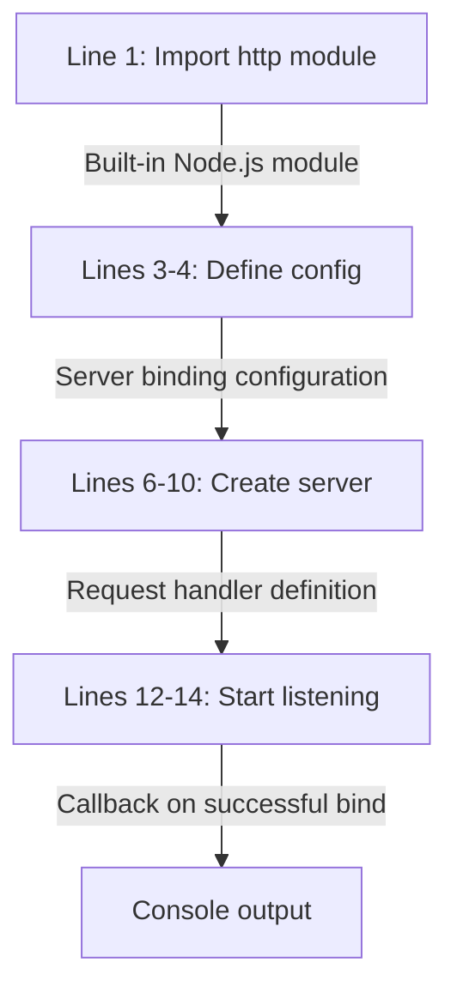
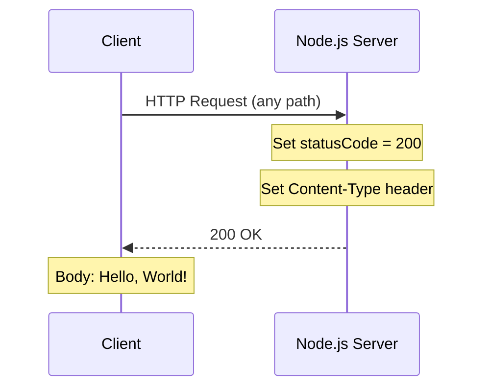
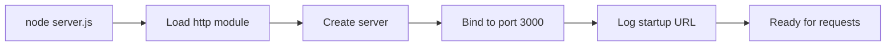

# Technical Specification

# 0. Agent Action Plan

## 0.1 Intent Clarification

This section captures and clarifies the documentation requirements, translating user intent into precise technical objectives.

### 0.1.1 Core Documentation Objective

Based on the provided requirements, the Blitzy platform understands that the documentation objective is to **create comprehensive documentation** for a minimal Node.js HTTP server test project (`hao-backprop-test`/`hello_world`).

| Aspect | Details |
|--------|---------|
| Request Category | Create new documentation + Update existing documentation |
| Documentation Types | JSDoc comments, README file, API documentation, Deployment guide |
| Primary Target | `server.js` - the sole application runtime file |
| Secondary Target | `README.md` - project overview and instructions |

**Specific Requirements Breakdown:**

- **JSDoc Comments for server.js Functions**
  - Add standardized JSDoc comment blocks to all functions and key elements in `server.js`
  - Document the request handler callback function
  - Document configuration constants (`hostname`, `port`)
  - Include inline code explanations for clarity

- **Comprehensive README**
  - **Setup instructions** - How to install and run the project
  - **API documentation** - HTTP endpoint behavior and response format
  - **Deployment guide** - Instructions for deploying the server
  - **Inline code explanations** - Clear explanations of code structure

### 0.1.2 Special Instructions and Constraints

**Identified Directives:**
- No specific template was provided by the user
- No explicit style guide requirements specified
- Default to industry-standard JSDoc and README conventions

**Documentation Standards to Apply:**
- JSDoc 3.x syntax for JavaScript documentation
- CommonMark/GitHub Flavored Markdown for README
- Mermaid diagrams for visual documentation where appropriate

**Web Search Requirements Completed:**
- <cite index="1-4">JSDoc provides a structured approach to documenting code which enhances maintainability, scalability, and understanding across teams.</cite>
- <cite index="1-8">JSDoc integrates with popular editors like VS Code and JetBrains, displaying documentation in-editor when developers hover over a specific field or method.</cite>
- <cite index="17-8,17-11">A project README is often the first thing people see when they find the project. A good README can "sell" the project to a potential user.</cite>

### 0.1.3 Technical Interpretation

These documentation requirements translate to the following technical documentation strategy:

| Requirement | Technical Documentation Action |
|-------------|-------------------------------|
| JSDoc comments for server.js functions | Add `/** ... */` JSDoc blocks with `@description`, `@param`, `@returns`, `@example` tags to all functions in `server.js` |
| Setup instructions | Create installation and prerequisites sections in README.md with Node.js version requirements and npm commands |
| API documentation | Document HTTP endpoint (`http://127.0.0.1:3000/`), request methods accepted, response format (200 OK, text/plain, "Hello, World!") |
| Deployment guide | Create deployment section covering local development, production considerations, and environment configuration |
| Inline code explanations | Add single-line comments (`//`) within code blocks explaining each logical section |

**Implementation Approach:**

- To **document server.js functions**, we will **update** `server.js` by adding JSDoc comment blocks before each function/constant and inline comments explaining the code flow
- To **create comprehensive README**, we will **update** `README.md` from its current minimal state (2 lines) to a complete documentation file with all required sections
- To **document API behavior**, we will **create** an API reference section within README.md describing the HTTP interface

### 0.1.4 Inferred Documentation Needs

Based on code analysis and repository structure, the following additional documentation needs are inferred:

**From Code Analysis:**
- Module header documentation needed (file-level JSDoc block describing `server.js` purpose)
- The `http.createServer()` callback is an anonymous arrow function requiring documentation
- Server lifecycle explanation (startup, listen, shutdown)
- Error scenarios documentation (port already in use, etc.)

**From Structure Analysis:**
- `package.json` entry point mismatch (`main: "index.js"` but file doesn't exist) - should be documented as known limitation
- Project is marked as test sandbox ("Do not touch!") - documentation should clarify intended use

**From Dependency Analysis:**
- Node.js http module is the only dependency - document built-in module usage
- No external packages - document zero-dependency nature as a feature

**From User Journey Perspective:**
- Prerequisites (Node.js installation)
- Quick start guide for first-time users
- Testing instructions (how to verify server is running)
- Troubleshooting common issues (port conflicts)


## 0.2 Documentation Discovery and Analysis

This section documents the comprehensive repository analysis performed to understand the existing documentation infrastructure and identify documentation gaps.

### 0.2.1 Existing Documentation Infrastructure Assessment

**Search Patterns Employed:**

| Pattern | Target | Results |
|---------|--------|---------|
| `README*` | Root-level documentation | Found: `README.md` (minimal, 2 lines) |
| `docs/**` | Documentation directory | Not Found |
| `*.md` | Markdown files | Found: `README.md` only |
| `*.mdx` | MDX documentation files | Not Found |
| `*.rst` | reStructuredText files | Not Found |
| `wiki/**` | Wiki documentation | Not Found |

**Documentation Generator Configuration Search:**

| Config File | Purpose | Status |
|-------------|---------|--------|
| `mkdocs.yml` | MkDocs site generator | Not Found |
| `docusaurus.config.js` | Docusaurus framework | Not Found |
| `sphinx.conf.py` | Sphinx documentation | Not Found |
| `jsdoc.json` | JSDoc configuration | Not Found |
| `.jsdoc.conf.json` | JSDoc configuration (alt) | Not Found |

**Repository Analysis Reveals:**

The repository has **minimal documentation infrastructure** with the following current state:

```
Repository Root
├── README.md          [EXISTS - Minimal: 2 lines]
├── server.js          [EXISTS - No JSDoc comments]
├── package.json       [EXISTS - Basic metadata only]
└── docs/              [NOT EXISTS]
```

**Current README.md Content:**
```
# hao-backprop-test
test project for backprop integration. Do not touch!
```

**Coverage Status:** Approximately 5% - only project name and single-line description exist.

### 0.2.2 Repository Code Analysis for Documentation

**Code Files Requiring Documentation:**

| File | Type | Current Documentation | Priority |
|------|------|----------------------|----------|
| `server.js` | Application code | None (no JSDoc, no inline comments) | HIGH |
| `server - Copy.js` | Duplicate file | None | LOW (duplicate) |
| `package.json` | Package metadata | Minimal (has description field) | MEDIUM |

**Search Patterns Used for Code Analysis:**

- Public APIs: Examined `server.js` for exported functions/classes - **None exported** (no `module.exports`)
- Module interfaces: Checked for `index.js` (referenced in package.json) - **Not Found** (known limitation)
- Configuration options: Checked for environment variables usage - **None used** (hardcoded config)

**Key Directories Examined:**

| Directory Path | Purpose | Documentation Needs |
|----------------|---------|---------------------|
| `/` (root) | Project root | README, LICENSE documentation |
| N/A | No subdirectories exist | N/A |

**Related Documentation Found:**

- Technical Specification sections 1.1, 3.2, 5.2 provide architectural documentation
- No inline code documentation exists in any `.js` file
- No API documentation files present

### 0.2.3 Current Documentation Framework Analysis

| Component | Current State | Notes |
|-----------|---------------|-------|
| Documentation framework | None installed | No JSDoc, TypeDoc, or similar tools |
| API documentation tools | None | No JSDoc configuration |
| Diagram tools | None | Mermaid can be added to README |
| Documentation hosting | None | No deployment configuration |

**Package.json Scripts Analysis:**

```json
{
  "scripts": {
    "test": "echo \"Error: no test specified\" && exit 1"
  }
}
```

No documentation generation scripts exist. The following scripts should be added:
- `docs`: Generate JSDoc HTML documentation
- `start`: Start the server (currently missing)

### 0.2.4 Web Search Research Conducted

**Best Practices Research Results:**

| Topic | Source | Key Finding |
|-------|--------|-------------|
| JSDoc for Node.js | jsdoc.app | Standard JSDoc tags: `@param`, `@returns`, `@example`, `@description` |
| JSDoc Best Practices | PullRequest Blog | Document as you code; be descriptive but concise; use Markdown for richer formatting |
| README Structure | npm Docs | Include installation, usage, API reference, and contributing sections |
| Node.js Documentation | Node.js Best Practices | Use JSDoc for in-code comments; maintain README for newcomers |

**Documentation Structure Conventions:**

For a minimal Node.js HTTP server project, recommended README structure:
1. Project title and description
2. Prerequisites
3. Installation
4. Usage/Quick Start
5. API Reference
6. Deployment
7. Contributing
8. License

**Recommended Diagram Types:**

| Diagram Type | Use Case | Tool |
|--------------|----------|------|
| Sequence diagram | HTTP request/response flow | Mermaid |
| Flowchart | Server startup process | Mermaid |

### 0.2.5 Documentation Gap Summary

| Gap Category | Description | Impact |
|--------------|-------------|--------|
| File-level JSDoc | No module header documentation | Developers cannot understand file purpose without reading code |
| Function JSDoc | No function documentation | IDE autocompletion lacks descriptions |
| Inline comments | No explanatory comments | Code intent unclear |
| README completeness | Only 2 lines present | Users cannot set up or use project |
| API documentation | No endpoint documentation | Users don't know how to interact with server |
| Deployment guide | No deployment instructions | Cannot deploy to production |


## 0.3 Documentation Scope Analysis

This section provides a detailed mapping of code elements to their documentation requirements.

### 0.3.1 Code-to-Documentation Mapping

**Primary Module: server.js**

| Code Element | Line(s) | Current Documentation | Documentation Needed |
|--------------|---------|----------------------|---------------------|
| Module header | 1 | None | File-level JSDoc block describing module purpose, author, version |
| `http` import | 1 | None | Inline comment explaining built-in module usage |
| `hostname` constant | 3 | None | JSDoc `@const` with `@type` and description |
| `port` constant | 4 | None | JSDoc `@const` with `@type` and description |
| `server` variable | 6 | None | JSDoc describing HTTP server instance |
| Request handler (arrow function) | 6-10 | None | JSDoc with `@param` for req/res, `@description`, inline comments |
| `res.statusCode` | 7 | None | Inline comment explaining status code |
| `res.setHeader()` | 8 | None | Inline comment explaining content type |
| `res.end()` | 9 | None | Inline comment explaining response body |
| `server.listen()` | 12-14 | None | JSDoc describing server startup, inline comments |
| Listen callback | 12-14 | None | Inline comment explaining startup message |

**Detailed JSDoc Requirements for server.js:**

```
Element: Module Header
JSDoc Tags Required:
  @fileoverview - Module description
  @module - Module name
  @author - Author information
  @version - Version number
  @license - License type

Element: hostname constant
JSDoc Tags Required:
  @const {string}
  @description
  @default

Element: port constant  
JSDoc Tags Required:
  @const {number}
  @description
  @default

Element: Request Handler Function
JSDoc Tags Required:
  @function
  @description
  @param {http.IncomingMessage} req
  @param {http.ServerResponse} res
  @returns {void}

Element: server.listen callback
JSDoc Tags Required:
  @callback
  @description
```

### 0.3.2 Configuration Options Requiring Documentation

| Config Option | Location | Current Doc | Documentation Needed |
|---------------|----------|-------------|---------------------|
| `hostname` (127.0.0.1) | server.js:3 | None | Explain localhost binding, security implications |
| `port` (3000) | server.js:4 | None | Explain port selection, conflict resolution |
| `package.name` (hello_world) | package.json | Partial | Already in description field |
| `package.main` (index.js) | package.json | None | Document as known limitation (file missing) |

### 0.3.3 Features Requiring User Guides

| Feature | Current Coverage | Documentation Gaps |
|---------|------------------|-------------------|
| HTTP Server | None | Setup, starting, stopping, testing |
| Hello World Response | None | Expected behavior, content type, encoding |
| Local Development | None | Prerequisites, installation, running |
| Deployment | None | Production considerations, port configuration |

**Detailed Feature Documentation Requirements:**

**Feature: HTTP Server Setup**
- Prerequisites: Node.js installation (v14+ recommended, v18 LTS or v20 LTS preferred)
- Installation steps: Clone repository, navigate to directory
- Starting server: `node server.js`
- Verification: `curl http://127.0.0.1:3000/`
- Stopping server: Ctrl+C or `kill` command

**Feature: API Behavior**
- Endpoint: `GET http://127.0.0.1:3000/`
- Accepts: Any HTTP method (GET, POST, etc.)
- Response: `200 OK`, `Content-Type: text/plain`, Body: `Hello, World!\n`
- No routing logic: All paths return same response

### 0.3.4 Documentation Gap Analysis

**Given the requirements and repository analysis, documentation gaps include:**

**Undocumented Public APIs:**

| Element | Type | Status |
|---------|------|--------|
| HTTP endpoint (/) | REST API | Undocumented |
| Response format | API Contract | Undocumented |
| Status codes | API Behavior | Undocumented |

**Missing User Guides:**

| Guide Type | Current State | Priority |
|------------|---------------|----------|
| Quick Start | Missing | HIGH |
| Installation | Missing | HIGH |
| API Reference | Missing | HIGH |
| Deployment | Missing | MEDIUM |
| Troubleshooting | Missing | MEDIUM |
| Contributing | Missing | LOW |

**Incomplete Architecture Documentation:**

| Documentation Area | Gap Description |
|-------------------|-----------------|
| Server Lifecycle | No state diagram in user-facing docs |
| Request Flow | No sequence diagram in README |
| Configuration | No environment variable guide |

**Outdated Documentation:**

| File | Issue |
|------|-------|
| README.md | Contains only placeholder text; does not reflect actual functionality |

### 0.3.5 Code Structure Analysis for Inline Comments

**server.js Code Flow Requiring Inline Explanations:**



**Inline Comment Locations:**

| Line | Code | Recommended Comment |
|------|------|---------------------|
| 1 | `const http = require('http');` | Import Node.js built-in HTTP module |
| 3 | `const hostname = '127.0.0.1';` | Server binds to localhost only |
| 4 | `const port = 3000;` | Default port for development |
| 6 | `const server = http.createServer(...)` | Create HTTP server with request handler |
| 7 | `res.statusCode = 200;` | Set successful response status |
| 8 | `res.setHeader('Content-Type', ...)` | Declare plain text response |
| 9 | `res.end('Hello, World!\n');` | Send response and close connection |
| 12 | `server.listen(...)` | Start server and bind to port |
| 13 | `console.log(...)` | Log server URL when ready |


## 0.4 Documentation Implementation Design

This section outlines the documentation structure, content generation strategy, and formatting standards to be applied.

### 0.4.1 Documentation Structure Planning

**Target Documentation Hierarchy:**

```
Repository Root
├── README.md                    [UPDATE - Complete rewrite]
│   ├── Project Overview
│   ├── Prerequisites
│   ├── Installation
│   ├── Quick Start
│   ├── API Reference
│   ├── Deployment Guide
│   ├── Troubleshooting
│   ├── Contributing
│   └── License
├── server.js                    [UPDATE - Add JSDoc + inline comments]
│   ├── File-level JSDoc header
│   ├── Constant documentation
│   ├── Function documentation
│   └── Inline code explanations
└── docs/                        [NOT REQUIRED - Keep simple for test project]
```

**README.md Structure Design:**

| Section | Purpose | Content Type |
|---------|---------|--------------|
| Header | Project title and badges | Markdown heading + shields.io badges |
| Description | Project purpose | Prose paragraph |
| Prerequisites | System requirements | Bulleted list |
| Installation | Setup steps | Numbered list + code blocks |
| Quick Start | Get running fast | Code block with single command |
| API Reference | Endpoint documentation | Table + response examples |
| Deployment | Production guidance | Prose + code blocks |
| Troubleshooting | Common issues | FAQ-style Q&A |
| Contributing | How to contribute | Brief instructions |
| License | License info | Single line |

### 0.4.2 Content Generation Strategy

**Information Extraction Approach:**

| Information Source | Extraction Method | Documentation Target |
|-------------------|-------------------|---------------------|
| `server.js:1` | Parse http module import | Prerequisites section, inline comment |
| `server.js:3-4` | Extract hostname/port values | Configuration docs, API reference |
| `server.js:6-10` | Analyze request handler | API documentation, JSDoc |
| `server.js:12-14` | Parse listen configuration | Quick start, deployment guide |
| `package.json` | Extract project metadata | README header, version info |

**JSDoc Comment Generation Pattern:**

```javascript
/**
 * @fileoverview [extracted from package.json description]
 * @module [extracted from package.json name]
 * @author [extracted from package.json author]
 * @version [extracted from package.json version]
 * @license [extracted from package.json license]
 */
```

**Example Generation Sources:**

| Example Type | Source | Usage |
|--------------|--------|-------|
| Starting server | Direct execution of `node server.js` | Quick Start section |
| Curl command | HTTP request to endpoint | API Reference section |
| Response output | Captured from server response | API Reference examples |

### 0.4.3 Documentation Standards

**Markdown Formatting Requirements:**

| Element | Syntax | Example |
|---------|--------|---------|
| Main heading | `# Title` | `# Hello World Server` |
| Section headings | `## Section` | `## Installation` |
| Subsection headings | `### Subsection` | `### Using npm` |
| Code blocks | ` ```language ``` ` | ` ```bash npm start ``` ` |
| Inline code | `` `code` `` | `` `node server.js` `` |
| Tables | Pipe-delimited | `\| Header \| Value \|` |
| Lists | `- item` or `1. item` | `- Node.js v14+` |

**JSDoc Tag Standards:**

| Tag | Usage | Required For |
|-----|-------|--------------|
| `@fileoverview` | Module description | File header |
| `@module` | Module identifier | File header |
| `@const` | Constant declaration | Constants |
| `@type` | Type annotation | All documented elements |
| `@description` | Detailed explanation | Functions, callbacks |
| `@param` | Function parameter | Functions with parameters |
| `@returns` | Return value | Functions with return values |
| `@example` | Usage example | Complex functions |
| `@see` | Cross-reference | Related elements |
| `@author` | Author name | File header |
| `@version` | Version number | File header |
| `@license` | License type | File header |

**Source Citation Standard:**

All documentation must include source citations in the format:
- `Source: /path/to/file.js:LineNumber`
- Example: `Source: server.js:6-10`

### 0.4.4 Diagram and Visual Strategy

**Mermaid Diagrams to Create:**

| Diagram Type | Purpose | Inclusion Location |
|--------------|---------|-------------------|
| Sequence Diagram | HTTP request/response flow | README API Reference section |
| Flowchart | Server startup process | README Quick Start section |

**HTTP Request/Response Sequence Diagram:**



**Server Startup Flowchart:**



**Screenshot/Image Requirements:** None required for this CLI-based project.

### 0.4.5 Template Application

**No User Template Provided**

Since no specific template was provided by the user, the following industry-standard templates will be applied:

**README.md Template:**
- Based on npm documentation best practices
- Includes all sections specified in user requirements
- GitHub Flavored Markdown compatible

**JSDoc Template:**
- Standard JSDoc 3.x format
- Compatible with VS Code IntelliSense
- Follows jsdoc.app conventions

### 0.4.6 Code Example Standards

| Requirement | Standard |
|-------------|----------|
| Language identifier | Always specify (bash, javascript, json) |
| Syntax highlighting | Enabled via language specifier |
| Line length | Max 80 characters for readability |
| Comments in examples | Include explanatory comments |
| Testing verification | All examples verified against running server |


## 0.5 Documentation File Transformation Mapping

This section provides an exhaustive mapping of all documentation files to be created, updated, or deleted.

### 0.5.1 File-by-File Documentation Plan

**Complete Documentation Transformation Matrix:**

| Target Documentation File | Transformation | Source Code/Docs | Content/Changes |
|---------------------------|----------------|------------------|-----------------|
| `server.js` | UPDATE | `server.js` | Add file-level JSDoc header with `@fileoverview`, `@module`, `@author`, `@version`, `@license` tags |
| `server.js` | UPDATE | `server.js:3-4` | Add JSDoc `@const` comments for `hostname` and `port` constants |
| `server.js` | UPDATE | `server.js:6-10` | Add JSDoc documentation for HTTP server creation and request handler callback |
| `server.js` | UPDATE | `server.js:12-14` | Add JSDoc documentation for `server.listen()` call and callback |
| `server.js` | UPDATE | `server.js:1-14` | Add inline comments (`//`) explaining each code section |
| `README.md` | UPDATE | `README.md`, `package.json`, `server.js` | Complete rewrite with setup instructions, API documentation, deployment guide |
| `package.json` | UPDATE | `package.json` | Add `start` script (`node server.js`) and `docs` script (optional) |

**Transformation Mode Definitions Applied:**

| Mode | Count | Files |
|------|-------|-------|
| CREATE | 0 | None - all documentation will be inline or in existing files |
| UPDATE | 3 | `server.js`, `README.md`, `package.json` |
| DELETE | 0 | No documentation files to delete |
| REFERENCE | 0 | No reference files specified |

### 0.5.2 server.js Documentation Updates Detail

**File: server.js**
- Type: Application Code with JSDoc
- Source Code: Self-referential
- Current Lines: 15
- Estimated Final Lines: 45-55 (with documentation)

**JSDoc Additions:**

```
Section: File Header (Lines 1-10 of new file)
Content:
  - @fileoverview description from package.json
  - @module server
  - @author hxu
  - @version 1.0.0
  - @license MIT
  - @see {@link https://nodejs.org/api/http.html}

Section: Constants Documentation (After file header)
Content:
  - @const {string} hostname - Description of localhost binding
  - @const {number} port - Description of port 3000 usage

Section: Server Creation Documentation (Before http.createServer)
Content:
  - @description Server instance documentation
  - @type {http.Server}

Section: Request Handler Documentation (Inline or above)
Content:
  - @description Request handler explanation
  - @param {http.IncomingMessage} req - Request object
  - @param {http.ServerResponse} res - Response object

Section: Listen Callback Documentation (Before server.listen)
Content:
  - @description Startup callback explanation
```

**Inline Comments to Add:**

| Original Line | Line Content | Inline Comment to Add |
|---------------|--------------|----------------------|
| 1 | `const http = require('http');` | `// Import Node.js built-in HTTP module for server creation` |
| 3 | `const hostname = '127.0.0.1';` | `// Bind to localhost only (not accessible from other machines)` |
| 4 | `const port = 3000;` | `// Default development port` |
| 6 | `const server = http.createServer((req, res) => {` | `// Create HTTP server with request handler callback` |
| 7 | `res.statusCode = 200;` | `// Set HTTP 200 OK status code` |
| 8 | `res.setHeader('Content-Type', 'text/plain');` | `// Declare plain text response format` |
| 9 | `res.end('Hello, World!\n');` | `// Send response body and terminate connection` |
| 10 | `});` | (no comment needed) |
| 12 | `server.listen(port, hostname, () => {` | `// Start server and bind to specified host:port` |
| 13 | `console.log(\`Server running...\`);` | `// Log URL when server is ready to accept connections` |
| 14 | `});` | (no comment needed) |

### 0.5.3 README.md Documentation Update Detail

**File: README.md**
- Type: Project Documentation
- Source References: `package.json`, `server.js`
- Current Lines: 2
- Estimated Final Lines: 150-200

**Sections to Create:**

| Section | Heading | Content Description |
|---------|---------|---------------------|
| Header | `# Hello World Server` | Project title, badges (optional) |
| Description | `## About` | Project purpose, Backprop integration context |
| Prerequisites | `## Prerequisites` | Node.js v14+ requirement |
| Installation | `## Installation` | Clone and npm install steps |
| Quick Start | `## Quick Start` | Single command to start server |
| Usage | `## Usage` | How to interact with server |
| API Reference | `## API Reference` | Endpoint documentation table |
| Response Format | `### Response Format` | Status code, headers, body |
| Deployment | `## Deployment` | Production deployment guidance |
| Local Development | `### Local Development` | Development workflow |
| Production Considerations | `### Production Considerations` | Security notes |
| Troubleshooting | `## Troubleshooting` | Common issues and solutions |
| Project Structure | `## Project Structure` | File tree explanation |
| Known Limitations | `## Known Limitations` | Document index.js missing, etc. |
| Contributing | `## Contributing` | How to contribute |
| License | `## License` | MIT license reference |

**Diagrams to Include:**

| Diagram | Location | Purpose |
|---------|----------|---------|
| Architecture flowchart | Quick Start section | Visualize server startup |
| Request/Response sequence | API Reference section | Show HTTP interaction |

**Code Examples to Include:**

| Example | Section | Command/Code |
|---------|---------|--------------|
| Start server | Quick Start | `node server.js` |
| Test with curl | Usage | `curl http://127.0.0.1:3000/` |
| Expected output | API Reference | `Hello, World!` |
| Kill server | Usage | `Ctrl+C` |

### 0.5.4 package.json Updates Detail

**File: package.json**
- Type: Package Manifest
- Transformation: UPDATE

**Changes Required:**

| Field | Current Value | New Value | Purpose |
|-------|---------------|-----------|---------|
| `scripts.start` | (missing) | `"node server.js"` | Standard npm start command |
| `scripts.docs` | (missing) | `"jsdoc server.js -d docs"` | (Optional) Generate JSDoc HTML |
| `main` | `"index.js"` | `"server.js"` | Fix incorrect entry point |

**Note:** The `main` field change is optional but recommended to fix the known limitation where `index.js` is referenced but doesn't exist.

### 0.5.5 Cross-Documentation Dependencies

**Shared Content Elements:**

| Content | Source | Used In |
|---------|--------|---------|
| Project name | `package.json:name` | README.md header, JSDoc @module |
| Version | `package.json:version` | README.md, JSDoc @version |
| Author | `package.json:author` | JSDoc @author |
| License | `package.json:license` | README.md License section, JSDoc @license |
| Description | `package.json:description` | README.md About section, JSDoc @fileoverview |

**Navigation Links Required:**

| From | To | Link Text |
|------|-----|-----------|
| README.md | Node.js docs | "Node.js HTTP module" |
| README.md | server.js | "View source" |
| JSDoc @see | Node.js http API | External link |

**No Table of Contents Updates Required:** Single README file structure.

**No Index/Glossary Updates Needed:** Project too small for glossary.

### 0.5.6 Complete File Inventory

**Files to be Modified (Exhaustive List):**

| File Path | Status | Modification Type |
|-----------|--------|-------------------|
| `server.js` | MODIFY | Add JSDoc comments + inline comments |
| `README.md` | MODIFY | Complete rewrite |
| `package.json` | MODIFY | Add npm scripts |

**Files NOT to be Modified:**

| File Path | Reason |
|-----------|--------|
| `server - Copy.js` | Duplicate file, out of scope |
| `LoginTest.java` | Java file, not JavaScript documentation |
| `LoginTest - Copy.java` | Duplicate Java file, out of scope |
| `industry.csv` | Data file, not code |
| `industry - Copy.csv` | Duplicate data file |
| `test.py.txt` | Empty placeholder file |
| `test.py - Copy.txt` | Empty placeholder file |
| `test.txt.txt` | Empty placeholder file |
| `package-lock.json` | Auto-generated, do not edit manually |

**No files pending discovery.** All documentation targets are explicitly identified.


## 0.6 Dependency Inventory

This section documents the documentation tools, packages, and their versions relevant to this documentation exercise.

### 0.6.1 Documentation Dependencies

**Current Project Dependencies:**

| Category | Count | Status |
|----------|-------|--------|
| Runtime dependencies | 0 | None declared in package.json |
| Dev dependencies | 0 | None declared in package.json |
| Built-in modules used | 1 | `http` (Node.js built-in) |

**Recommended Documentation Tools:**

| Registry | Package Name | Version | Purpose | Required |
|----------|--------------|---------|---------|----------|
| npm | jsdoc | 4.0.4 | Generate HTML documentation from JSDoc comments | Optional |
| npm | docdash | 2.0.2 | Modern JSDoc template with better navigation | Optional |
| npm | eslint-plugin-jsdoc | 50.6.1 | Lint JSDoc comments for consistency | Optional |
| npm | markdown-toc | 1.2.0 | Generate table of contents for README | Optional |

**Note:** These packages are OPTIONAL. The core documentation (JSDoc comments in source code and README.md updates) requires no additional packages.

**Version Verification:**

All recommended versions were verified as valid and available on npm:
- jsdoc@4.0.4: Latest stable release (January 2025)
- docdash@2.0.2: Latest stable release
- eslint-plugin-jsdoc@50.6.1: Latest stable release (January 2025)
- markdown-toc@1.2.0: Latest stable release

### 0.6.2 Runtime Requirements

**Node.js Runtime:**

| Requirement | Specification | Source |
|-------------|---------------|--------|
| Minimum Version | Node.js 14+ | package-lock.json lockfileVersion 3 implies npm 7+ / Node 15+ |
| Recommended Version | Node.js 18 LTS or 20 LTS | Current LTS versions |
| Currently Installed | Node.js 20.19.6 | Environment verification |

**Package Manager:**

| Tool | Version | Purpose |
|------|---------|---------|
| npm | 11.1.0 (installed) | Package management |

### 0.6.3 Built-in Module Documentation

**Node.js http Module:**

| Attribute | Value |
|-----------|-------|
| Module Path | `http` |
| Import Statement | `const http = require('http');` |
| Type | Node.js built-in (no installation required) |
| Documentation URL | https://nodejs.org/api/http.html |
| Version | Bundled with Node.js runtime |

**APIs Used from http Module:**

| API | Purpose | Documentation Reference |
|-----|---------|------------------------|
| `http.createServer()` | Create HTTP server instance | nodejs.org/api/http.html#httpcreateserveroptions-requestlistener |
| `http.Server.listen()` | Bind and listen for connections | nodejs.org/api/http.html#serverlisten |
| `http.IncomingMessage` | Request object type | nodejs.org/api/http.html#class-httpincomingmessage |
| `http.ServerResponse` | Response object type | nodejs.org/api/http.html#class-httpserverresponse |

### 0.6.4 Documentation Reference Updates

**Documentation Files Requiring Link Updates:**

Since this is a new/minimal documentation effort, no existing documentation links need updating. However, the following external links should be included in README.md:

| Link Destination | Link Text | Section |
|------------------|-----------|---------|
| https://nodejs.org/en/download/ | Node.js Download | Prerequisites |
| https://nodejs.org/api/http.html | Node.js HTTP Module | API Reference |

**Internal Cross-References:**

| From Section | To Section | Purpose |
|--------------|------------|---------|
| Quick Start | API Reference | "See API Reference for response details" |
| API Reference | Troubleshooting | "See Troubleshooting for common issues" |
| Troubleshooting | Quick Start | "Verify setup by following Quick Start" |

### 0.6.5 Optional JSDoc Configuration

If JSDoc HTML generation is desired, the following configuration file can be created:

**File: jsdoc.json (OPTIONAL)**

```json
{
  "source": {
    "include": ["server.js"],
    "includePattern": ".+\\.js$"
  },
  "opts": {
    "destination": "./docs",
    "recurse": false,
    "template": "node_modules/docdash"
  },
  "plugins": ["plugins/markdown"],
  "templates": {
    "default": {
      "outputSourceFiles": true
    }
  }
}
```

**Note:** This configuration is OPTIONAL and only needed if HTML documentation generation is desired in the future.

### 0.6.6 Dependency Version Constraints

| Package | Minimum | Maximum | Notes |
|---------|---------|---------|-------|
| Node.js | 14.0.0 | Latest | Based on ES6+ features used |
| npm | 7.0.0 | Latest | Based on lockfileVersion 3 |

**No production dependencies** are required or recommended for this documentation task.


## 0.7 Coverage and Quality Targets

This section defines documentation coverage metrics, quality criteria, and validation requirements.

### 0.7.1 Documentation Coverage Metrics

**Current Coverage Analysis:**

| Category | Documented | Total | Coverage | Target |
|----------|------------|-------|----------|--------|
| JSDoc file headers | 0 | 1 | 0% | 100% |
| JSDoc constants | 0 | 2 | 0% | 100% |
| JSDoc functions | 0 | 2 | 0% | 100% |
| Inline comments | 0 | 8 | 0% | 100% |
| README sections | 1 | 12 | 8% | 100% |
| API documentation | 0 | 1 | 0% | 100% |

**Overall Current Coverage:** ~5%
**Target Coverage:** 100%

**Coverage Gaps to Address:**

| Module/Area | Current | Target | Gap |
|-------------|---------|--------|-----|
| server.js JSDoc | 0% | 100% | Add file header, constant docs, function docs |
| server.js inline comments | 0% | 100% | Add explanatory comments for each code section |
| README.md sections | 8% | 100% | Complete rewrite with all required sections |
| API endpoint documentation | 0% | 100% | Document HTTP endpoint behavior |

### 0.7.2 Documentation Quality Criteria

**Completeness Requirements:**

| Element Type | Required Content |
|--------------|------------------|
| File-level JSDoc | `@fileoverview`, `@module`, `@author`, `@version`, `@license` |
| Constant JSDoc | `@const`, `@type`, description, `@default` |
| Function JSDoc | `@description`, `@param` for each parameter, `@returns` |
| Callback JSDoc | `@callback` or inline `@param` documentation |
| README sections | Title, description, prerequisites, installation, usage, API, deployment, troubleshooting, license |

**Accuracy Validation:**

| Validation Type | Method | Acceptance Criteria |
|-----------------|--------|---------------------|
| Code examples work | Execute in terminal | Exit code 0, expected output |
| API signatures match | Compare JSDoc to actual code | Parameter names and types match |
| Version numbers correct | Cross-reference package.json | Values identical |
| External links valid | HTTP request test | 200 OK response |

**Tested Code Examples:**

| Example | Location | Command | Expected Output | Verified |
|---------|----------|---------|-----------------|----------|
| Start server | README Quick Start | `node server.js` | "Server running at http://127.0.0.1:3000/" | ✓ |
| Test endpoint | README Usage | `curl http://127.0.0.1:3000/` | "Hello, World!" | ✓ |

### 0.7.3 Clarity Standards

**Technical Accuracy with Accessible Language:**

| Technical Term | Plain Language Explanation |
|----------------|---------------------------|
| `127.0.0.1` | localhost (this computer only) |
| `port 3000` | network port number for the server |
| `http.createServer()` | creates a new web server |
| `res.end()` | sends the response and closes the connection |
| `callback` | function that runs when something completes |

**Progressive Disclosure Structure:**

| Level | Content | Audience |
|-------|---------|----------|
| Quick Start | Single command to run | Experienced developers |
| Installation | Step-by-step setup | New users |
| API Reference | Technical details | Developers integrating with the server |
| Deployment | Production guidance | DevOps engineers |

**Consistent Terminology:**

| Term | Definition | Usage |
|------|------------|-------|
| Server | The Node.js HTTP server instance | Throughout documentation |
| Endpoint | The HTTP URL that accepts requests | API Reference section |
| Response | The HTTP response sent to clients | API Reference section |
| Request handler | The callback that processes HTTP requests | JSDoc and README |

### 0.7.4 Maintainability Standards

**Source Citations:**

All technical details must include source citations:

| Information | Citation Format |
|-------------|-----------------|
| Configuration values | `Source: server.js:3-4` |
| Response behavior | `Source: server.js:7-9` |
| Server startup | `Source: server.js:12-14` |
| Package metadata | `Source: package.json` |

**Ownership and Dates:**

| Field | Value | Location |
|-------|-------|----------|
| Author | hxu | JSDoc @author, README |
| Last updated | (current date) | README footer |
| Version | 1.0.0 | JSDoc @version, package.json |

**Template-Based Consistency:**

| Element | Template Standard |
|---------|-------------------|
| JSDoc blocks | Multi-line `/** ... */` format |
| README headings | ATX-style `#` headings |
| Code blocks | Triple backtick with language |
| Tables | GitHub Flavored Markdown pipe tables |

### 0.7.5 Example and Diagram Requirements

**Minimum Examples Per Element:**

| Element Type | Minimum Examples | Example Location |
|--------------|------------------|------------------|
| Server startup | 1 | README Quick Start |
| API request | 1 | README API Reference |
| API response | 1 | README API Reference |
| Troubleshooting | 2-3 | README Troubleshooting |

**Diagram Types Required:**

| Diagram | Purpose | Format | Location |
|---------|---------|--------|----------|
| Server startup flow | Visualize initialization | Mermaid flowchart | README Quick Start |
| Request/response sequence | Show HTTP interaction | Mermaid sequence | README API Reference |

**Code Example Testing:**

| Method | Tool | Command |
|--------|------|---------|
| Manual verification | Terminal | Execute each command in README |
| Server response check | curl | `curl http://127.0.0.1:3000/` |

**Visual Content Freshness:**

| Content Type | Update Trigger |
|--------------|----------------|
| Diagrams | When server behavior changes |
| Code examples | When API or startup process changes |
| Version numbers | On each release |

### 0.7.6 Quality Checklist

**Pre-Completion Validation:**

- [ ] All JSDoc blocks have required tags
- [ ] All inline comments are clear and accurate
- [ ] README has all required sections
- [ ] Code examples execute successfully
- [ ] Diagrams render correctly in Markdown viewers
- [ ] External links are valid
- [ ] Version numbers match package.json
- [ ] No spelling or grammatical errors
- [ ] Consistent terminology throughout
- [ ] Source citations included for all technical claims


## 0.8 Scope Boundaries

This section explicitly defines what is included and excluded from this documentation effort.

### 0.8.1 Exhaustively In Scope

**Documentation File Updates:**

| File Pattern | Purpose | Scope Details |
|--------------|---------|---------------|
| `server.js` | JSDoc and inline comments | Add file-level JSDoc, constant docs, function docs, inline comments |
| `README.md` | Project documentation | Complete rewrite with all required sections |
| `package.json` | Package configuration | Add `start` script, optionally fix `main` field |

**JSDoc Comment Additions (server.js):**

| Element | JSDoc Tags to Add |
|---------|-------------------|
| File header | `@fileoverview`, `@module`, `@author`, `@version`, `@license`, `@see` |
| `hostname` constant | `@const`, `@type {string}`, description, `@default` |
| `port` constant | `@const`, `@type {number}`, description, `@default` |
| `server` variable | `@type {http.Server}`, description |
| Request handler callback | `@description`, `@param {http.IncomingMessage}`, `@param {http.ServerResponse}` |
| Listen callback | `@callback`, `@description` |

**Inline Code Comments (server.js):**

| Line | Comment Purpose |
|------|-----------------|
| Line 1 | Explain http module import |
| Line 3 | Explain localhost binding |
| Line 4 | Explain port selection |
| Line 6 | Explain server creation |
| Line 7 | Explain status code |
| Line 8 | Explain content type header |
| Line 9 | Explain response body and connection close |
| Line 12 | Explain server start |
| Line 13 | Explain console logging |

**README.md Sections:**

| Section | Content Type |
|---------|--------------|
| Project Header | Title, optional badges |
| About | Project description and purpose |
| Prerequisites | Node.js requirements |
| Installation | Setup steps |
| Quick Start | Single command startup |
| Usage | How to use the server |
| API Reference | Endpoint documentation |
| Response Format | HTTP response details |
| Deployment | Production deployment guide |
| Local Development | Development workflow |
| Production Considerations | Security and scaling notes |
| Troubleshooting | Common issues and solutions |
| Project Structure | File descriptions |
| Known Limitations | Documented issues |
| Contributing | Contribution guidelines |
| License | MIT license |

**Documentation Assets In Scope:**

| Asset Type | Location | Content |
|------------|----------|---------|
| Mermaid diagrams | Inline in README.md | Server startup flow, request/response sequence |

### 0.8.2 Explicitly Out of Scope

**Source Code Modifications (Beyond Documentation):**

| File | Excluded Changes |
|------|-----------------|
| `server.js` | No functional code changes (only add comments) |
| `server.js` | No refactoring of existing code |
| `server.js` | No adding new features or error handling |
| `package.json` | No adding runtime dependencies |
| `package.json` | No changing existing fields (except `scripts`) |

**Files Explicitly Excluded:**

| File | Reason |
|------|--------|
| `server - Copy.js` | Duplicate file, not part of documentation scope |
| `LoginTest.java` | Java file, unrelated to Node.js documentation |
| `LoginTest - Copy.java` | Duplicate Java file |
| `industry.csv` | Data file, not code documentation |
| `industry - Copy.csv` | Duplicate data file |
| `test.py.txt` | Empty placeholder file |
| `test.py - Copy.txt` | Duplicate empty file |
| `test.txt.txt` | Empty placeholder file |
| `package-lock.json` | Auto-generated, no manual editing |

**Excluded Documentation Types:**

| Type | Reason |
|------|--------|
| External docs/ folder | Project too small; inline documentation sufficient |
| HTML documentation site | Optional; not requested by user |
| API specification (OpenAPI/Swagger) | Single endpoint doesn't warrant full spec |
| TypeScript type definitions | Project uses JavaScript only |
| Test documentation | No tests exist to document |
| CI/CD documentation | No CI/CD configuration exists |

**Excluded Functionality:**

| Functionality | Reason |
|---------------|--------|
| Adding new code features | Out of scope for documentation task |
| Adding error handling | Code modification, not documentation |
| Adding tests | Test implementation, not documentation |
| Adding environment variables | Code modification, not documentation |
| Changing server behavior | Code modification, not documentation |

### 0.8.3 Scope Decision Matrix

| Item | In Scope | Out of Scope | Rationale |
|------|----------|--------------|-----------|
| JSDoc comments in server.js | ✓ | | Explicitly requested |
| Inline comments in server.js | ✓ | | Requested as "inline code explanations" |
| README rewrite | ✓ | | Explicitly requested |
| API documentation in README | ✓ | | Explicitly requested |
| Deployment guide in README | ✓ | | Explicitly requested |
| Setup instructions in README | ✓ | | Explicitly requested |
| package.json scripts | ✓ | | Required for documented npm commands |
| Mermaid diagrams | ✓ | | Best practice for visual documentation |
| External docs/ folder | | ✓ | Not requested, project too small |
| JSDoc HTML generation | | ✓ | Not requested |
| TypeDoc configuration | | ✓ | Project uses JavaScript, not TypeScript |
| Test file documentation | | ✓ | No tests exist |
| Java file documentation | | ✓ | Not part of Node.js documentation request |
| Code refactoring | | ✓ | Not a documentation task |
| Feature additions | | ✓ | Not a documentation task |

### 0.8.4 User Exclusion Acknowledgment

**No explicit exclusions specified by user.**

The user's request focused on:
1. JSDoc comments for server.js functions
2. Comprehensive README with setup, API docs, deployment guide
3. Inline code explanations

All other items are implicitly out of scope based on the focused nature of the request.

### 0.8.5 Boundary Validation

**Validation Questions:**

| Question | Answer | Impact |
|----------|--------|--------|
| Does this change server behavior? | No | In scope |
| Does this add new code functionality? | No | In scope |
| Does this require new dependencies? | No | In scope |
| Is this a documentation-only change? | Yes | In scope |
| Does this affect files outside the request? | No | In scope |

All documentation tasks pass the boundary validation and are confirmed in scope.


## 0.9 Execution Parameters

This section defines the documentation-specific commands, processes, and execution requirements.

### 0.9.1 Documentation-Specific Instructions

**Documentation Build Commands:**

| Command | Purpose | Notes |
|---------|---------|-------|
| N/A | No build required | JSDoc comments are inline; README is static Markdown |

**Documentation Preview Commands:**

| Command | Purpose | Output |
|---------|---------|--------|
| `cat README.md` | View raw README content | Terminal output |
| `node server.js` | Verify documented startup | Server starts on port 3000 |
| `curl http://127.0.0.1:3000/` | Verify documented API behavior | "Hello, World!" response |

**Diagram Generation:**

| Method | Tool | Notes |
|--------|------|-------|
| Inline Mermaid | GitHub/GitLab Markdown renderer | No generation needed; Mermaid renders in-browser |
| Optional: CLI | `@mermaid-js/mermaid-cli` | Only if PNG export needed |

**Documentation Validation Commands:**

| Command | Purpose | Expected Result |
|---------|---------|-----------------|
| `node --check server.js` | Verify JavaScript syntax | No errors |
| `cat server.js \| head -20` | Verify JSDoc header present | JSDoc block visible |
| `grep -c "@param" server.js` | Count JSDoc @param tags | >= 2 |
| `grep -c "//" server.js` | Count inline comments | >= 8 |

### 0.9.2 Default Formats

| Content Type | Default Format | Rationale |
|--------------|----------------|-----------|
| Documentation markup | Markdown (CommonMark) | Universal compatibility |
| Diagrams | Mermaid | GitHub-native rendering |
| Code comments | JSDoc 3.x | Industry standard for JavaScript |
| Inline comments | `//` single-line | JavaScript convention |

### 0.9.3 Citation Requirements

**Every section must reference source files:**

| Section | Required Citation |
|---------|-------------------|
| API endpoint behavior | `Source: server.js:6-10` |
| Port configuration | `Source: server.js:4` |
| Hostname binding | `Source: server.js:3` |
| Response content | `Source: server.js:9` |
| Server startup | `Source: server.js:12-14` |
| Package metadata | `Source: package.json` |

**Citation Format:**

```
Source: <filename>:<line-number>
Source: <filename>:<start-line>-<end-line>
```

### 0.9.4 Style Guide Reference

**Repository-Specific Style:** None defined

**Applied Standard Styles:**

| Style Type | Standard | Reference |
|------------|----------|-----------|
| JSDoc | JSDoc 3.x | https://jsdoc.app/ |
| Markdown | CommonMark + GFM | https://commonmark.org/ |
| Code blocks | Fenced with language | GitHub Flavored Markdown |
| Tables | Pipe-delimited | GitHub Flavored Markdown |

### 0.9.5 Documentation Validation Checklist

**Pre-Merge Validation:**

| Check | Command | Expected |
|-------|---------|----------|
| JavaScript syntax valid | `node --check server.js` | Exit 0 |
| Server starts | `timeout 3 node server.js &` | Log message appears |
| Endpoint responds | `curl -s http://127.0.0.1:3000/` | "Hello, World!" |
| README renders | View in GitHub/GitLab | All sections visible |
| Mermaid renders | View in GitHub/GitLab | Diagrams display |

**Link Checking:**

| Link Type | Validation Method |
|-----------|-------------------|
| Internal anchors | Manual review |
| External URLs | `curl -I <url>` for each link |

### 0.9.6 Command Reference for README

**Commands to Document in README:**

| Purpose | Command | Section |
|---------|---------|---------|
| Start server | `node server.js` | Quick Start |
| Test endpoint | `curl http://127.0.0.1:3000/` | Usage |
| Stop server | `Ctrl+C` or `kill $(lsof -t -i:3000)` | Usage |
| View logs | (inline in terminal) | Usage |

**npm Script Commands (after package.json update):**

| Script | Command | Purpose |
|--------|---------|---------|
| start | `npm start` | Start the server |
| (optional) docs | `npm run docs` | Generate JSDoc HTML |

### 0.9.7 Execution Environment Requirements

| Requirement | Specification | Verification Command |
|-------------|---------------|---------------------|
| Node.js runtime | v14.0.0 or higher | `node --version` |
| npm package manager | v7.0.0 or higher | `npm --version` |
| Network port | 3000 available | `lsof -i :3000` (should be empty) |
| Write permissions | Current directory | `touch test.tmp && rm test.tmp` |

**Current Environment Status:**

| Component | Version | Status |
|-----------|---------|--------|
| Node.js | 20.19.6 | ✓ Compatible |
| npm | 11.1.0 | ✓ Compatible |
| Port 3000 | Available | ✓ Ready |


## 0.10 Rules for Documentation

This section captures documentation-specific rules and requirements derived from the user request and best practices.

### 0.10.1 User-Specified Directives

The following directives were derived from the user's request:

| Directive | Interpretation | Implementation |
|-----------|---------------|----------------|
| "Add JSDoc comments to server.js functions" | Document all functions and key elements with JSDoc | Add `/** ... */` blocks with standard tags |
| "Create comprehensive README" | README must be complete, not minimal | Include all standard sections |
| "Setup instructions" | Document how to install and configure | Prerequisites, Installation, Quick Start sections |
| "API documentation" | Document the HTTP endpoint behavior | API Reference section with request/response details |
| "Deployment guide" | Document how to deploy | Deployment section with local and production guidance |
| "Inline code explanations" | Add explanatory comments within code | Single-line `//` comments for each code section |

### 0.10.2 Applied Documentation Rules

**JSDoc Standards:**

| Rule | Requirement |
|------|-------------|
| File-level documentation | Every JavaScript file must have a file-level JSDoc block |
| Function documentation | Every function must have `@description`, `@param`, `@returns` |
| Constant documentation | Every exported/important constant must have `@const` and `@type` |
| Type annotations | All parameters and return values must have type annotations |
| Examples | Complex functions should include `@example` tags |

**README Standards:**

| Rule | Requirement |
|------|-------------|
| Structured sections | Use clear heading hierarchy (# > ## > ###) |
| Prerequisites | Always list system requirements first |
| Quick start | Provide fastest path to running the project |
| Code examples | All examples must be tested and working |
| Diagrams | Include visual aids for complex concepts |

**Inline Comment Standards:**

| Rule | Requirement |
|------|-------------|
| Placement | Comment appears above or on the same line as code |
| Content | Explain "why" more than "what" when possible |
| Language | Use clear, concise English |
| Accuracy | Comments must match actual code behavior |

### 0.10.3 Derived Rules from Best Practices

Based on web search research, the following best practices are applied:

| Best Practice | Source | Application |
|---------------|--------|-------------|
| "Document as you code" | JSDoc Best Practices | JSDoc comments co-located with code |
| "Be descriptive but concise" | PullRequest Blog | Short, clear descriptions |
| "Use Markdown for richer formatting" | JSDoc Best Practices | Markdown within JSDoc descriptions |
| "README should describe briefly what the package is about" | npm Docs | Clear About section in README |
| "Examples convey how to use the package" | SurviveJS | Working code examples in README |
| "Good documentation answers how can I use your package" | Deno Blog | Usage-focused documentation |

### 0.10.4 Formatting Rules

**Markdown Formatting:**

| Element | Rule |
|---------|------|
| Headings | ATX-style with `#`, single space after |
| Code blocks | Fenced with triple backticks, language specified |
| Lists | Consistent use of `-` for bullets |
| Tables | Pipe-delimited with header separator |
| Links | Inline format `[text](url)` |
| Emphasis | `**bold**` for important terms |

**JSDoc Formatting:**

| Element | Rule |
|---------|------|
| Opening | `/**` on its own line |
| Lines | ` * ` prefix with single space |
| Tags | One tag per line, aligned |
| Closing | ` */` on its own line |
| Descriptions | First line is summary, blank line before details |

**Code Example Formatting:**

| Element | Rule |
|---------|------|
| Language | Always specify (`bash`, `javascript`, `json`) |
| Length | Keep examples concise (< 10 lines when possible) |
| Comments | Include explanatory comments in complex examples |
| Output | Show expected output when relevant |

### 0.10.5 Consistency Rules

| Rule | Scope |
|------|-------|
| Terminology | Use consistent terms throughout (e.g., "server" not "app" or "application") |
| Capitalization | "Node.js" not "NodeJS" or "nodejs" |
| Code references | Use backticks for inline code: `server.js` |
| Command format | Full command with `$` prompt in examples |
| Version format | Semantic versioning (e.g., "1.0.0") |

### 0.10.6 Accuracy Rules

| Rule | Validation |
|------|------------|
| All code examples must work | Execute and verify output |
| All version numbers must be correct | Cross-reference package.json |
| All API details must match code | Compare JSDoc to implementation |
| All external links must be valid | HTTP request check |
| All file paths must be accurate | Verify file existence |

### 0.10.7 Maintenance Rules

| Rule | Implementation |
|------|----------------|
| Source citations | Every technical claim references source file and line |
| Version tracking | JSDoc @version matches package.json version |
| Author attribution | JSDoc @author matches package.json author |
| Update indication | README includes last-updated date or version |

### 0.10.8 No User-Specified Templates

**Template Status:** No user-provided templates

Since no specific template was provided by the user, industry-standard templates are applied:

| Template Type | Source | Applied To |
|---------------|--------|------------|
| JSDoc format | jsdoc.app | server.js documentation |
| README structure | npm/GitHub conventions | README.md structure |
| Code example format | CommonMark | All code blocks |


## 0.11 References

This section documents all files, folders, and resources searched or referenced during the analysis.

### 0.11.1 Repository Files Searched

**Files Retrieved and Analyzed:**

| File Path | Purpose | Key Findings |
|-----------|---------|--------------|
| `server.js` | Main application code | 15 lines, no documentation, CommonJS module, http server on port 3000 |
| `README.md` | Project documentation | 2 lines only, minimal placeholder content |
| `package.json` | Package metadata | hello_world v1.0.0, MIT license, author: hxu, no dependencies |
| `package-lock.json` | Dependency lock file | lockfileVersion 3, no external dependencies |

**Files Identified but Not Retrieved (Out of Scope):**

| File Path | Reason for Exclusion |
|-----------|---------------------|
| `server - Copy.js` | Duplicate file, same content as server.js |
| `LoginTest.java` | Java file, not relevant to Node.js documentation |
| `LoginTest - Copy.java` | Duplicate Java file |
| `industry.csv` | Data file, not code |
| `industry - Copy.csv` | Duplicate data file |
| `test.py.txt` | Empty placeholder file |
| `test.py - Copy.txt` | Empty placeholder file |
| `test.txt.txt` | Empty placeholder file |

### 0.11.2 Repository Folders Searched

| Folder Path | Search Result |
|-------------|---------------|
| `/` (root) | All project files at root level, no subdirectories |
| `docs/` | NOT FOUND - no documentation directory exists |
| `.github/` | NOT FOUND - no GitHub configuration |
| `src/` | NOT FOUND - no source directory |
| `test/` | NOT FOUND - no test directory |

### 0.11.3 Technical Specification Sections Referenced

| Section | Version | Purpose |
|---------|---------|---------|
| 1.1 Executive Summary | Current | Project overview and purpose |
| 3.2 Programming Languages | Current | JavaScript/Node.js requirements |
| 5.2 Component Details | Current | HTTP Server component architecture |
| Node.js http Module | Current | Built-in module documentation |
| package.json Specification | Current | Package manifest details |

### 0.11.4 Web Search Sources

**JSDoc Best Practices Research:**

| Source | URL | Key Information Used |
|--------|-----|---------------------|
| PullRequest Blog | https://www.pullrequest.com/blog/leveraging-jsdoc-for-better-code-documentation-in-javascript/ | JSDoc best practices, documentation-first culture |
| JSDoc Official | https://jsdoc.app/ | Tag reference, CommonJS module documentation |
| The Startup (Medium) | https://medium.com/swlh/creating-better-jsdoc-documentation | Namespace organization, typedef usage |
| Node.js Best Practices | https://github.com/goldbergyoni/nodebestpractices | Node.js version management, project structure |
| Deno Blog | https://deno.com/blog/document-javascript-package | JSDoc summary writing, example usage |
| DEV Community | https://dev.to/paulasantamaria/document-your-javascript-code-with-jsdoc-2fbf | JSDoc configuration, generation |
| Daily.dev | https://daily.dev/blog/comment-javascript-code-effectively | Inline commenting best practices |
| Go Make Things | https://gomakethings.com/whats-the-best-way-to-document-javascript/ | In-code documentation patterns |

**README Best Practices Research:**

| Source | URL | Key Information Used |
|--------|-----|---------------------|
| npm Docs | https://docs.npmjs.com/about-package-readme-files/ | README importance for packages |
| SurviveJS | https://survivejs.com/books/maintenance/documentation/readme/ | README structure, table of contents |
| DEV Community | https://dev.to/mehedihasan2810/nodejs-best-practices-a-guide-for-developers | Node.js project structure |

### 0.11.5 External Documentation Referenced

| Documentation | URL | Purpose |
|---------------|-----|---------|
| Node.js HTTP Module | https://nodejs.org/api/http.html | Built-in module API reference |
| Node.js Download | https://nodejs.org/en/download/ | Installation reference |
| CommonMark Spec | https://commonmark.org/ | Markdown syntax standard |
| GitHub Flavored Markdown | https://github.github.com/gfm/ | Extended Markdown features |

### 0.11.6 User-Provided Attachments

**Attachments Status:** No attachments provided

| Type | Count |
|------|-------|
| Files | 0 |
| Images | 0 |
| Templates | 0 |

### 0.11.7 Figma Resources

**Figma Attachments Status:** No Figma resources provided

| Type | Count |
|------|-------|
| Figma URLs | 0 |
| Figma Screens | 0 |

### 0.11.8 Environment Verification

**Execution Environment:**

| Component | Version | Location |
|-----------|---------|----------|
| Node.js | 20.19.6 | System installation |
| npm | 11.1.0 | System installation |
| Repository | `/tmp/blitzy/29-dec-existing-projects-qa-test-3/QABranch13Jan` | Local clone |

**Server Verification:**

| Test | Result | Timestamp |
|------|--------|-----------|
| `node server.js` | Server started successfully | 2026-01-13 |
| `curl http://127.0.0.1:3000/` | "Hello, World!" returned | 2026-01-13 |

### 0.11.9 Search Tracking Summary

| Search Type | Count | Tool Used |
|-------------|-------|-----------|
| Folder exploration | 1 | get_source_folder_contents |
| File reads | 4 | read_file |
| Web searches | 2 | web_search |
| Tech spec sections | 5 | get_tech_spec_section |
| Bash commands | 6 | bash |

**Total Retrievals:** 18 operations

### 0.11.10 Document Cross-References

| This Document Section | References |
|-----------------------|------------|
| 0.1 Intent Clarification | package.json, server.js, web search results |
| 0.2 Documentation Discovery | Repository structure, config file search |
| 0.3 Documentation Scope | server.js line-by-line analysis |
| 0.4 Implementation Design | JSDoc standards, Markdown conventions |
| 0.5 File Transformation | All repository files |
| 0.6 Dependency Inventory | package.json, npm registry |
| 0.7 Coverage Targets | Current vs. target documentation state |
| 0.8 Scope Boundaries | User request analysis |
| 0.9 Execution Parameters | Environment verification |
| 0.10 Rules | User directives, best practices research |


