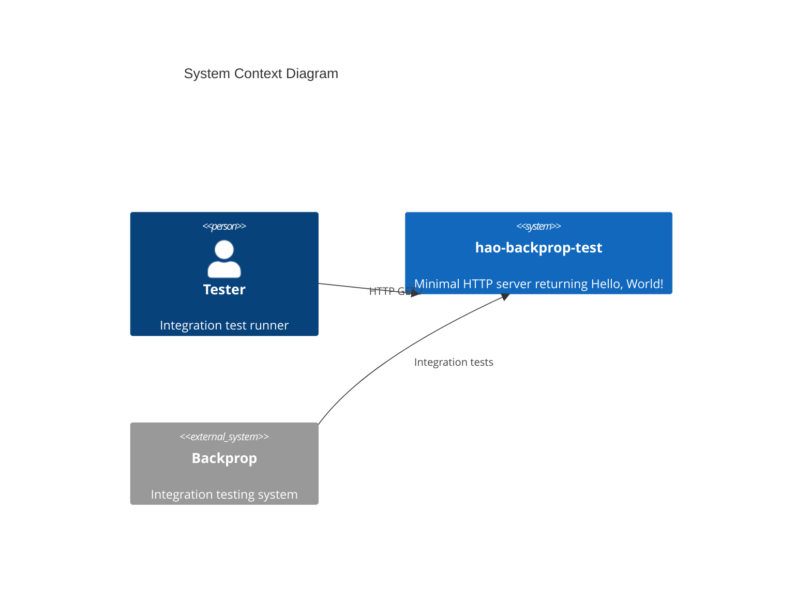
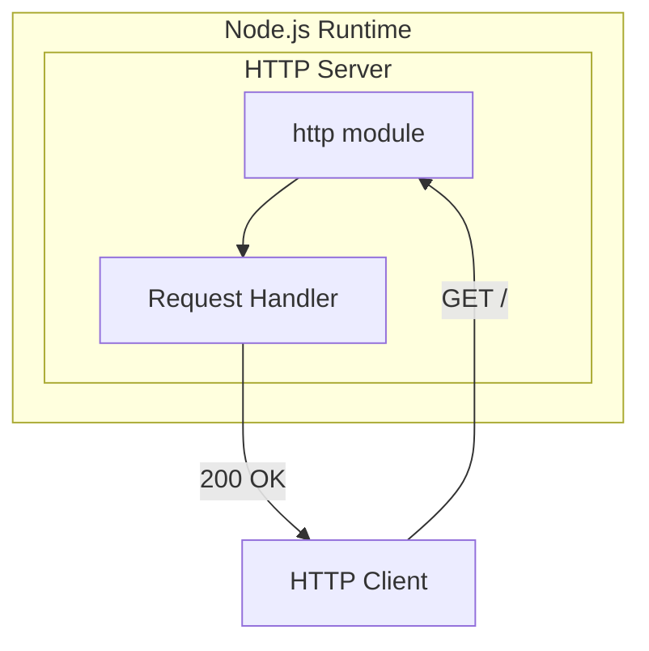
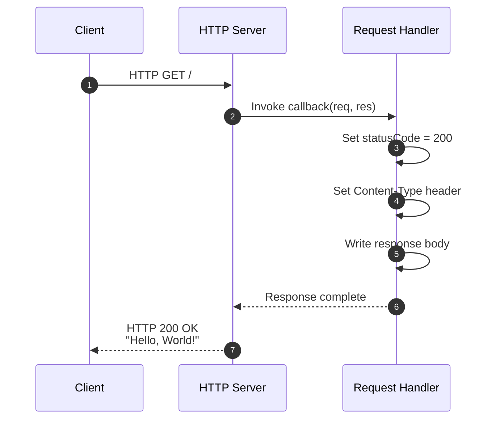
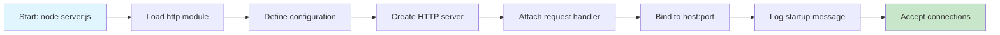
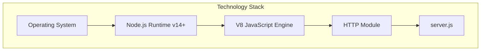
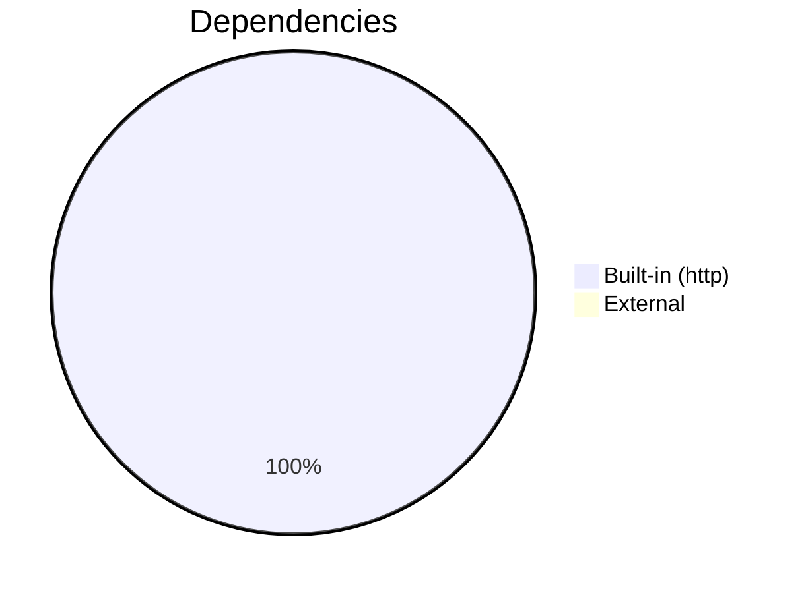
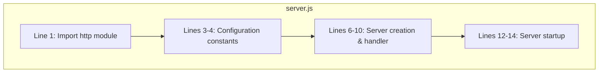
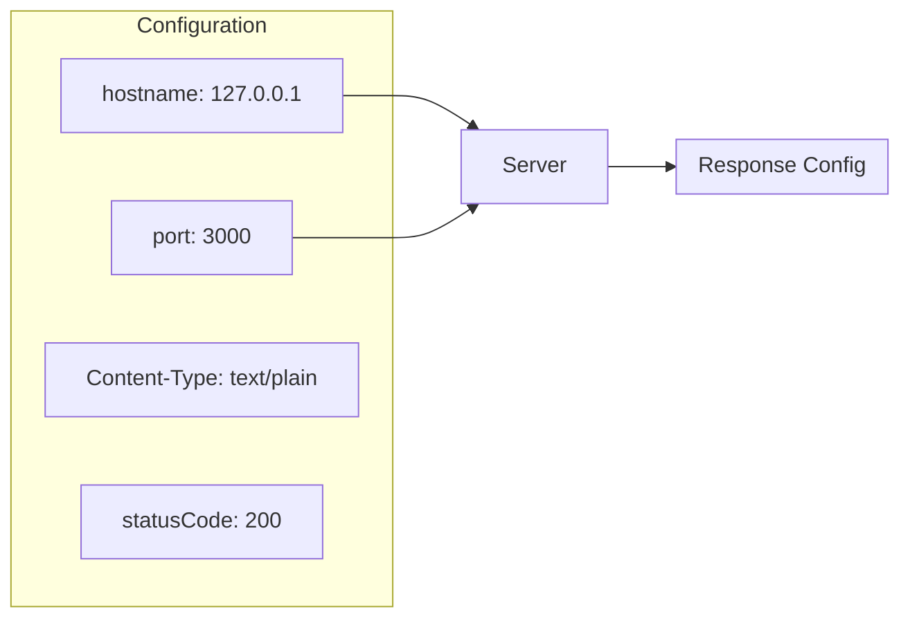
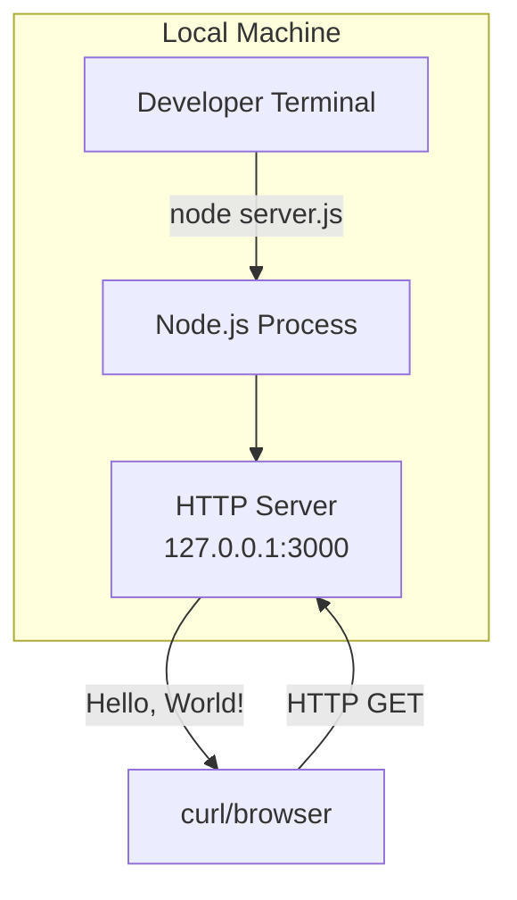

# Architecture Documentation

This document provides a detailed overview of the hao-backprop-test system architecture.

## Table of Contents

- [System Overview](#system-overview)
- [Component Architecture](#component-architecture)
- [Request Flow](#request-flow)
- [Technology Stack](#technology-stack)
- [Code Structure](#code-structure)
- [Configuration](#configuration)
- [Deployment Model](#deployment-model)

## System Overview

The hao-backprop-test project is a minimal HTTP server designed for Backprop integration testing. It follows a single-file, zero-dependency architecture pattern.

### Design Principles

| Principle | Implementation |
|-----------|----------------|
| Simplicity | Single-file server with no external dependencies |
| Predictability | Fixed response for all requests |
| Portability | Uses only Node.js built-in modules |
| Testability | Consistent behavior for integration tests |

### System Context



## Component Architecture

### High-Level Architecture



### Component Description

| Component | Description | Source |
|-----------|-------------|--------|
| HTTP Module | Node.js built-in HTTP server | `require('http')` |
| Server Instance | HTTP server created via `http.createServer()` | `server.js:6` |
| Request Handler | Callback function processing requests | `server.js:6-10` |
| Response Writer | Sends HTTP response with status and body | `server.js:7-9` |

## Request Flow

### Sequence Diagram



### Request Processing Steps

| Step | Action | Code Reference |
|------|--------|----------------|
| 1 | Client sends HTTP request | External |
| 2 | Server receives request | `server.listen()` |
| 3 | Handler sets status code to 200 | `server.js:7` |
| 4 | Handler sets Content-Type header | `server.js:8` |
| 5 | Handler writes response body | `server.js:9` |
| 6 | Response sent to client | Automatic |

### Server Startup Flow



## Technology Stack

### Runtime Environment



### Stack Components

| Layer | Technology | Version | Purpose |
|-------|------------|---------|---------|
| Application | JavaScript | ES6+ | Server logic |
| Runtime | Node.js | 14.x+ | JavaScript execution |
| HTTP | http module | Built-in | HTTP server functionality |
| Engine | V8 | (bundled) | JavaScript compilation |

### Dependencies



This project has **zero external dependencies**, using only the Node.js built-in `http` module.

## Code Structure

### File Organization

```
hao-backprop-test/
├── server.js           # Main server implementation (14 lines)
├── package.json        # npm package configuration
├── package-lock.json   # Dependency lock (empty deps)
└── docs/
    └── ARCHITECTURE.md # This file
```

### Server.js Structure



### Code Anatomy

| Lines | Purpose | Description |
|-------|---------|-------------|
| 1 | Import | Load Node.js http module |
| 3-4 | Configuration | Define hostname and port constants |
| 6-10 | Server Logic | Create server with request handler |
| 12-14 | Startup | Start listening and log message |

## Configuration

### Configuration Values



### Configuration Matrix

| Parameter | Value | Type | Modifiable | Location |
|-----------|-------|------|------------|----------|
| hostname | `127.0.0.1` | string | Source code only | `server.js:3` |
| port | `3000` | number | Source code only | `server.js:4` |
| statusCode | `200` | number | Source code only | `server.js:7` |
| Content-Type | `text/plain` | string | Source code only | `server.js:8` |
| Response body | `Hello, World!\n` | string | Source code only | `server.js:9` |

## Deployment Model

### Local Development



### Limitations

| Aspect | Current State | Reason |
|--------|---------------|--------|
| Network Access | Localhost only | Bound to 127.0.0.1 |
| Scalability | Single instance | Test project |
| High Availability | None | Not required |
| Containerization | Not implemented | Minimal scope |

---

## References

- **Source Code**: [server.js](../server.js)
- **Configuration**: [package.json](../package.json)
- **Main Documentation**: [README.md](../README.md)

[← Back to README](../README.md)
